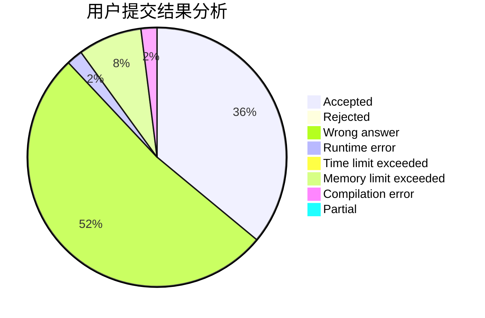
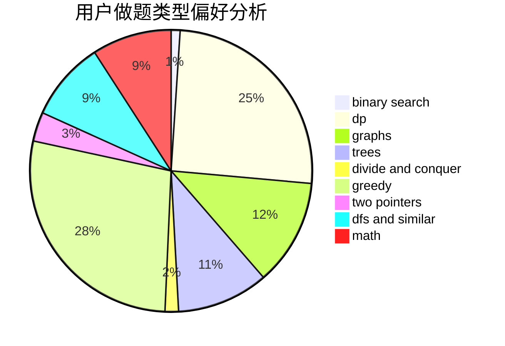

# Peipei

<!-- tabs:start -->

#### **用户提交结果分析**

#### **用户做题类型偏好分析**

<!-- tabs:end -->
# 推荐题目
[1243A](https://codeforces.com/contest/1243/problem/A)
[382E](https://codeforces.com/contest/382/problem/E)
[730J](https://codeforces.com/contest/730/problem/J)
[1341D](https://codeforces.com/contest/1341/problem/D)
[601C](https://codeforces.com/contest/601/problem/C)
[1194F](https://codeforces.com/contest/1194/problem/F)
[11521](https://codeforces.com/contest/1152/problem/1)
[827D](https://codeforces.com/contest/827/problem/D)
[456B](https://codeforces.com/contest/456/problem/B)
[1321C](https://codeforces.com/contest/1321/problem/C)
