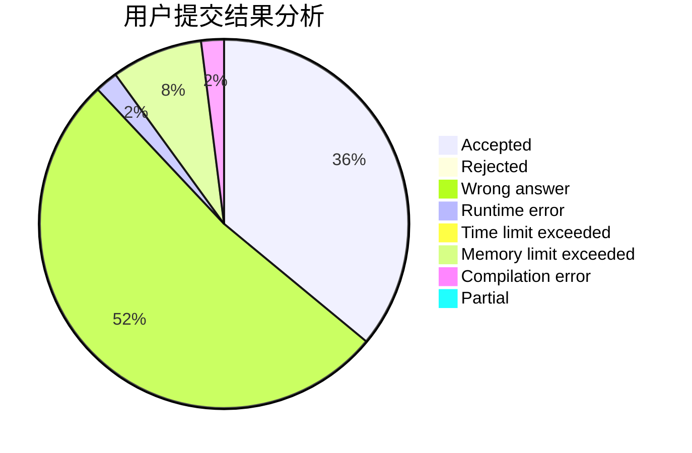
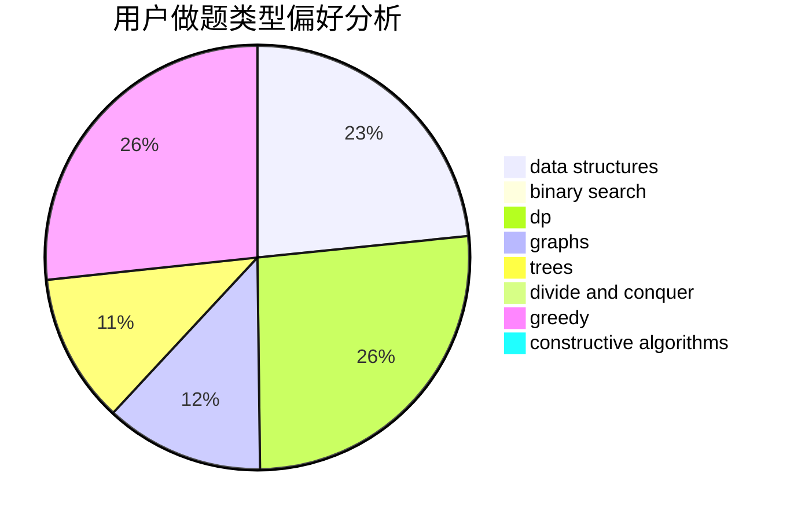
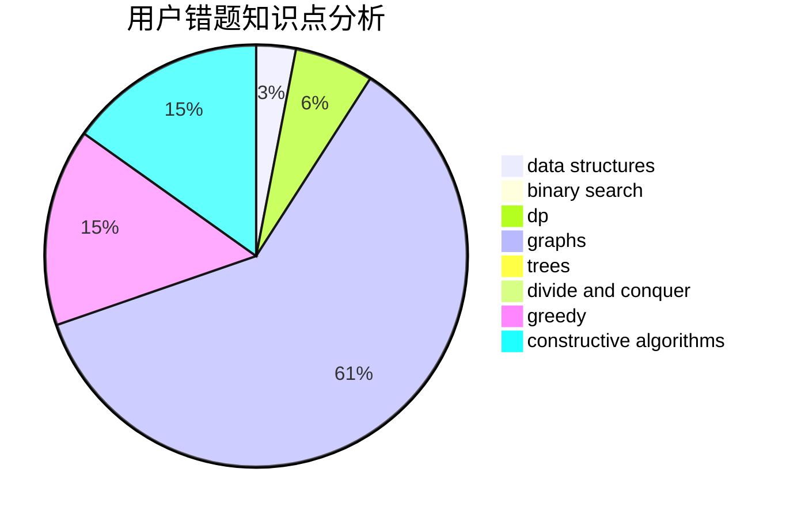

# Peipei

<!-- tabs:start -->

#### **用户提交结果分析**

#### **用户做题类型偏好分析**

#### **用户错题知识点分析**

<!-- tabs:end -->
# 推荐题目
[1243A](https://codeforces.com/contest/1243/problem/A)		implementation		  
[382E](https://codeforces.com/contest/382/problem/E)		combinatorics,
                        dp		  
[730J](https://codeforces.com/contest/730/problem/J)		dp		  
[1341D](https://codeforces.com/contest/1341/problem/D)		dsu,graphs,sortings,trees		  
[601C](https://codeforces.com/contest/601/problem/C)		dp,
                        math,
                        probabilities		  
[1194F](https://codeforces.com/contest/1194/problem/F)		combinatorics,
                        dp,
                        number theory,
                        probabilities,
                        two pointers		  
[11521](https://codeforces.com/contest/1152/problem/1)		dsu,graphs,sortings,trees		  
[827D](https://codeforces.com/contest/827/problem/D)		data structures,
                        dfs and similar,
                        graphs,
                        trees		  
[456B](https://codeforces.com/contest/456/problem/B)		math,
                        number theory		  
[1321C](https://codeforces.com/contest/1321/problem/C)		brute force,
                        constructive algorithms,
                        greedy,
                        strings		  
