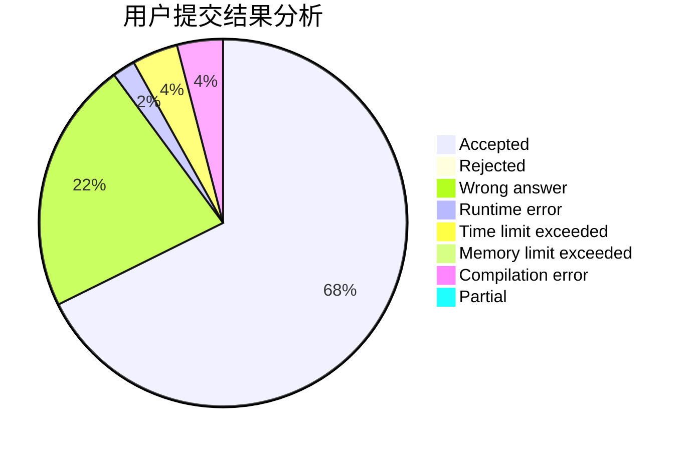
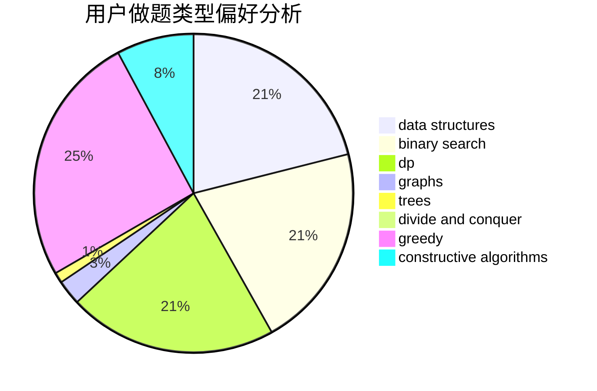
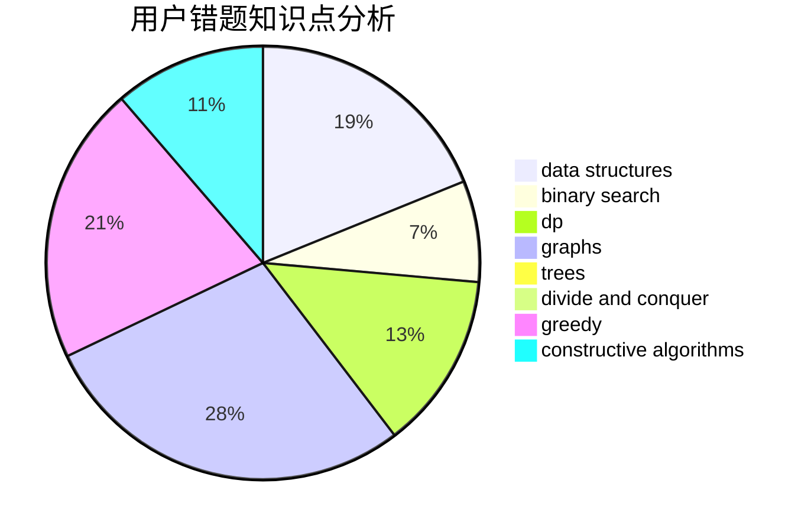

# Pepper_yzy

<!-- tabs:start -->

#### **用户提交结果分析**

#### **用户做题类型偏好分析**

#### **用户错题知识点分析**

<!-- tabs:end -->
# 推荐题目
[1341A](https://codeforces.com/contest/1341/problem/A)		math		  
[1185A](https://codeforces.com/contest/1185/problem/A)		math		  
[850C](https://codeforces.com/contest/850/problem/C)		bitmasks,
                        dp,
                        games		  
[813B](https://codeforces.com/contest/813/problem/B)		brute force,
                        math		  
[200A](https://codeforces.com/contest/200/problem/A)		brute force,
                        data structures		  
[107C](https://codeforces.com/contest/107/problem/C)		bitmasks,
                        dp		  
[401C](https://codeforces.com/contest/401/problem/C)		constructive algorithms,
                        greedy,
                        implementation		  
[721B](https://codeforces.com/contest/721/problem/B)		implementation,
                        math,
                        sortings,
                        strings		  
[571D](https://codeforces.com/contest/571/problem/D)		binary search,
                        data structures,
                        dsu,
                        trees		  
[934E](https://codeforces.com/contest/934/problem/E)		dsu,graphs,sortings,trees		  
