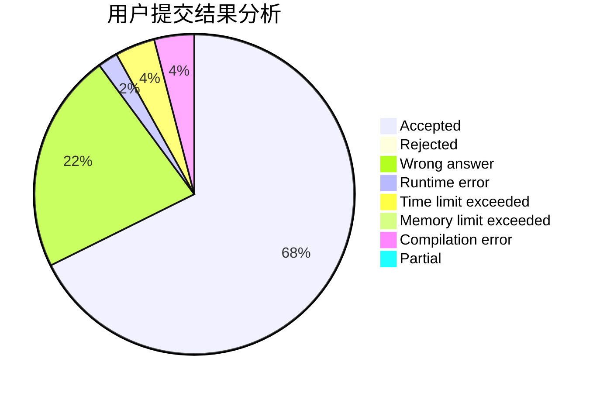
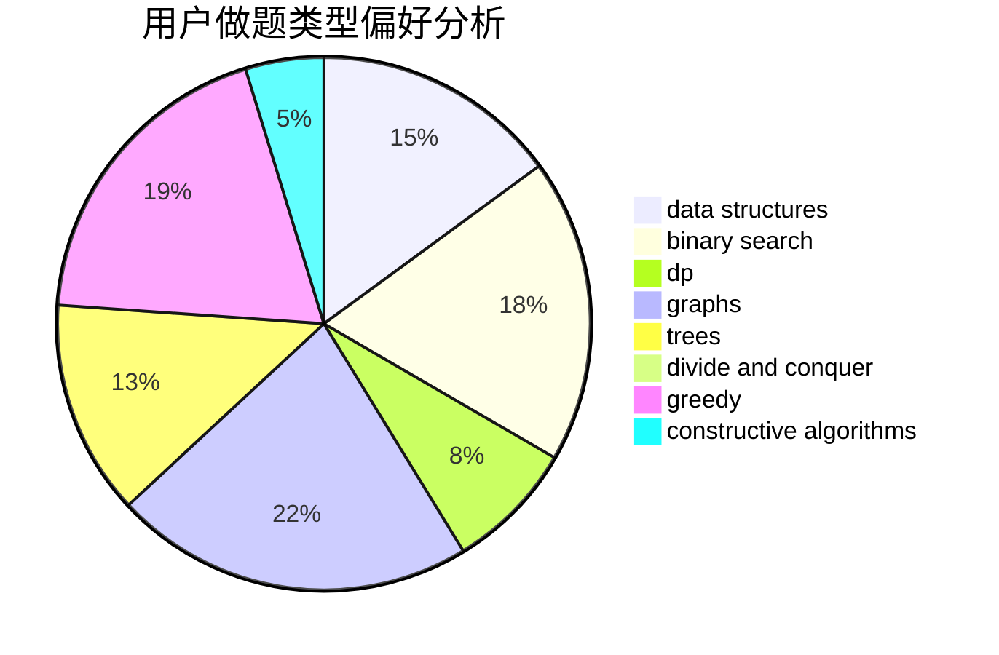
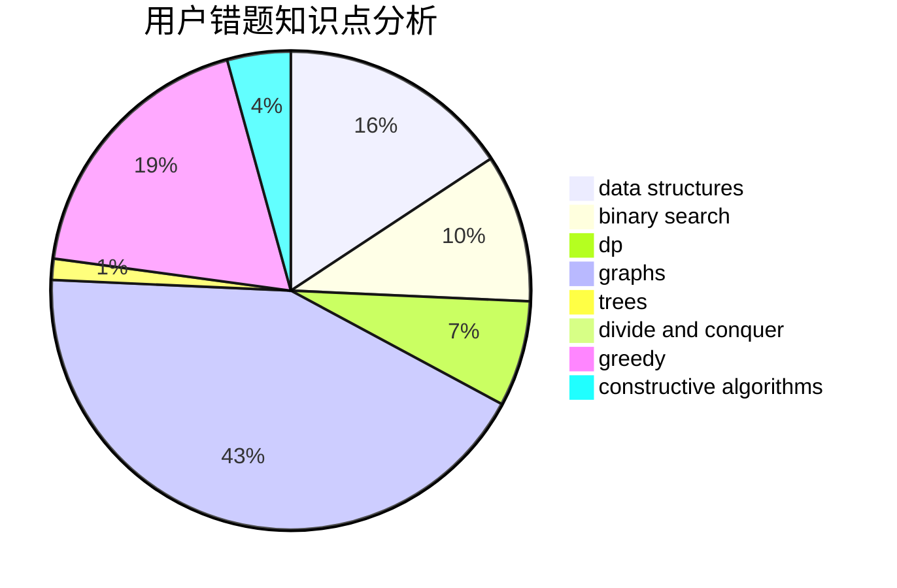

# Pepper_yzy

<!-- tabs:start -->

#### **用户提交结果分析**

#### **用户做题类型偏好分析**

#### **用户错题知识点分析**

<!-- tabs:end -->
# 推荐题目
[1348A](https://codeforces.com/contest/1348/problem/A)		greedy,
                        math		  
[11891](https://codeforces.com/contest/1189/problem/1)		dsu,graphs,sortings,trees		  
[869B](https://codeforces.com/contest/869/problem/B)		math		  
[831D](https://codeforces.com/contest/831/problem/D)		dsu,graphs,sortings,trees		  
[225C](https://codeforces.com/contest/225/problem/C)		dp,
                        matrices		  
[1080B](https://codeforces.com/contest/1080/problem/B)		math		  
[42C](https://codeforces.com/contest/42/problem/C)		brute force,
                        constructive algorithms		  
[738D](https://codeforces.com/contest/738/problem/D)		dsu,graphs,sortings,trees		  
[592A](https://codeforces.com/contest/592/problem/A)		implementation		  
[956D](https://codeforces.com/contest/956/problem/D)		dsu,graphs,sortings,trees		  
