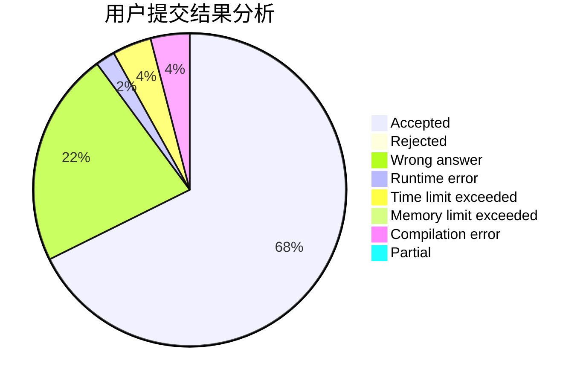
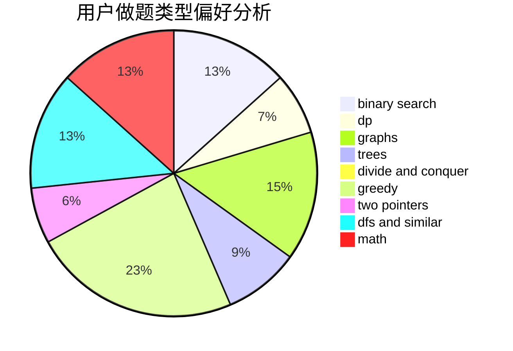

# Pepper_yzy

<!-- tabs:start -->

#### **用户提交结果分析**

#### **用户做题类型偏好分析**

<!-- tabs:end -->
# 推荐题目
[1348A](https://codeforces.com/contest/1348/problem/A)
[11891](https://codeforces.com/contest/1189/problem/1)
[869B](https://codeforces.com/contest/869/problem/B)
[831D](https://codeforces.com/contest/831/problem/D)
[225C](https://codeforces.com/contest/225/problem/C)
[1080B](https://codeforces.com/contest/1080/problem/B)
[42C](https://codeforces.com/contest/42/problem/C)
[738D](https://codeforces.com/contest/738/problem/D)
[592A](https://codeforces.com/contest/592/problem/A)
[956D](https://codeforces.com/contest/956/problem/D)
