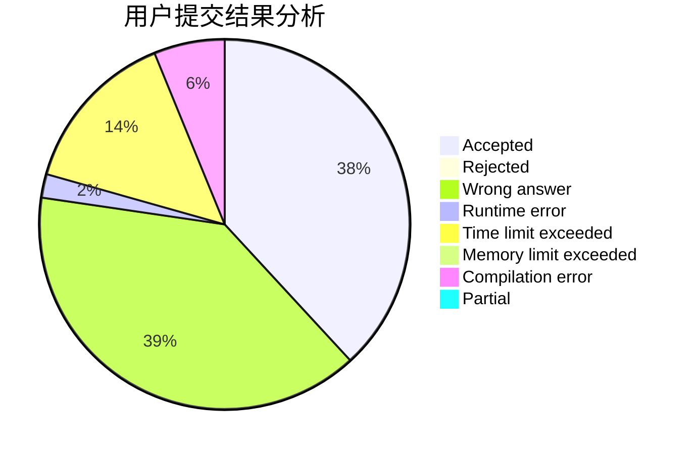
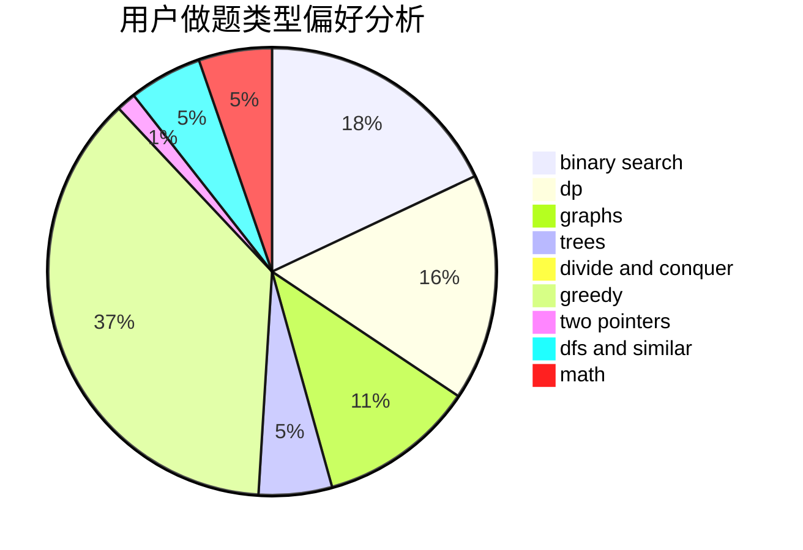

# Peterlits

<!-- tabs:start -->

#### **用户提交结果分析**

#### **用户做题类型偏好分析**

<!-- tabs:end -->
# 推荐题目
[1437E](https://codeforces.com/contest/1437/problem/E)
[97D](https://codeforces.com/contest/97/problem/D)
[651D](https://codeforces.com/contest/651/problem/D)
[825F](https://codeforces.com/contest/825/problem/F)
[1078B](https://codeforces.com/contest/1078/problem/B)
[588A](https://codeforces.com/contest/588/problem/A)
[1065C](https://codeforces.com/contest/1065/problem/C)
[205B](https://codeforces.com/contest/205/problem/B)
[765D](https://codeforces.com/contest/765/problem/D)
[1260D](https://codeforces.com/contest/1260/problem/D)
