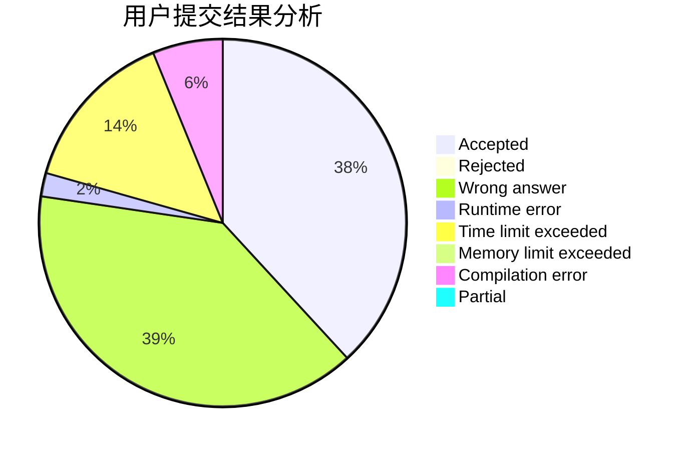
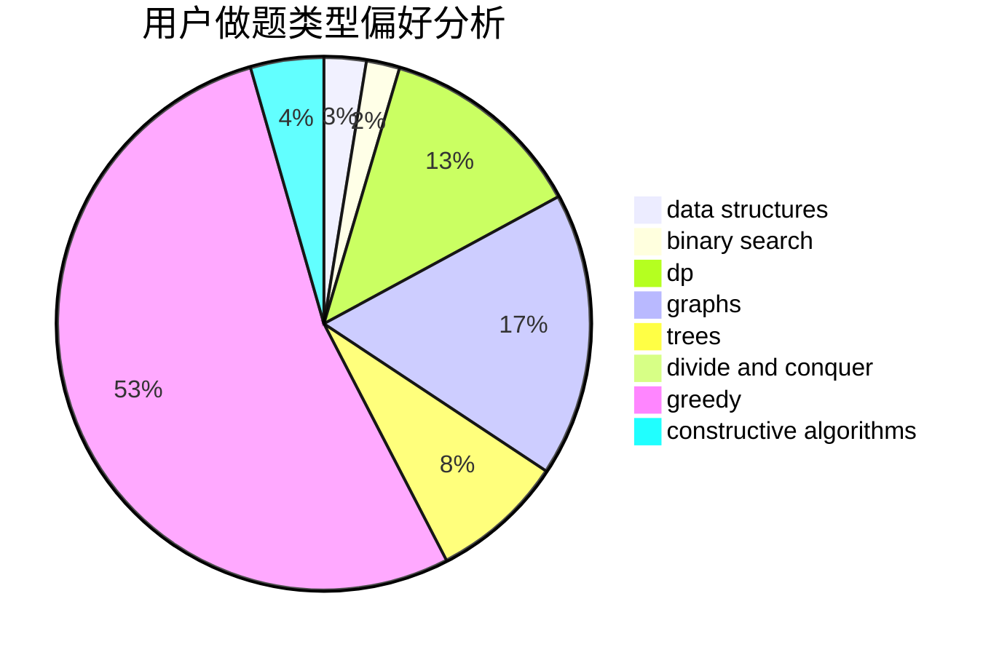

# Peterlits

<!-- tabs:start -->

#### **用户提交结果分析**

#### **用户做题类型偏好分析**

#### **用户错题知识点分析**

<!-- tabs:end -->
# 推荐题目
[1437E](https://codeforces.com/contest/1437/problem/E)		binary search,
                        constructive algorithms,
                        data structures,
                        dp,
                        implementation		  
[97D](https://codeforces.com/contest/97/problem/D)		bitmasks,
                        brute force,
                        implementation		  
[651D](https://codeforces.com/contest/651/problem/D)		dsu,graphs,sortings,trees		  
[825F](https://codeforces.com/contest/825/problem/F)		dp,
                        hashing,
                        string suffix structures,
                        strings		  
[1078B](https://codeforces.com/contest/1078/problem/B)		dsu,graphs,sortings,trees		  
[588A](https://codeforces.com/contest/588/problem/A)		greedy		  
[1065C](https://codeforces.com/contest/1065/problem/C)		greedy		  
[205B](https://codeforces.com/contest/205/problem/B)		brute force,
                        greedy		  
[765D](https://codeforces.com/contest/765/problem/D)		constructive algorithms,
                        dsu,
                        math		  
[1260D](https://codeforces.com/contest/1260/problem/D)		binary search,
                        dp,
                        greedy,
                        sortings		  
