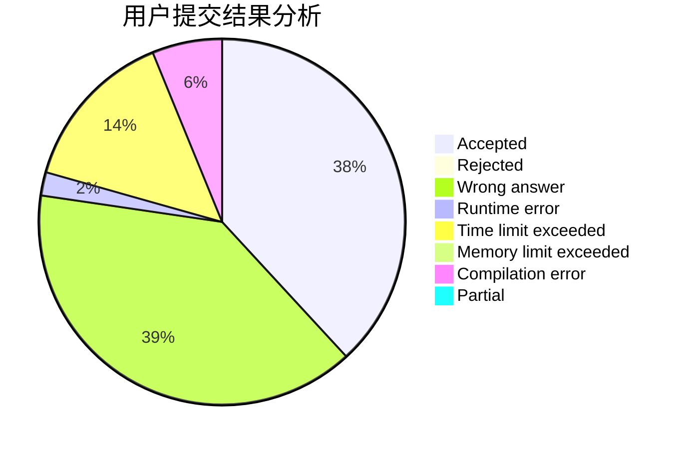
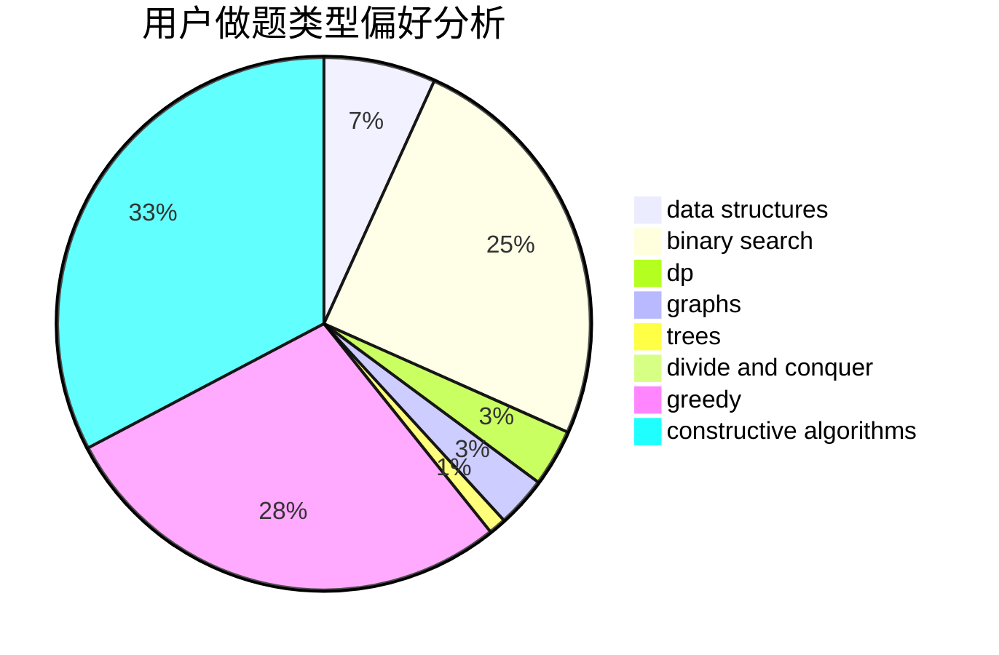

# Peterlits

<!-- tabs:start -->

#### **用户提交结果分析**

#### **用户做题类型偏好分析**

#### **用户错题知识点分析**

<!-- tabs:end -->
# 推荐题目
[1428E](https://codeforces.com/contest/1428/problem/E)		binary search,
                        data structures,
                        greedy,
                        math,
                        sortings		  
[958D1](https://codeforces.com/contest/958D/problem/1)		expression parsing,
                        math		  
[623D](https://codeforces.com/contest/623/problem/D)		greedy,
                        math,
                        probabilities		  
[808G](https://codeforces.com/contest/808/problem/G)		dp,
                        strings		  
[1077F1](https://codeforces.com/contest/1077F/problem/1)		dp		  
[568B](https://codeforces.com/contest/568/problem/B)		combinatorics,
                        dp,
                        math		  
[1064F](https://codeforces.com/contest/1064/problem/F)		dsu,graphs,sortings,trees		  
[17C](https://codeforces.com/contest/17/problem/C)		dp		  
[746B](https://codeforces.com/contest/746/problem/B)		implementation,
                        strings		  
[1253B](https://codeforces.com/contest/1253/problem/B)		greedy,
                        implementation		  
