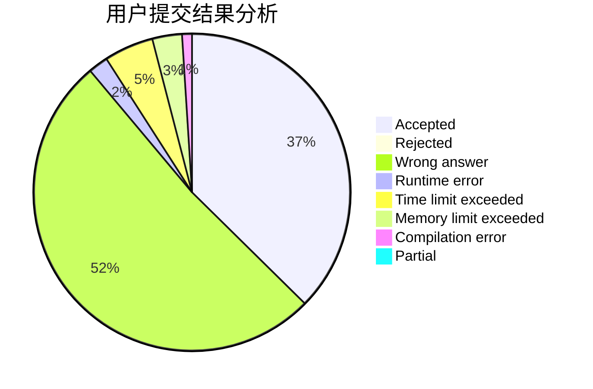
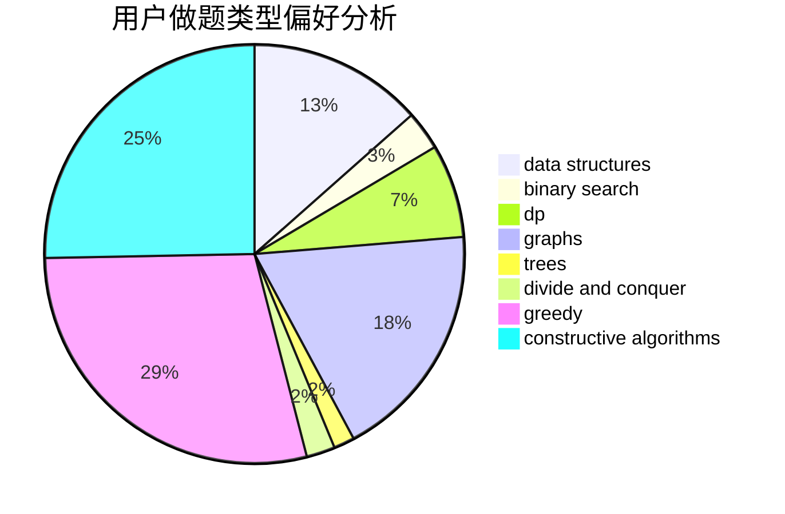
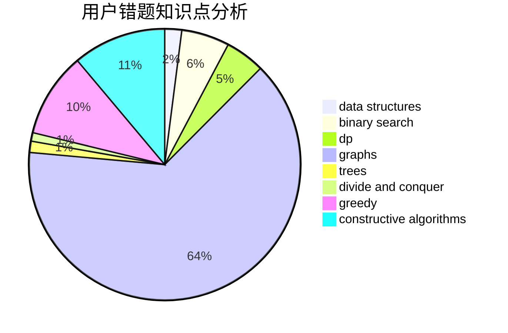

# PhantoM__

<!-- tabs:start -->

#### **用户提交结果分析**

#### **用户做题类型偏好分析**

#### **用户错题知识点分析**

<!-- tabs:end -->
# 推荐题目
[1504C](https://codeforces.com/contest/1504/problem/C)		dsu,graphs,sortings,trees		  
[527B](https://codeforces.com/contest/527/problem/B)		greedy		  
[1401A](https://codeforces.com/contest/1401/problem/A)		constructive algorithms,
                        math		  
[812E](https://codeforces.com/contest/812/problem/E)		games,
                        trees		  
[1230A](https://codeforces.com/contest/1230/problem/A)		brute force,
                        implementation		  
[1119B](https://codeforces.com/contest/1119/problem/B)		binary search,
                        flows,
                        greedy,
                        sortings		  
[550E](https://codeforces.com/contest/550/problem/E)		constructive algorithms,
                        greedy,
                        implementation,
                        math		  
[662A](https://codeforces.com/contest/662/problem/A)		bitmasks,
                        math,
                        matrices,
                        probabilities		  
[24D](https://codeforces.com/contest/24/problem/D)		dp,
                        math,
                        probabilities		  
[855B](https://codeforces.com/contest/855/problem/B)		brute force,
                        data structures,
                        dp		  
