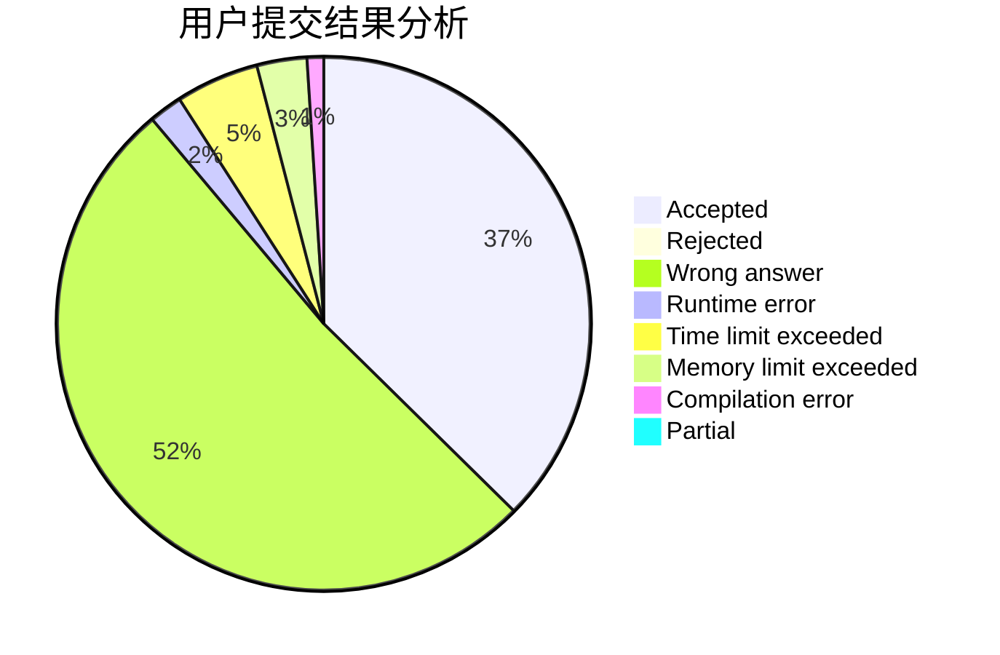
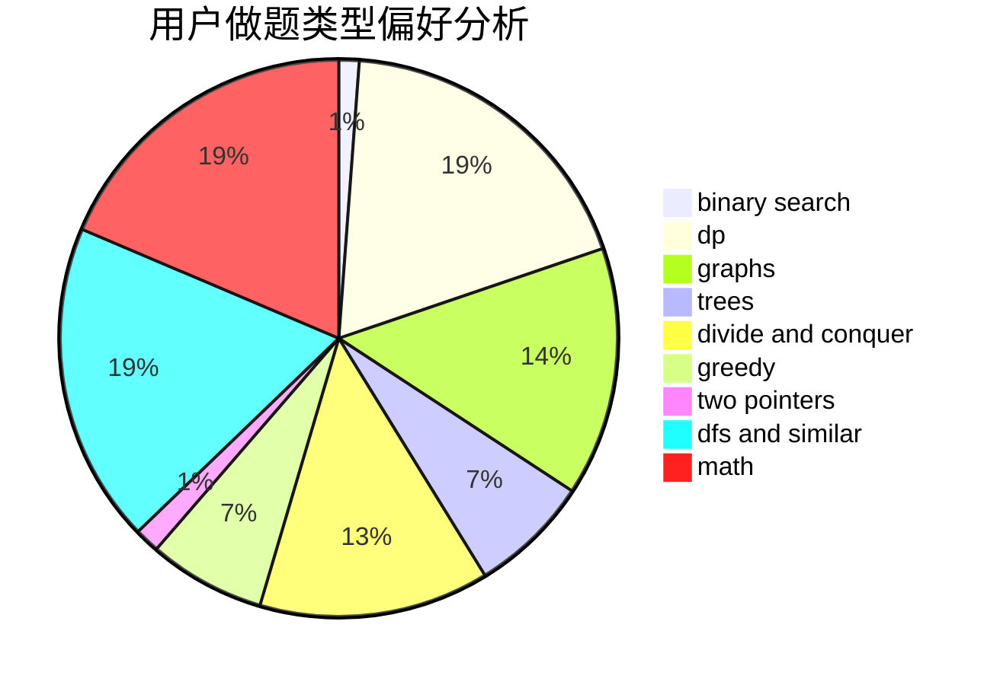

# PhantoM__

<!-- tabs:start -->

#### **用户提交结果分析**

#### **用户做题类型偏好分析**

<!-- tabs:end -->
# 推荐题目
[1513B](https://codeforces.com/contest/1513/problem/B)
[551B](https://codeforces.com/contest/551/problem/B)
[1411C](https://codeforces.com/contest/1411/problem/C)
[831B](https://codeforces.com/contest/831/problem/B)
[1238E](https://codeforces.com/contest/1238/problem/E)
[1121B](https://codeforces.com/contest/1121/problem/B)
[575I](https://codeforces.com/contest/575/problem/I)
[682A](https://codeforces.com/contest/682/problem/A)
[268E](https://codeforces.com/contest/268/problem/E)
[873C](https://codeforces.com/contest/873/problem/C)
