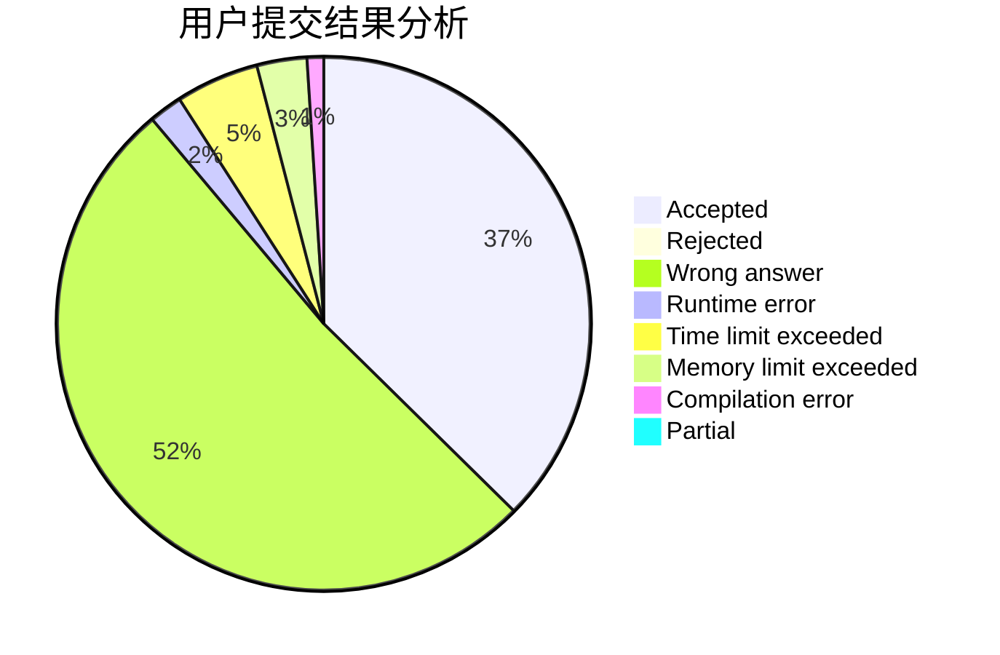
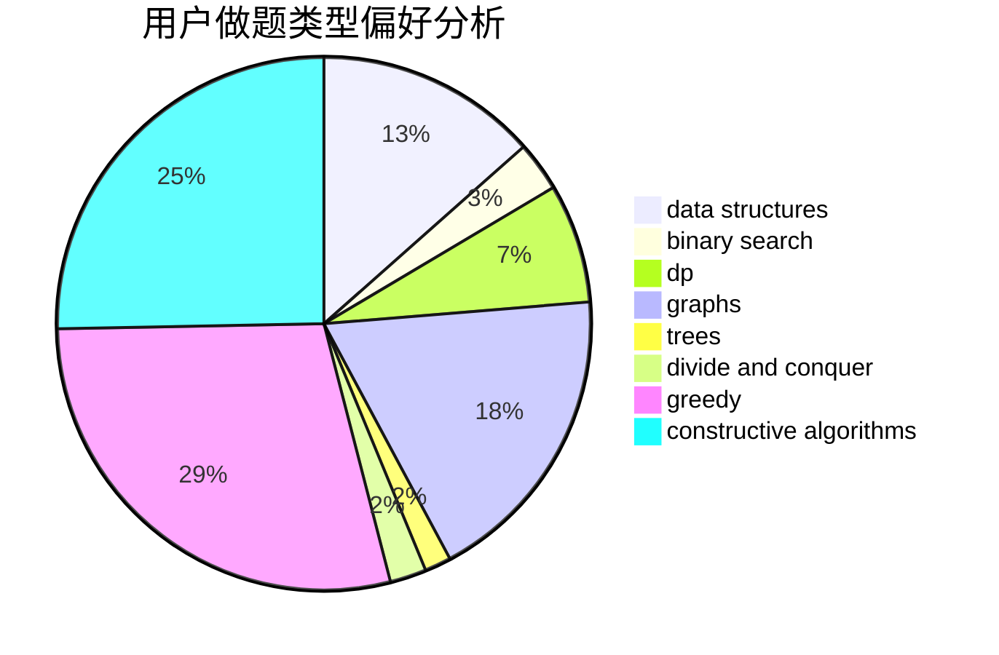
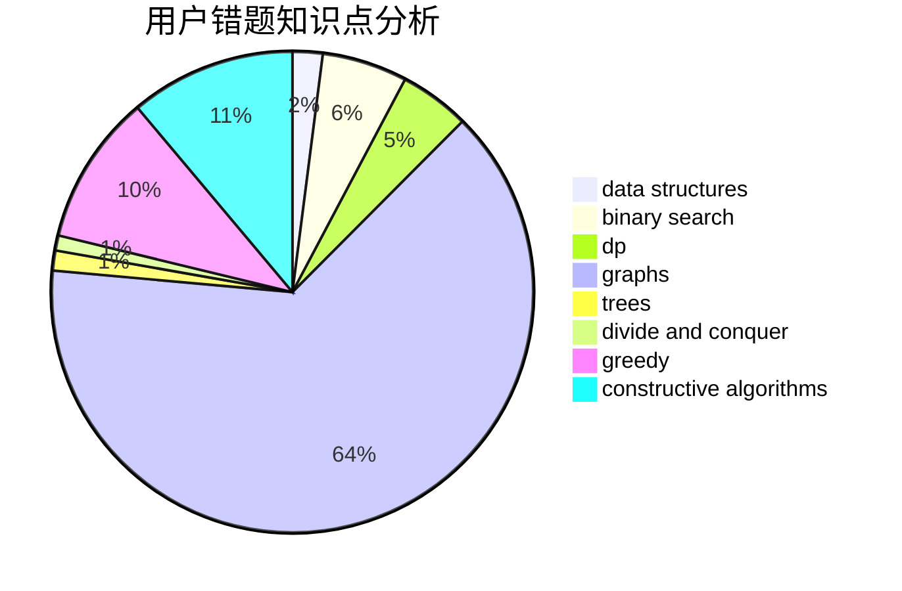

# PhantoM__
<!-- tabs:start -->
#### **用户提交结果分析**

#### **用户做题类型偏好分析**

#### **用户错题知识点分析**

<!-- tabs:end -->
# 推荐题目
[Balance the Bits](https://codeforces.com/contest/1504/problem/C)		constructive algorithms,
                        greedy		  
[Distance and Axis](http://codeforces.com/problemset/problem/1401/A)		constructive algorithms,
                        math		  
[Error Correct System](http://codeforces.com/problemset/problem/527/B)		greedy		  
[Squares and not squares](http://codeforces.com/problemset/problem/898/E)		constructive algorithms,
                        greedy		  
[Alyona and a Narrow Fridge](http://codeforces.com/problemset/problem/1119/B)		binary search,
                        flows,
                        greedy,
                        sortings		  
[Sagheer and Apple Tree](http://codeforces.com/problemset/problem/812/E)		games,
                        trees		  
[Gambling Nim](http://codeforces.com/problemset/problem/662/A)		bitmasks,
                        math,
                        matrices,
                        probabilities		  
[Marvolo Gaunt's Ring](http://codeforces.com/problemset/problem/855/B)		brute force,
                        data structures,
                        dp		  
[Maximum Questions](http://codeforces.com/problemset/problem/900/E)		data structures,
                        dp,
                        strings		  
[Three Piles of Candies](http://codeforces.com/problemset/problem/1196/A)		brute force,
                        constructive algorithms,
                        math		  
<!-- tabs:start -->
#### **data structures**
[Balance the Bits](http://codeforces.com/problemset/problem/855/B)		brute force,
                        data structures,
                        dp		  
[Distance and Axis](http://codeforces.com/problemset/problem/900/E)		data structures,
                        dp,
                        strings		  
[Error Correct System](http://codeforces.com/problemset/problem/1252/C)		data structures,
                        implementation		  
[Squares and not squares](http://codeforces.com/problemset/problem/1492/C)		binary search,
                        data structures,
                        dp,
                        greedy,
                        two pointers		  
[Alyona and a Narrow Fridge](http://codeforces.com/problemset/problem/1490/G)		binary search,
                        data structures,
                        math		  
[Sagheer and Apple Tree](http://codeforces.com/problemset/problem/1479/D)		binary search,
                        bitmasks,
                        brute force,
                        data structures,
                        probabilities,
                        trees		  
[Gambling Nim](http://codeforces.com/problemset/problem/1497/A)		brute force,
                        data structures,
                        greedy,
                        sortings		  
[Marvolo Gaunt's Ring](http://codeforces.com/problemset/problem/1491/C)		brute force,
                        data structures,
                        dp,
                        greedy,
                        implementation		  
[Maximum Questions](http://codeforces.com/problemset/problem/1492/B)		data structures,
                        greedy,
                        math		  
[Three Piles of Candies](http://codeforces.com/problemset/problem/1436/E)		binary search,
                        data structures,
                        two pointers		  
#### **binary search**
[Balance the Bits](http://codeforces.com/problemset/problem/1119/B)		binary search,
                        flows,
                        greedy,
                        sortings		  
[Distance and Axis](http://codeforces.com/problemset/problem/216/D)		binary search,
                        sortings,
                        two pointers		  
[Error Correct System](http://codeforces.com/problemset/problem/1016/E)		binary search,
                        geometry		  
[Squares and not squares](http://codeforces.com/problemset/problem/1419/D2)		binary search,
                        brute force,
                        constructive algorithms,
                        greedy,
                        sortings,
                        two pointers		  
[Alyona and a Narrow Fridge](http://codeforces.com/problemset/problem/1492/C)		binary search,
                        data structures,
                        dp,
                        greedy,
                        two pointers		  
[Sagheer and Apple Tree](http://codeforces.com/problemset/problem/1463/D)		binary search,
                        constructive algorithms,
                        greedy,
                        two pointers		  
[Gambling Nim](http://codeforces.com/problemset/problem/1490/G)		binary search,
                        data structures,
                        math		  
[Marvolo Gaunt's Ring](http://codeforces.com/problemset/problem/1479/D)		binary search,
                        bitmasks,
                        brute force,
                        data structures,
                        probabilities,
                        trees		  
[Maximum Questions](http://codeforces.com/problemset/problem/1436/E)		binary search,
                        data structures,
                        two pointers		  
[Three Piles of Candies](http://codeforces.com/problemset/problem/1461/D)		binary search,
                        brute force,
                        data structures,
                        divide and conquer,
                        implementation,
                        sortings		  
#### **dp**
[Balance the Bits](http://codeforces.com/problemset/problem/855/B)		brute force,
                        data structures,
                        dp		  
[Distance and Axis](http://codeforces.com/problemset/problem/900/E)		data structures,
                        dp,
                        strings		  
[Error Correct System](http://codeforces.com/problemset/problem/24/D)		dp,
                        math,
                        probabilities		  
[Squares and not squares](http://codeforces.com/problemset/problem/1056/D)		constructive algorithms,
                        dfs and similar,
                        dp,
                        graphs,
                        greedy,
                        sortings,
                        trees		  
[Alyona and a Narrow Fridge](https://codeforces.com/contest/1382/problem/D)		dp		  
[Sagheer and Apple Tree](http://codeforces.com/problemset/problem/149/D)		dp		  
[Gambling Nim](http://codeforces.com/problemset/problem/1492/C)		binary search,
                        data structures,
                        dp,
                        greedy,
                        two pointers		  
[Marvolo Gaunt's Ring](https://codeforces.com/contest/1457/problem/C)		brute force,
                        dp,
                        implementation		  
[Maximum Questions](http://codeforces.com/problemset/problem/1491/C)		brute force,
                        data structures,
                        dp,
                        greedy,
                        implementation		  
[Three Piles of Candies](http://codeforces.com/problemset/problem/1437/C)		dp,
                        flows,
                        graph matchings,
                        greedy,
                        math,
                        sortings		  
#### **graph**
[Balance the Bits](http://codeforces.com/problemset/problem/1056/D)		constructive algorithms,
                        dfs and similar,
                        dp,
                        graphs,
                        greedy,
                        sortings,
                        trees		  
[Distance and Axis](http://codeforces.com/problemset/problem/1487/C)		brute force,
                        constructive algorithms,
                        dfs and similar,
                        graphs,
                        greedy,
                        implementation,
                        math		  
[Error Correct System](http://codeforces.com/problemset/problem/1437/C)		dp,
                        flows,
                        graph matchings,
                        greedy,
                        math,
                        sortings		  
[Squares and not squares](http://codeforces.com/problemset/problem/1470/D)		constructive algorithms,
                        dfs and similar,
                        graph matchings,
                        graphs,
                        greedy		  
[Alyona and a Narrow Fridge](http://codeforces.com/problemset/problem/1476/C)		dp,
                        graphs,
                        greedy		  
[Sagheer and Apple Tree](http://codeforces.com/problemset/problem/1304/D)		constructive algorithms,
                        graphs,
                        greedy,
                        two pointers		  
[Gambling Nim](http://codeforces.com/problemset/problem/1475/C)		combinatorics,
                        graphs,
                        math		  
[Marvolo Gaunt's Ring](http://codeforces.com/problemset/problem/553/E)		dp,
                        fft,
                        graphs,
                        math,
                        probabilities		  
[Maximum Questions](http://codeforces.com/problemset/problem/1495/C)		constructive algorithms,
                        graphs		  
[Three Piles of Candies](http://codeforces.com/problemset/problem/1510/K)		brute force,
                        graphs,
                        implementation		  
#### **trees**
[Balance the Bits](http://codeforces.com/problemset/problem/812/E)		games,
                        trees		  
[Distance and Axis](http://codeforces.com/problemset/problem/1056/D)		constructive algorithms,
                        dfs and similar,
                        dp,
                        graphs,
                        greedy,
                        sortings,
                        trees		  
[Error Correct System](http://codeforces.com/problemset/problem/1479/D)		binary search,
                        bitmasks,
                        brute force,
                        data structures,
                        probabilities,
                        trees		  
[Squares and not squares](http://codeforces.com/problemset/problem/1511/C)		brute force,
                        data structures,
                        implementation,
                        trees		  
[Alyona and a Narrow Fridge](http://codeforces.com/problemset/problem/1499/F)		combinatorics,
                        dfs and similar,
                        dp,
                        trees		  
[Sagheer and Apple Tree](http://codeforces.com/problemset/problem/1491/E)		brute force,
                        dfs and similar,
                        divide and conquer,
                        number theory,
                        trees		  
[Gambling Nim](http://codeforces.com/problemset/problem/1466/D)		data structures,
                        greedy,
                        sortings,
                        trees		  
[Marvolo Gaunt's Ring](http://codeforces.com/problemset/problem/1495/D)		combinatorics,
                        dfs and similar,
                        graphs,
                        math,
                        shortest paths,
                        trees		  
[Maximum Questions](http://codeforces.com/problemset/problem/1303/G)		data structures,
                        divide and conquer,
                        geometry,
                        trees		  
[Three Piles of Candies](http://codeforces.com/problemset/problem/1454/E)		combinatorics,
                        dfs and similar,
                        graphs,
                        trees		  
#### **divide and conquer**
[Balance the Bits](http://codeforces.com/problemset/problem/1461/D)		binary search,
                        brute force,
                        data structures,
                        divide and conquer,
                        implementation,
                        sortings		  
[Distance and Axis](http://codeforces.com/problemset/problem/1466/G)		combinatorics,
                        divide and conquer,
                        hashing,
                        math,
                        string suffix structures,
                        strings		  
[Error Correct System](http://codeforces.com/problemset/problem/1490/D)		dfs and similar,
                        divide and conquer,
                        implementation		  
[Squares and not squares](https://codeforces.com/contest/1483/problem/C)		data structures,
                        divide and conquer,
                        dp		  
[Alyona and a Narrow Fridge](http://codeforces.com/problemset/problem/1491/E)		brute force,
                        dfs and similar,
                        divide and conquer,
                        number theory,
                        trees		  
[Sagheer and Apple Tree](http://codeforces.com/problemset/problem/1303/G)		data structures,
                        divide and conquer,
                        geometry,
                        trees		  
[Gambling Nim](http://codeforces.com/problemset/problem/1494/D)		constructive algorithms,
                        data structures,
                        dfs and similar,
                        divide and conquer,
                        dsu,
                        greedy,
                        sortings,
                        trees		  
[Marvolo Gaunt's Ring](http://codeforces.com/problemset/problem/1482/E)		data structures,
                        divide and conquer,
                        dp		  
[Maximum Questions](http://codeforces.com/problemset/problem/566/C)		dfs and similar,
                        divide and conquer,
                        trees		  
[Three Piles of Candies](http://codeforces.com/problemset/problem/1428/F)		binary search,
                        data structures,
                        divide and conquer,
                        dp,
                        two pointers		  
#### **greedy**
[Balance the Bits](https://codeforces.com/contest/1504/problem/C)		constructive algorithms,
                        greedy		  
[Distance and Axis](http://codeforces.com/problemset/problem/527/B)		greedy		  
[Error Correct System](http://codeforces.com/problemset/problem/898/E)		constructive algorithms,
                        greedy		  
[Squares and not squares](http://codeforces.com/problemset/problem/1119/B)		binary search,
                        flows,
                        greedy,
                        sortings		  
[Alyona and a Narrow Fridge](https://codeforces.com/contest/860/problem/C)		greedy,
                        implementation		  
[Sagheer and Apple Tree](http://codeforces.com/problemset/problem/1056/D)		constructive algorithms,
                        dfs and similar,
                        dp,
                        graphs,
                        greedy,
                        sortings,
                        trees		  
[Gambling Nim](http://codeforces.com/problemset/problem/550/E)		constructive algorithms,
                        greedy,
                        implementation,
                        math		  
[Marvolo Gaunt's Ring](http://codeforces.com/problemset/problem/1419/D2)		binary search,
                        brute force,
                        constructive algorithms,
                        greedy,
                        sortings,
                        two pointers		  
[Maximum Questions](http://codeforces.com/problemset/problem/522/C)		greedy		  
[Three Piles of Candies](http://codeforces.com/problemset/problem/1492/C)		binary search,
                        data structures,
                        dp,
                        greedy,
                        two pointers		  
#### **constructive algorithms**
[Balance the Bits](http://codeforces.com/problemset/problem/1401/A)		constructive algorithms,
                        math		  
[Distance and Axis](https://codeforces.com/contest/1504/problem/C)		constructive algorithms,
                        greedy		  
[Error Correct System](http://codeforces.com/problemset/problem/898/E)		constructive algorithms,
                        greedy		  
[Squares and not squares](http://codeforces.com/problemset/problem/1196/A)		brute force,
                        constructive algorithms,
                        math		  
[Alyona and a Narrow Fridge](http://codeforces.com/problemset/problem/1056/D)		constructive algorithms,
                        dfs and similar,
                        dp,
                        graphs,
                        greedy,
                        sortings,
                        trees		  
[Sagheer and Apple Tree](http://codeforces.com/problemset/problem/550/E)		constructive algorithms,
                        greedy,
                        implementation,
                        math		  
[Gambling Nim](http://codeforces.com/problemset/problem/1419/D2)		binary search,
                        brute force,
                        constructive algorithms,
                        greedy,
                        sortings,
                        two pointers		  
[Marvolo Gaunt's Ring](http://codeforces.com/problemset/problem/128/B)		brute force,
                        constructive algorithms,
                        hashing,
                        implementation,
                        string suffix structures,
                        strings		  
[Maximum Questions](http://codeforces.com/problemset/problem/1493/A)		constructive algorithms,
                        greedy		  
[Three Piles of Candies](http://codeforces.com/problemset/problem/1463/D)		binary search,
                        constructive algorithms,
                        greedy,
                        two pointers		  
#### **sortings**
[Balance the Bits](http://codeforces.com/problemset/problem/1119/B)		binary search,
                        flows,
                        greedy,
                        sortings		  
[Distance and Axis](http://codeforces.com/problemset/problem/216/D)		binary search,
                        sortings,
                        two pointers		  
[Error Correct System](http://codeforces.com/problemset/problem/1056/D)		constructive algorithms,
                        dfs and similar,
                        dp,
                        graphs,
                        greedy,
                        sortings,
                        trees		  
[Squares and not squares](http://codeforces.com/problemset/problem/1419/D2)		binary search,
                        brute force,
                        constructive algorithms,
                        greedy,
                        sortings,
                        two pointers		  
[Alyona and a Narrow Fridge](https://codeforces.com/contest/1496/problem/C)		geometry,
                        greedy,
                        math,
                        sortings		  
[Sagheer and Apple Tree](http://codeforces.com/problemset/problem/1495/A)		geometry,
                        greedy,
                        math,
                        sortings		  
[Gambling Nim](http://codeforces.com/problemset/problem/1497/A)		brute force,
                        data structures,
                        greedy,
                        sortings		  
[Marvolo Gaunt's Ring](http://codeforces.com/problemset/problem/1427/A)		math,
                        sortings		  
[Maximum Questions](http://codeforces.com/problemset/problem/1461/D)		binary search,
                        brute force,
                        data structures,
                        divide and conquer,
                        implementation,
                        sortings		  
[Three Piles of Candies](http://codeforces.com/problemset/problem/1437/C)		dp,
                        flows,
                        graph matchings,
                        greedy,
                        math,
                        sortings		  
<!-- tabs:end -->
