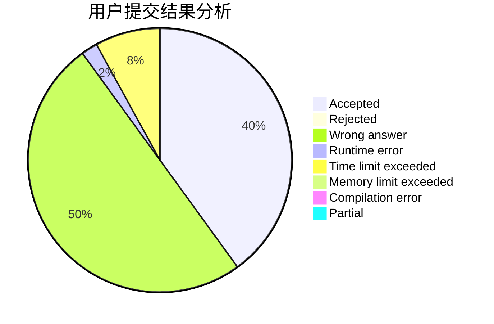
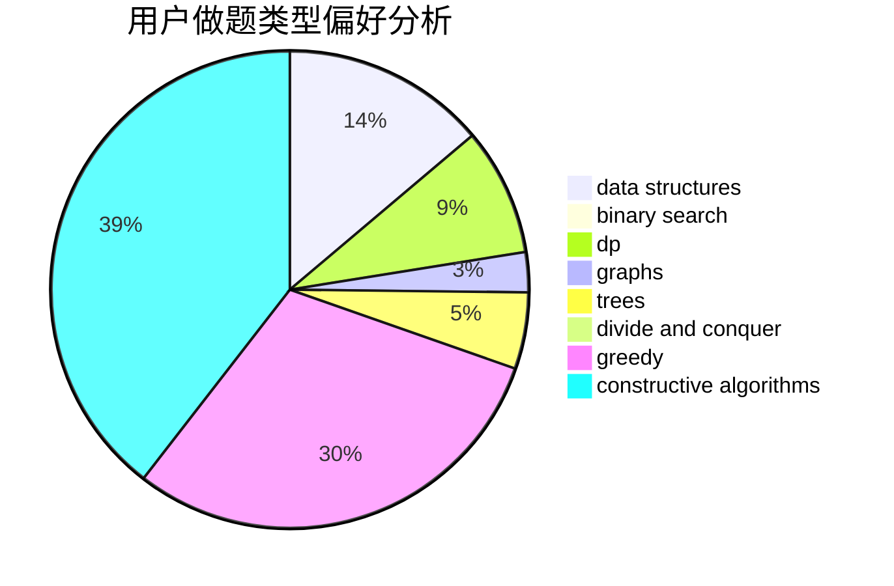
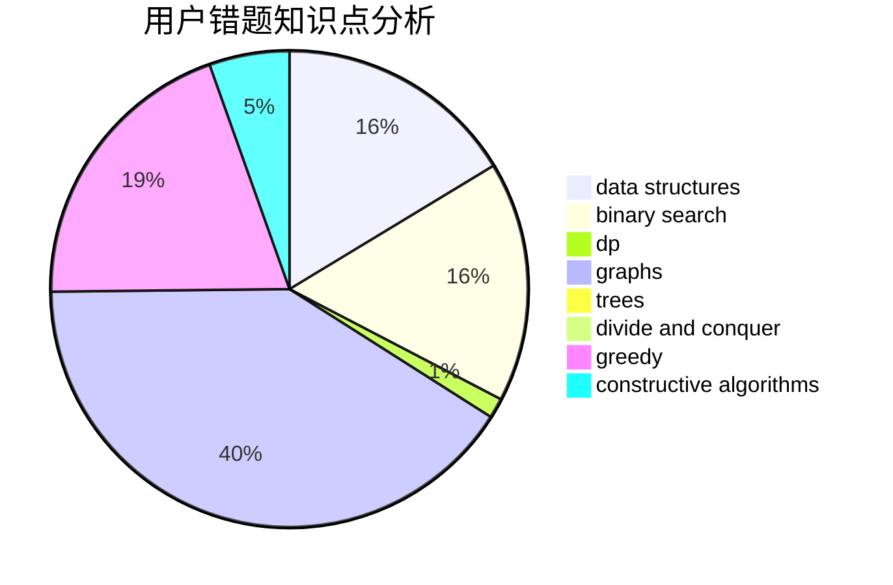

# Phoenix_zenghao

<!-- tabs:start -->

#### **用户提交结果分析**

#### **用户做题类型偏好分析**

#### **用户错题知识点分析**

<!-- tabs:end -->
# 推荐题目
[1316B](https://codeforces.com/contest/1316/problem/B)		brute force,
                        constructive algorithms,
                        implementation,
                        sortings,
                        strings		  
[671A](https://codeforces.com/contest/671/problem/A)		dp,
                        geometry,
                        greedy,
                        implementation		  
[853D](https://codeforces.com/contest/853/problem/D)		binary search,
                        dp,
                        greedy		  
[1175D](https://codeforces.com/contest/1175/problem/D)		greedy,
                        sortings		  
[164C](https://codeforces.com/contest/164/problem/C)		flows,
                        graphs		  
[681B](https://codeforces.com/contest/681/problem/B)		brute force		  
[922B](https://codeforces.com/contest/922/problem/B)		brute force		  
[1208G](https://codeforces.com/contest/1208/problem/G)		greedy,
                        math,
                        number theory		  
[304B](https://codeforces.com/contest/304/problem/B)		brute force,
                        implementation		  
[903B](https://codeforces.com/contest/903/problem/B)		greedy,
                        implementation		  
