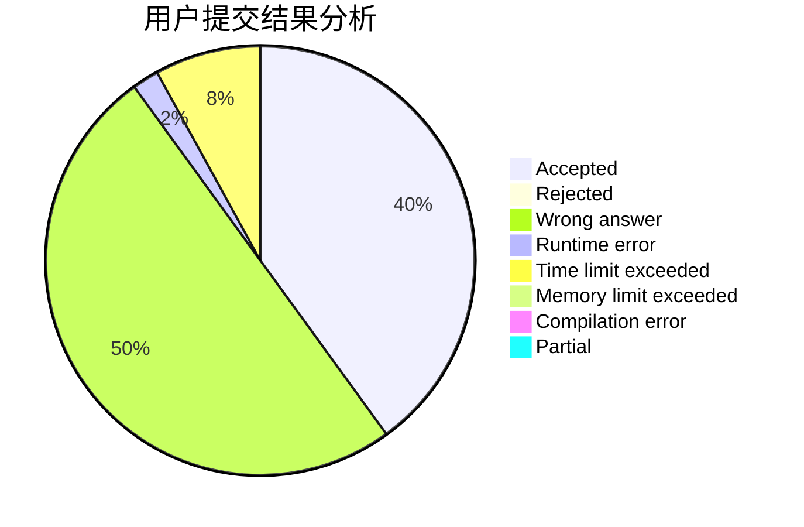
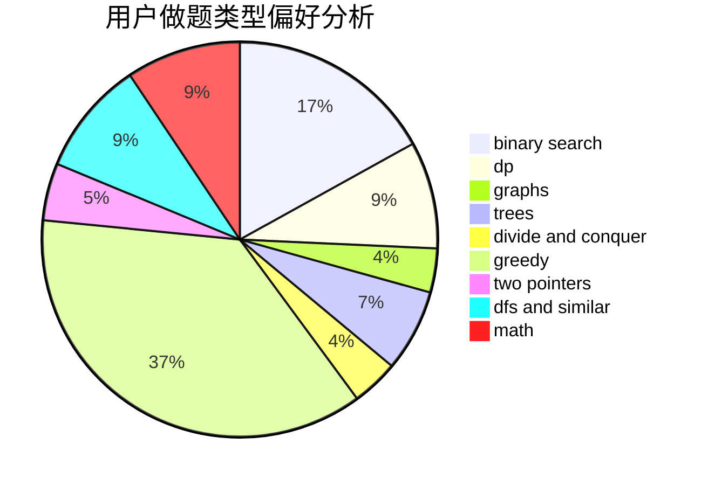

# Phoenix_zenghao

<!-- tabs:start -->

#### **用户提交结果分析**

#### **用户做题类型偏好分析**

<!-- tabs:end -->
# 推荐题目
[1316B](https://codeforces.com/contest/1316/problem/B)
[671A](https://codeforces.com/contest/671/problem/A)
[853D](https://codeforces.com/contest/853/problem/D)
[1175D](https://codeforces.com/contest/1175/problem/D)
[164C](https://codeforces.com/contest/164/problem/C)
[681B](https://codeforces.com/contest/681/problem/B)
[922B](https://codeforces.com/contest/922/problem/B)
[1208G](https://codeforces.com/contest/1208/problem/G)
[304B](https://codeforces.com/contest/304/problem/B)
[903B](https://codeforces.com/contest/903/problem/B)
