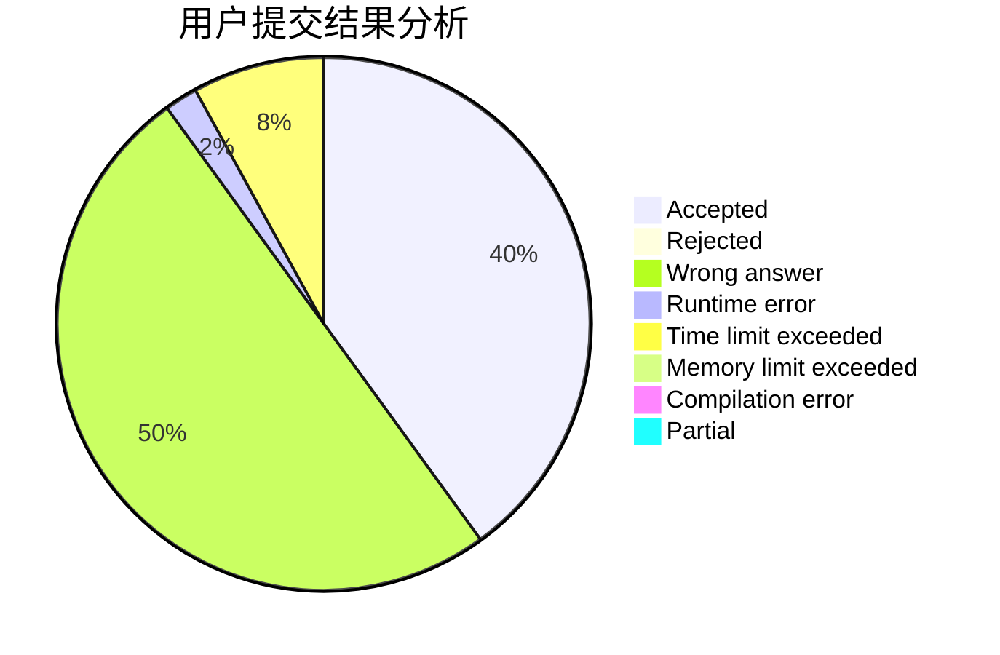
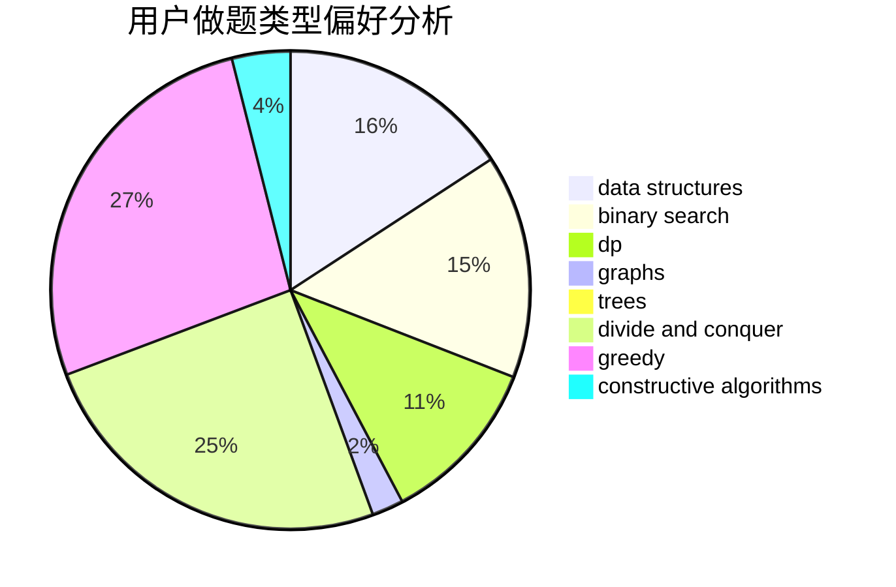
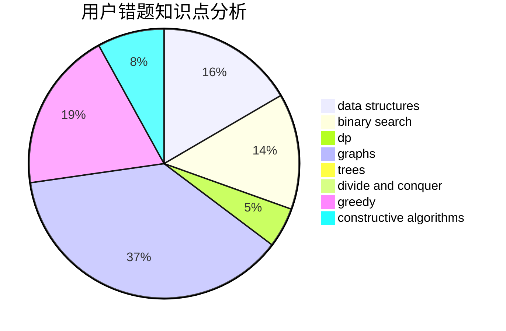

# Phoenix_zenghao
<!-- tabs:start -->
#### **用户提交结果分析**

#### **用户做题类型偏好分析**

#### **用户错题知识点分析**

<!-- tabs:end -->
# 推荐题目
[Choosing Ads](http://codeforces.com/problemset/problem/643/G)		data structures		  
[New Year and Counting Cards](http://codeforces.com/problemset/problem/908/A)		brute force,
                        implementation		  
[``Is the number of ones divisible by 3?'' oracle](http://codeforces.com/problemset/problem/1116/C3)		nan		  
[Cow and Vacation](http://codeforces.com/problemset/problem/1307/F)		dfs and similar,
                        dsu,
                        trees		  
[World of Darkraft](http://codeforces.com/problemset/problem/138/D)		dp,
                        games		  
[Points and Segments (easy)](http://codeforces.com/problemset/problem/430/A)		constructive algorithms,
                        sortings		  
[PE Lesson](http://codeforces.com/problemset/problem/316/D2)		dp		  
[Common Divisors](http://codeforces.com/problemset/problem/182/D)		brute force,
                        hashing,
                        implementation,
                        math,
                        strings		  
[pSort](http://codeforces.com/problemset/problem/28/B)		dfs and similar,
                        dsu,
                        graphs		  
[Digits](http://codeforces.com/problemset/problem/1510/D)		dp,
                        math,
                        number theory		  
<!-- tabs:start -->
#### **data structures**
[Choosing Ads](http://codeforces.com/problemset/problem/643/G)		data structures		  
[New Year and Counting Cards](https://codeforces.com/contest/1053/problem/C)		data structures		  
[``Is the number of ones divisible by 3?'' oracle](http://codeforces.com/problemset/problem/1320/D)		data structures,
                        hashing,
                        strings		  
[Cow and Vacation](http://codeforces.com/problemset/problem/526/F)		data structures,
                        divide and conquer		  
[World of Darkraft](http://codeforces.com/problemset/problem/176/E)		data structures,
                        dfs and similar,
                        trees		  
[Points and Segments (easy)](http://codeforces.com/problemset/problem/785/E)		brute force,
                        data structures		  
[PE Lesson](http://codeforces.com/problemset/problem/1399/E1)		data structures,
                        dfs and similar,
                        greedy,
                        trees		  
[Common Divisors](http://codeforces.com/problemset/problem/1492/C)		binary search,
                        data structures,
                        dp,
                        greedy,
                        two pointers		  
[pSort](http://codeforces.com/problemset/problem/1490/G)		binary search,
                        data structures,
                        math		  
[Digits](http://codeforces.com/problemset/problem/1479/D)		binary search,
                        bitmasks,
                        brute force,
                        data structures,
                        probabilities,
                        trees		  
#### **binary search**
[Choosing Ads](http://codeforces.com/problemset/problem/492/D)		binary search,
                        implementation,
                        math,
                        sortings		  
[New Year and Counting Cards](http://codeforces.com/problemset/problem/623/C)		binary search,
                        dp		  
[``Is the number of ones divisible by 3?'' oracle](http://codeforces.com/problemset/problem/1098/C)		binary search,
                        constructive algorithms,
                        dfs and similar,
                        graphs,
                        greedy,
                        trees		  
[Cow and Vacation](http://codeforces.com/problemset/problem/1492/C)		binary search,
                        data structures,
                        dp,
                        greedy,
                        two pointers		  
[World of Darkraft](http://codeforces.com/problemset/problem/1463/D)		binary search,
                        constructive algorithms,
                        greedy,
                        two pointers		  
[Points and Segments (easy)](http://codeforces.com/problemset/problem/1490/G)		binary search,
                        data structures,
                        math		  
[PE Lesson](http://codeforces.com/problemset/problem/1479/D)		binary search,
                        bitmasks,
                        brute force,
                        data structures,
                        probabilities,
                        trees		  
[Common Divisors](http://codeforces.com/problemset/problem/1436/E)		binary search,
                        data structures,
                        two pointers		  
[pSort](http://codeforces.com/problemset/problem/1461/D)		binary search,
                        brute force,
                        data structures,
                        divide and conquer,
                        implementation,
                        sortings		  
[Digits](http://codeforces.com/problemset/problem/1493/C)		binary search,
                        brute force,
                        constructive algorithms,
                        greedy,
                        strings		  
#### **dp**
[Choosing Ads](http://codeforces.com/problemset/problem/138/D)		dp,
                        games		  
[New Year and Counting Cards](http://codeforces.com/problemset/problem/316/D2)		dp		  
[``Is the number of ones divisible by 3?'' oracle](http://codeforces.com/problemset/problem/1510/D)		dp,
                        math,
                        number theory		  
[Cow and Vacation](http://codeforces.com/problemset/problem/623/C)		binary search,
                        dp		  
[World of Darkraft](http://codeforces.com/problemset/problem/835/F)		dfs and similar,
                        dp,
                        graphs,
                        trees		  
[Points and Segments (easy)](https://codeforces.com/contest/1240/problem/B)		dp,
                        greedy,
                        two pointers		  
[PE Lesson](http://codeforces.com/problemset/problem/1492/C)		binary search,
                        data structures,
                        dp,
                        greedy,
                        two pointers		  
[Common Divisors](https://codeforces.com/contest/1457/problem/C)		brute force,
                        dp,
                        implementation		  
[pSort](http://codeforces.com/problemset/problem/1491/C)		brute force,
                        data structures,
                        dp,
                        greedy,
                        implementation		  
[Digits](http://codeforces.com/problemset/problem/1437/C)		dp,
                        flows,
                        graph matchings,
                        greedy,
                        math,
                        sortings		  
#### **graph**
[Choosing Ads](http://codeforces.com/problemset/problem/28/B)		dfs and similar,
                        dsu,
                        graphs		  
[New Year and Counting Cards](http://codeforces.com/problemset/problem/508/D)		dfs and similar,
                        graphs		  
[``Is the number of ones divisible by 3?'' oracle](http://codeforces.com/problemset/problem/835/F)		dfs and similar,
                        dp,
                        graphs,
                        trees		  
[Cow and Vacation](http://codeforces.com/problemset/problem/884/F)		flows,
                        graphs,
                        greedy		  
[World of Darkraft](http://codeforces.com/problemset/problem/1098/C)		binary search,
                        constructive algorithms,
                        dfs and similar,
                        graphs,
                        greedy,
                        trees		  
[Points and Segments (easy)](http://codeforces.com/problemset/problem/715/E)		combinatorics,
                        fft,
                        graphs,
                        math		  
[PE Lesson](http://codeforces.com/problemset/problem/1487/C)		brute force,
                        constructive algorithms,
                        dfs and similar,
                        graphs,
                        greedy,
                        implementation,
                        math		  
[Common Divisors](http://codeforces.com/problemset/problem/1437/C)		dp,
                        flows,
                        graph matchings,
                        greedy,
                        math,
                        sortings		  
[pSort](http://codeforces.com/problemset/problem/1470/D)		constructive algorithms,
                        dfs and similar,
                        graph matchings,
                        graphs,
                        greedy		  
[Digits](http://codeforces.com/problemset/problem/1476/C)		dp,
                        graphs,
                        greedy		  
#### **trees**
[Choosing Ads](http://codeforces.com/problemset/problem/1307/F)		dfs and similar,
                        dsu,
                        trees		  
[New Year and Counting Cards](http://codeforces.com/problemset/problem/835/F)		dfs and similar,
                        dp,
                        graphs,
                        trees		  
[``Is the number of ones divisible by 3?'' oracle](http://codeforces.com/problemset/problem/176/E)		data structures,
                        dfs and similar,
                        trees		  
[Cow and Vacation](http://codeforces.com/problemset/problem/1098/C)		binary search,
                        constructive algorithms,
                        dfs and similar,
                        graphs,
                        greedy,
                        trees		  
[World of Darkraft](http://codeforces.com/problemset/problem/1399/E1)		data structures,
                        dfs and similar,
                        greedy,
                        trees		  
[Points and Segments (easy)](http://codeforces.com/problemset/problem/1479/D)		binary search,
                        bitmasks,
                        brute force,
                        data structures,
                        probabilities,
                        trees		  
[PE Lesson](http://codeforces.com/problemset/problem/1511/C)		brute force,
                        data structures,
                        implementation,
                        trees		  
[Common Divisors](http://codeforces.com/problemset/problem/1499/F)		combinatorics,
                        dfs and similar,
                        dp,
                        trees		  
[pSort](http://codeforces.com/problemset/problem/1491/E)		brute force,
                        dfs and similar,
                        divide and conquer,
                        number theory,
                        trees		  
[Digits](http://codeforces.com/problemset/problem/1466/D)		data structures,
                        greedy,
                        sortings,
                        trees		  
#### **divide and conquer**
[Choosing Ads](http://codeforces.com/problemset/problem/526/F)		data structures,
                        divide and conquer		  
[New Year and Counting Cards](http://codeforces.com/problemset/problem/1461/D)		binary search,
                        brute force,
                        data structures,
                        divide and conquer,
                        implementation,
                        sortings		  
[``Is the number of ones divisible by 3?'' oracle](http://codeforces.com/problemset/problem/1466/G)		combinatorics,
                        divide and conquer,
                        hashing,
                        math,
                        string suffix structures,
                        strings		  
[Cow and Vacation](http://codeforces.com/problemset/problem/1490/D)		dfs and similar,
                        divide and conquer,
                        implementation		  
[World of Darkraft](https://codeforces.com/contest/1483/problem/C)		data structures,
                        divide and conquer,
                        dp		  
[Points and Segments (easy)](http://codeforces.com/problemset/problem/1491/E)		brute force,
                        dfs and similar,
                        divide and conquer,
                        number theory,
                        trees		  
[PE Lesson](http://codeforces.com/problemset/problem/1303/G)		data structures,
                        divide and conquer,
                        geometry,
                        trees		  
[Common Divisors](http://codeforces.com/problemset/problem/1494/D)		constructive algorithms,
                        data structures,
                        dfs and similar,
                        divide and conquer,
                        dsu,
                        greedy,
                        sortings,
                        trees		  
[pSort](http://codeforces.com/problemset/problem/1482/E)		data structures,
                        divide and conquer,
                        dp		  
[Digits](http://codeforces.com/problemset/problem/566/C)		dfs and similar,
                        divide and conquer,
                        trees		  
#### **greedy**
[Choosing Ads](http://codeforces.com/problemset/problem/884/F)		flows,
                        graphs,
                        greedy		  
[New Year and Counting Cards](http://codeforces.com/problemset/problem/1173/A)		greedy		  
[``Is the number of ones divisible by 3?'' oracle](http://codeforces.com/problemset/problem/1204/B)		greedy,
                        math		  
[Cow and Vacation](http://codeforces.com/problemset/problem/1098/C)		binary search,
                        constructive algorithms,
                        dfs and similar,
                        graphs,
                        greedy,
                        trees		  
[World of Darkraft](http://codeforces.com/problemset/problem/1399/E1)		data structures,
                        dfs and similar,
                        greedy,
                        trees		  
[Points and Segments (easy)](https://codeforces.com/contest/1240/problem/B)		dp,
                        greedy,
                        two pointers		  
[PE Lesson](http://codeforces.com/problemset/problem/1492/C)		binary search,
                        data structures,
                        dp,
                        greedy,
                        two pointers		  
[Common Divisors](https://codeforces.com/contest/1496/problem/C)		geometry,
                        greedy,
                        math,
                        sortings		  
[pSort](http://codeforces.com/problemset/problem/1493/A)		constructive algorithms,
                        greedy		  
[Digits](http://codeforces.com/problemset/problem/1463/D)		binary search,
                        constructive algorithms,
                        greedy,
                        two pointers		  
#### **constructive algorithms**
[Choosing Ads](http://codeforces.com/problemset/problem/430/A)		constructive algorithms,
                        sortings		  
[New Year and Counting Cards](https://codeforces.com/contest/304/problem/C)		constructive algorithms,
                        implementation,
                        math		  
[``Is the number of ones divisible by 3?'' oracle](https://codeforces.com/contest/1261/problem/A)		constructive algorithms		  
[Cow and Vacation](http://codeforces.com/problemset/problem/297/C)		constructive algorithms		  
[World of Darkraft](http://codeforces.com/problemset/problem/1098/C)		binary search,
                        constructive algorithms,
                        dfs and similar,
                        graphs,
                        greedy,
                        trees		  
[Points and Segments (easy)](http://codeforces.com/problemset/problem/1421/B)		constructive algorithms,
                        implementation		  
[PE Lesson](http://codeforces.com/problemset/problem/1365/F)		constructive algorithms,
                        implementation,
                        sortings		  
[Common Divisors](http://codeforces.com/problemset/problem/1493/A)		constructive algorithms,
                        greedy		  
[pSort](http://codeforces.com/problemset/problem/1463/D)		binary search,
                        constructive algorithms,
                        greedy,
                        two pointers		  
[Digits](https://codeforces.com/contest/1456/problem/B)		bitmasks,
                        brute force,
                        constructive algorithms		  
#### **sortings**
[Choosing Ads](http://codeforces.com/problemset/problem/430/A)		constructive algorithms,
                        sortings		  
[New Year and Counting Cards](http://codeforces.com/problemset/problem/492/D)		binary search,
                        implementation,
                        math,
                        sortings		  
[``Is the number of ones divisible by 3?'' oracle](http://codeforces.com/problemset/problem/1365/F)		constructive algorithms,
                        implementation,
                        sortings		  
[Cow and Vacation](https://codeforces.com/contest/1496/problem/C)		geometry,
                        greedy,
                        math,
                        sortings		  
[World of Darkraft](http://codeforces.com/problemset/problem/1495/A)		geometry,
                        greedy,
                        math,
                        sortings		  
[Points and Segments (easy)](http://codeforces.com/problemset/problem/1497/A)		brute force,
                        data structures,
                        greedy,
                        sortings		  
[PE Lesson](http://codeforces.com/problemset/problem/1427/A)		math,
                        sortings		  
[Common Divisors](http://codeforces.com/problemset/problem/1461/D)		binary search,
                        brute force,
                        data structures,
                        divide and conquer,
                        implementation,
                        sortings		  
[pSort](http://codeforces.com/problemset/problem/1437/C)		dp,
                        flows,
                        graph matchings,
                        greedy,
                        math,
                        sortings		  
[Digits](http://codeforces.com/problemset/problem/1473/A)		greedy,
                        implementation,
                        math,
                        sortings		  
<!-- tabs:end -->
