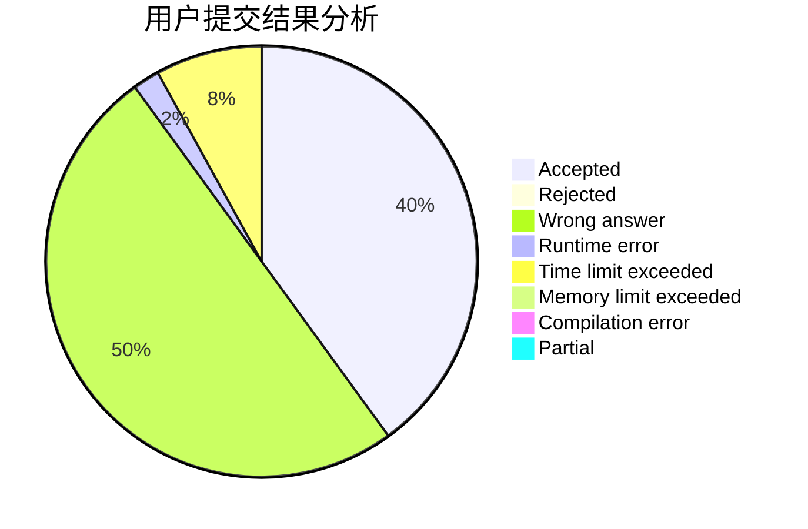
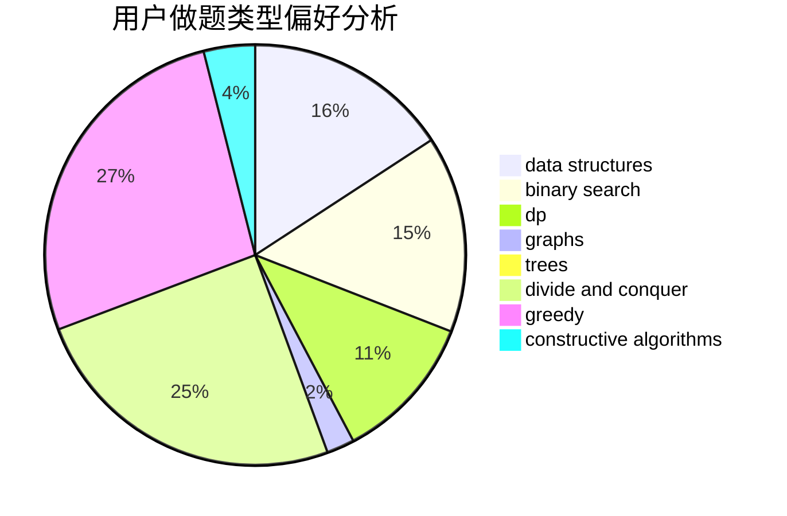
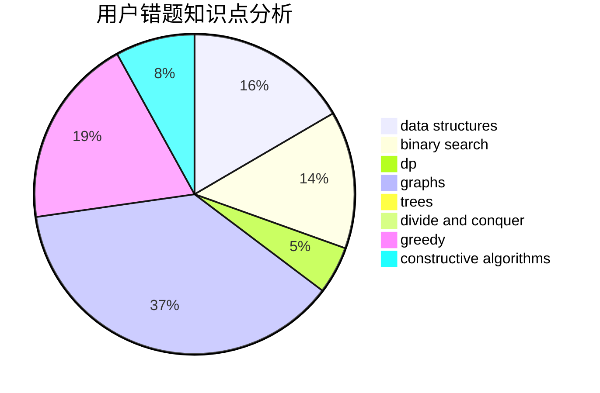

# Phoenix_zenghao

<!-- tabs:start -->

#### **用户提交结果分析**

#### **用户做题类型偏好分析**

#### **用户错题知识点分析**

<!-- tabs:end -->
# 推荐题目
[1307F](https://codeforces.com/contest/1307/problem/F)		dfs and similar,
                        dsu,
                        trees		  
[643G](https://codeforces.com/contest/643/problem/G)		data structures		  
[835F](https://codeforces.com/contest/835/problem/F)		dfs and similar,
                        dp,
                        graphs,
                        trees		  
[1173A](https://codeforces.com/contest/1173/problem/A)		greedy		  
[1510D](https://codeforces.com/contest/1510/problem/D)		dp,
                        math,
                        number theory		  
[660D](https://codeforces.com/contest/660/problem/D)		geometry		  
[908A](https://codeforces.com/contest/908/problem/A)		brute force,
                        implementation		  
[1204B](https://codeforces.com/contest/1204/problem/B)		greedy,
                        math		  
[28B](https://codeforces.com/contest/28/problem/B)		dfs and similar,
                        dsu,
                        graphs		  
[884F](https://codeforces.com/contest/884/problem/F)		flows,
                        graphs,
                        greedy		  
