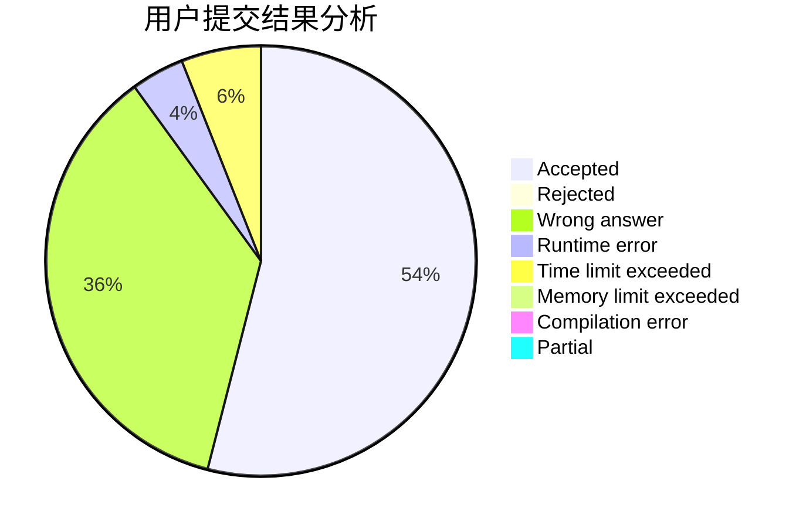
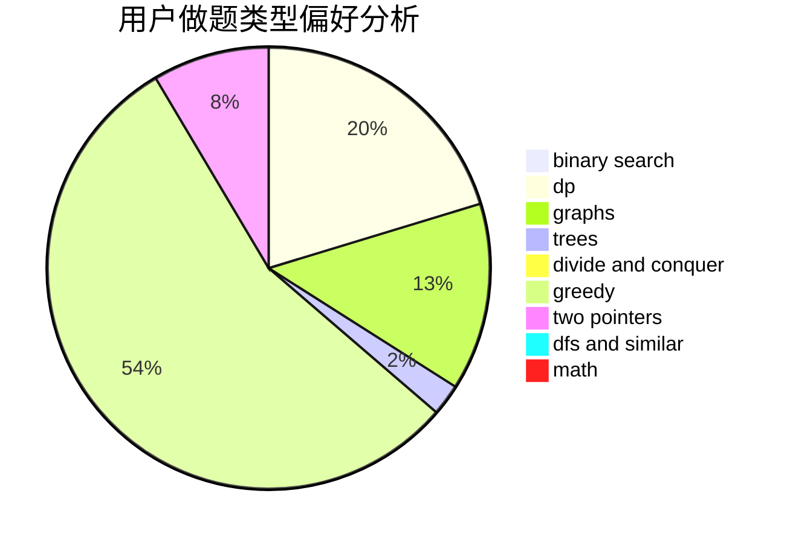

# ACM_killer

<!-- tabs:start -->

#### **用户提交结果分析**

#### **用户做题类型偏好分析**

<!-- tabs:end -->
# 推荐题目
[1295D](https://codeforces.com/contest/1295/problem/D)
[1194F](https://codeforces.com/contest/1194/problem/F)
[1482B](https://codeforces.com/contest/1482/problem/B)
[1482C](https://codeforces.com/contest/1482/problem/C)
[12492](https://codeforces.com/contest/1249/problem/2)
[1000B](https://codeforces.com/contest/1000/problem/B)
[1370C](https://codeforces.com/contest/1370/problem/C)
[1481D](https://codeforces.com/contest/1481/problem/D)
[1442A](https://codeforces.com/contest/1442/problem/A)
[10E](https://codeforces.com/contest/10/problem/E)
