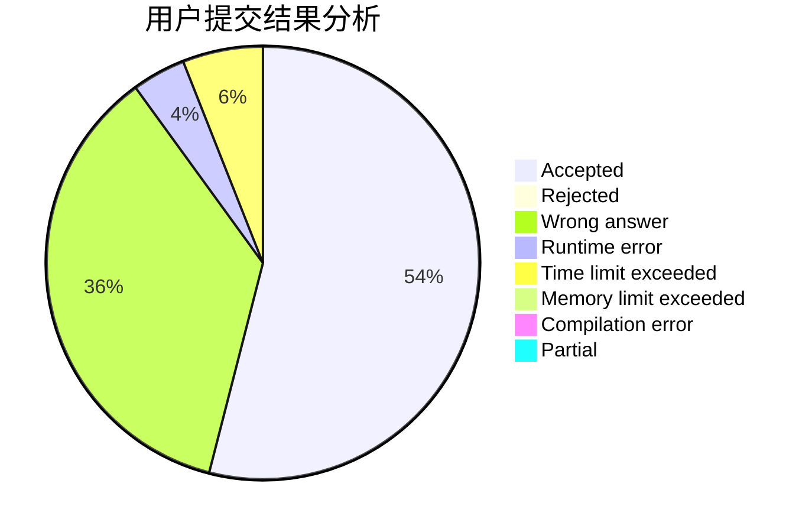
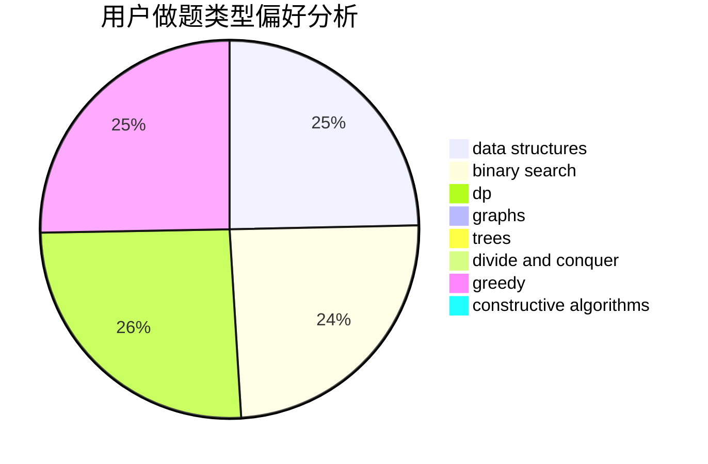
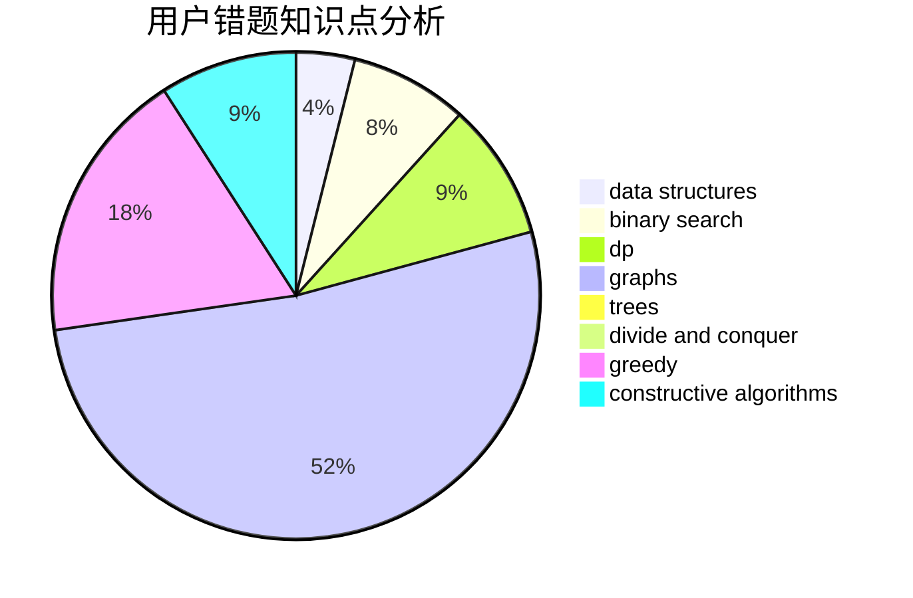

# ACM_killer

<!-- tabs:start -->

#### **用户提交结果分析**

#### **用户做题类型偏好分析**

#### **用户错题知识点分析**

<!-- tabs:end -->
# 推荐题目
[1288B](https://codeforces.com/contest/1288/problem/B)		math		  
[1189D1](https://codeforces.com/contest/1189D/problem/1)		dsu,graphs,sortings,trees		  
[1473E](https://codeforces.com/contest/1473/problem/E)		graphs,
                        shortest paths		  
[1473F](https://codeforces.com/contest/1473/problem/F)		flows,
                        math		  
[1244A](https://codeforces.com/contest/1244/problem/A)		math		  
[1000B](https://codeforces.com/contest/1000/problem/B)		greedy		  
[1363D](https://codeforces.com/contest/1363/problem/D)		binary search,
                        implementation,
                        interactive,
                        math		  
[1473A](https://codeforces.com/contest/1473/problem/A)		greedy,
                        implementation,
                        math,
                        sortings		  
[1432B](https://codeforces.com/contest/1432/problem/B)		dsu,graphs,sortings,trees		  
[10B](https://codeforces.com/contest/10/problem/B)		dp,
                        implementation		  
