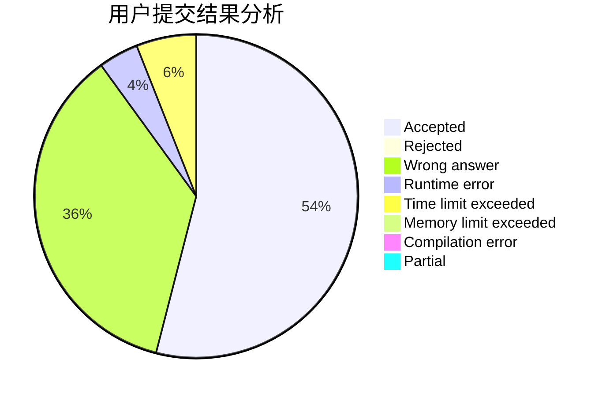
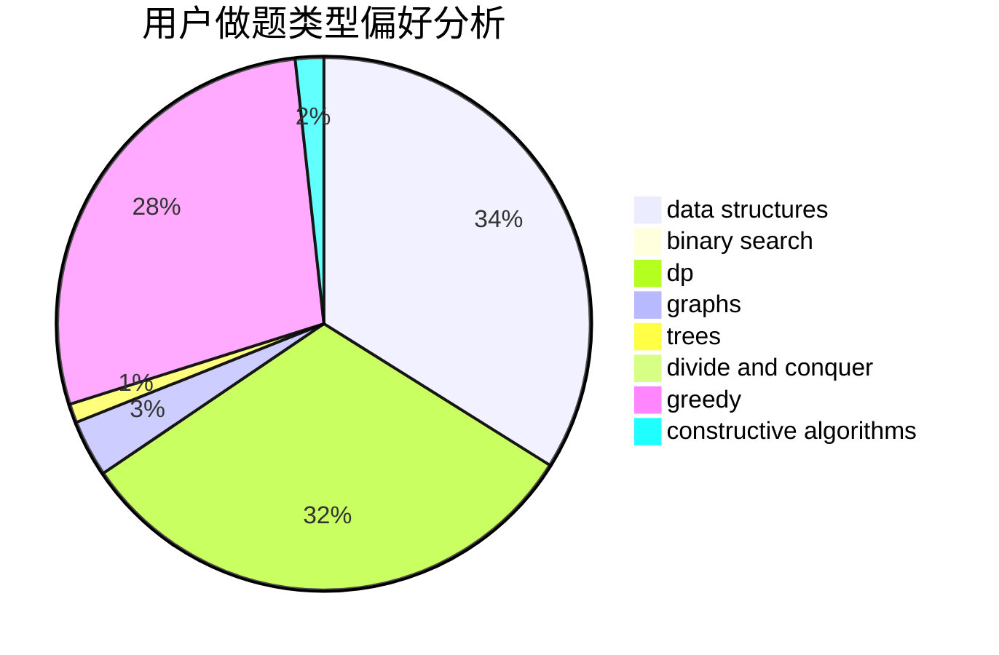
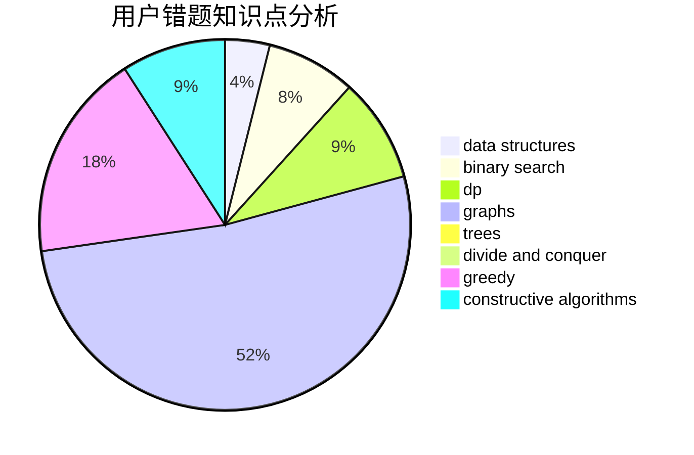

# ACM_killer

<!-- tabs:start -->

#### **用户提交结果分析**

#### **用户做题类型偏好分析**

#### **用户错题知识点分析**

<!-- tabs:end -->
# 推荐题目
[1295D](https://codeforces.com/contest/1295/problem/D)		math,
                        number theory		  
[1194F](https://codeforces.com/contest/1194/problem/F)		combinatorics,
                        dp,
                        number theory,
                        probabilities,
                        two pointers		  
[1482B](https://codeforces.com/contest/1482/problem/B)		implementation,
                        math		  
[1482C](https://codeforces.com/contest/1482/problem/C)		brute force,
                        constructive algorithms,
                        greedy,
                        implementation		  
[12492](https://codeforces.com/contest/1249/problem/2)		dsu,graphs,sortings,trees		  
[1000B](https://codeforces.com/contest/1000/problem/B)		greedy		  
[1370C](https://codeforces.com/contest/1370/problem/C)		games,
                        math,
                        number theory		  
[1481D](https://codeforces.com/contest/1481/problem/D)		brute force,
                        constructive algorithms,
                        graphs,
                        greedy,
                        implementation		  
[1442A](https://codeforces.com/contest/1442/problem/A)		constructive algorithms,
                        dp,
                        greedy		  
[10E](https://codeforces.com/contest/10/problem/E)		constructive algorithms		  
