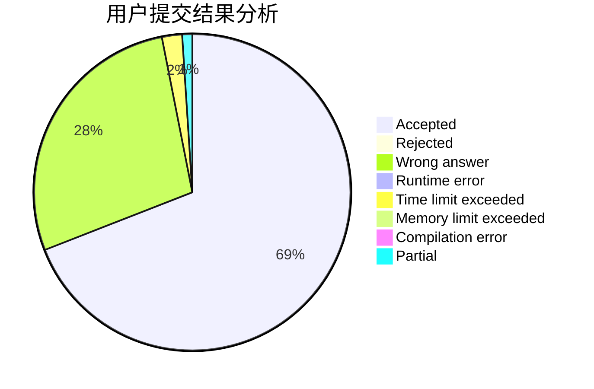
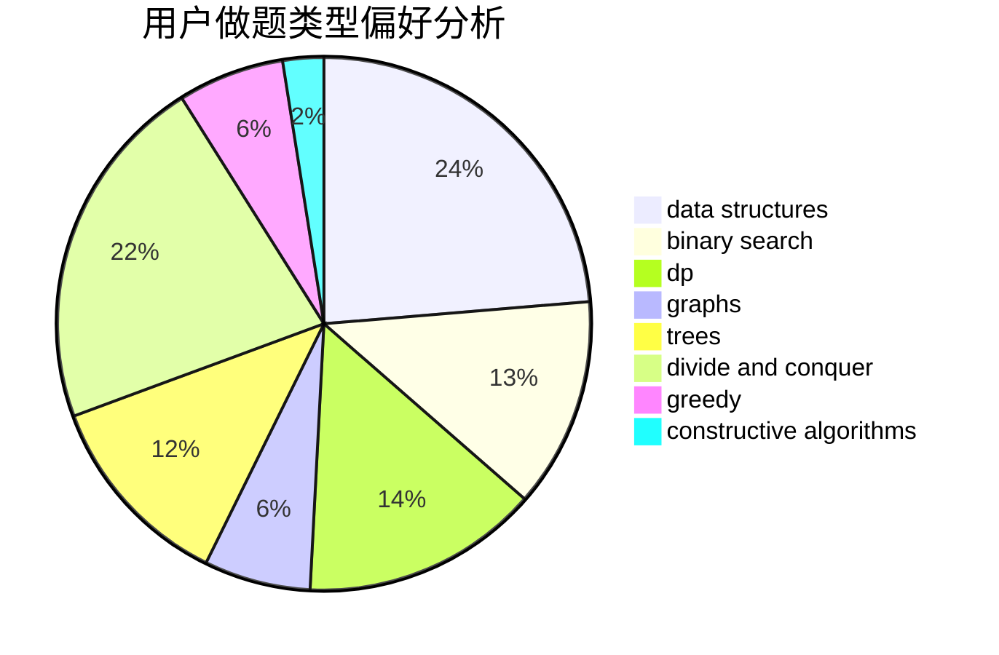
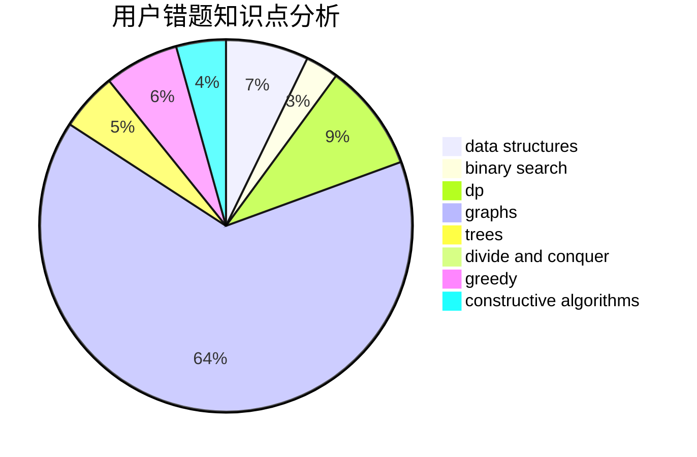

# Pigbrain

<!-- tabs:start -->

#### **用户提交结果分析**

#### **用户做题类型偏好分析**

#### **用户错题知识点分析**

<!-- tabs:end -->
# 推荐题目
[1483F](https://codeforces.com/contest/1483/problem/F)		dsu,graphs,sortings,trees		  
[1310D](https://codeforces.com/contest/1310/problem/D)		dp,
                        graphs,
                        probabilities		  
[762A](https://codeforces.com/contest/762/problem/A)		math,
                        number theory		  
[429D](https://codeforces.com/contest/429/problem/D)		data structures,
                        divide and conquer,
                        geometry		  
[1411A](https://codeforces.com/contest/1411/problem/A)		implementation		  
[1264F](https://codeforces.com/contest/1264/problem/F)		constructive algorithms,
                        number theory		  
[681B](https://codeforces.com/contest/681/problem/B)		brute force		  
[846E](https://codeforces.com/contest/846/problem/E)		dfs and similar,
                        greedy,
                        trees		  
[787B](https://codeforces.com/contest/787/problem/B)		greedy,
                        implementation,
                        math		  
[1121A](https://codeforces.com/contest/1121/problem/A)		implementation,
                        sortings		  
