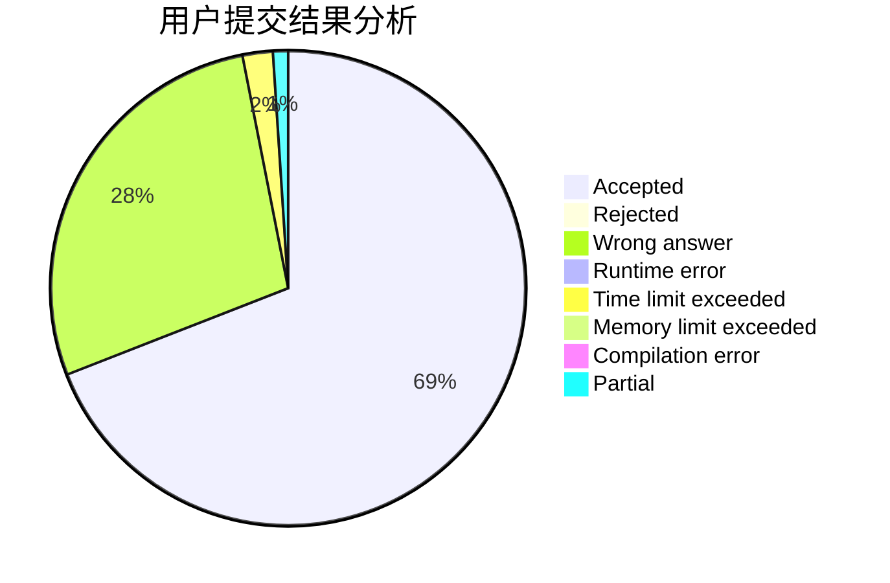
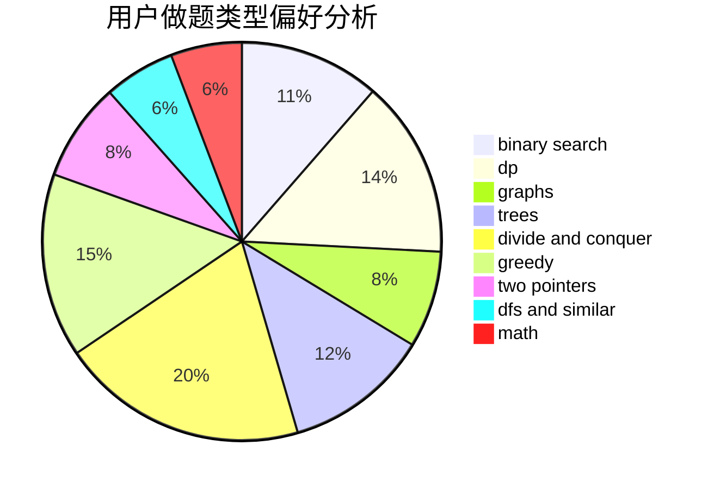

# Pigbrain

<!-- tabs:start -->

#### **用户提交结果分析**

#### **用户做题类型偏好分析**

<!-- tabs:end -->
# 推荐题目
[1483F](https://codeforces.com/contest/1483/problem/F)
[1310D](https://codeforces.com/contest/1310/problem/D)
[762A](https://codeforces.com/contest/762/problem/A)
[429D](https://codeforces.com/contest/429/problem/D)
[1411A](https://codeforces.com/contest/1411/problem/A)
[1264F](https://codeforces.com/contest/1264/problem/F)
[681B](https://codeforces.com/contest/681/problem/B)
[846E](https://codeforces.com/contest/846/problem/E)
[787B](https://codeforces.com/contest/787/problem/B)
[1121A](https://codeforces.com/contest/1121/problem/A)
