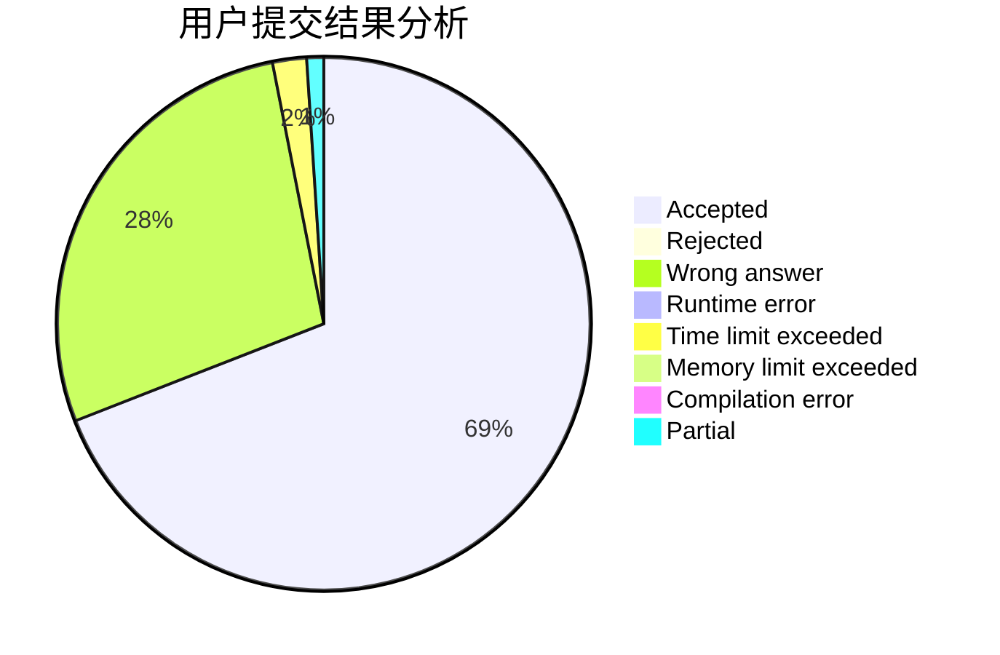
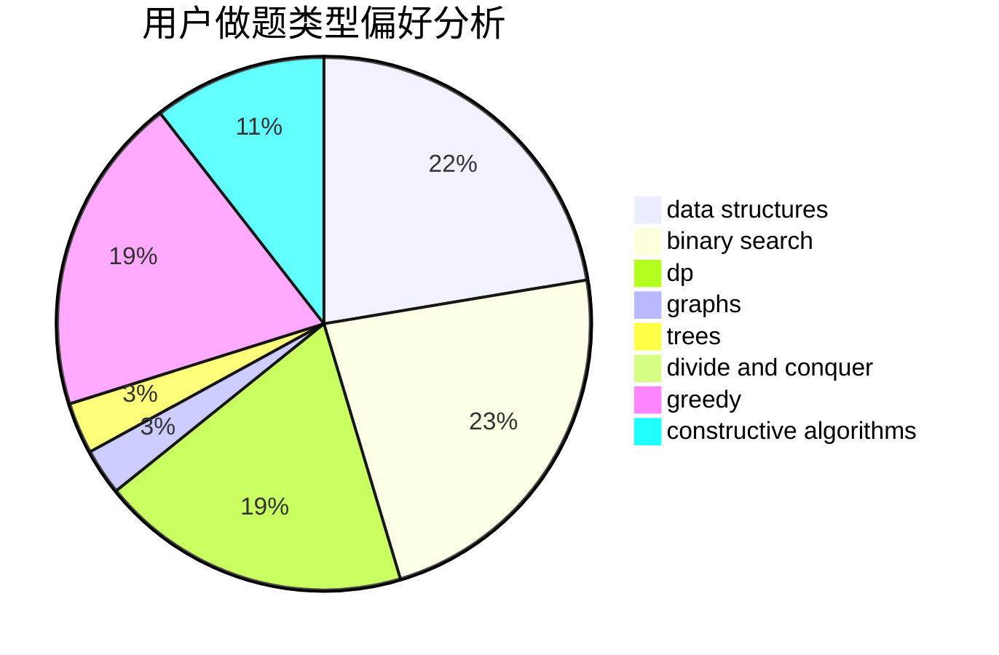
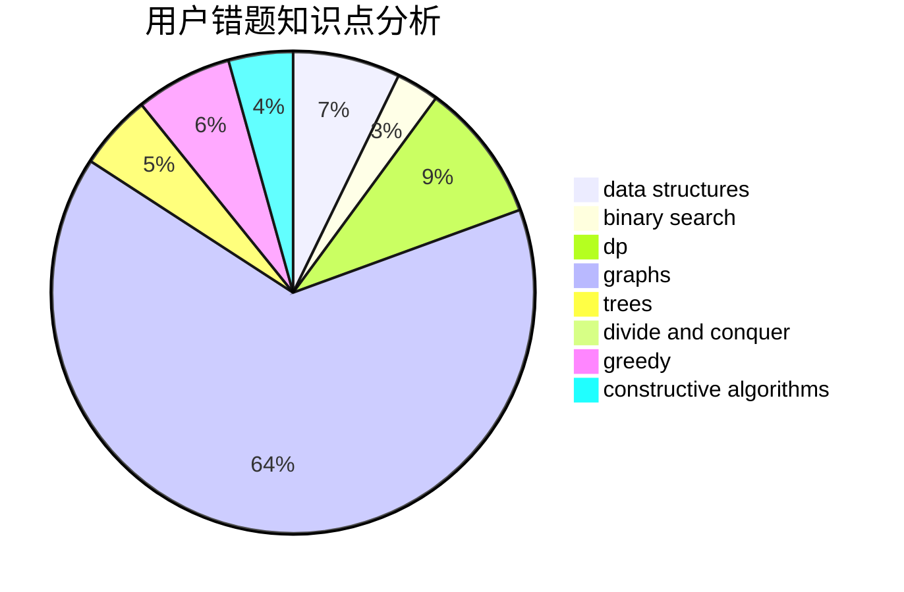

# Pigbrain

<!-- tabs:start -->

#### **用户提交结果分析**

#### **用户做题类型偏好分析**

#### **用户错题知识点分析**

<!-- tabs:end -->
# 推荐题目
[1475C](https://codeforces.com/contest/1475/problem/C)		combinatorics,
                        graphs,
                        math		  
[1301A](https://codeforces.com/contest/1301/problem/A)		implementation,
                        strings		  
[741A](https://codeforces.com/contest/741/problem/A)		dfs and similar,
                        math		  
[3C](https://codeforces.com/contest/3/problem/C)		brute force,
                        games,
                        implementation		  
[1400F](https://codeforces.com/contest/1400/problem/F)		brute force,
                        dfs and similar,
                        dp,
                        string suffix structures,
                        strings		  
[1257E](https://codeforces.com/contest/1257/problem/E)		data structures,
                        dp,
                        greedy		  
[660D](https://codeforces.com/contest/660/problem/D)		geometry		  
[828B](https://codeforces.com/contest/828/problem/B)		implementation		  
[767E](https://codeforces.com/contest/767/problem/E)		greedy		  
[1119A](https://codeforces.com/contest/1119/problem/A)		greedy,
                        implementation		  
