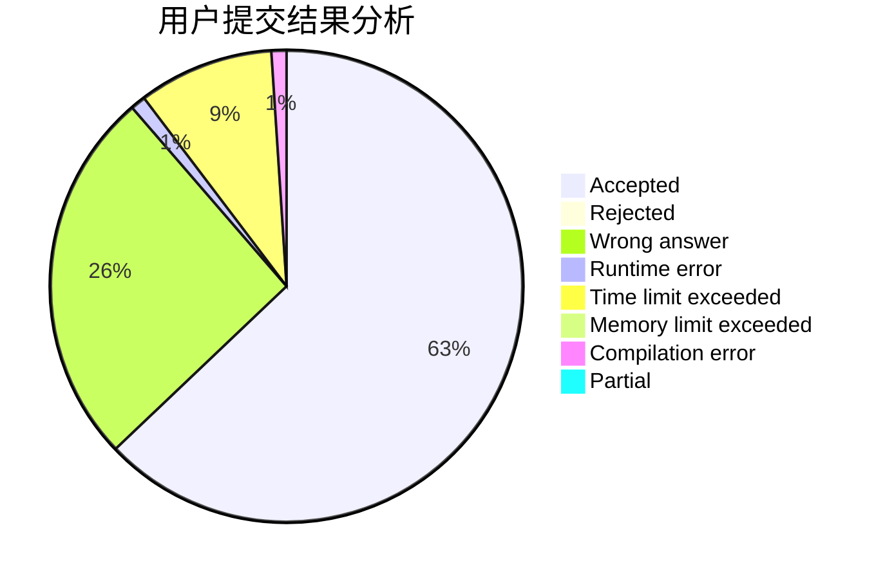
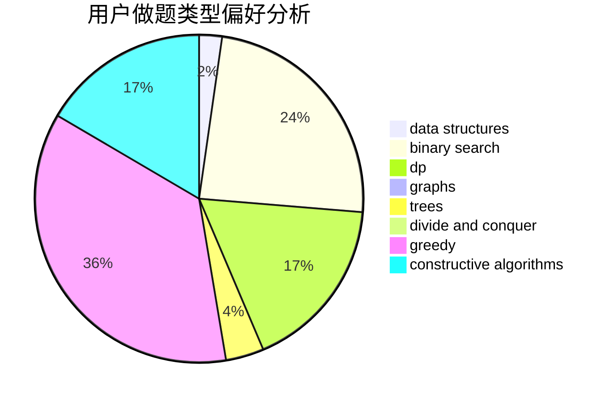
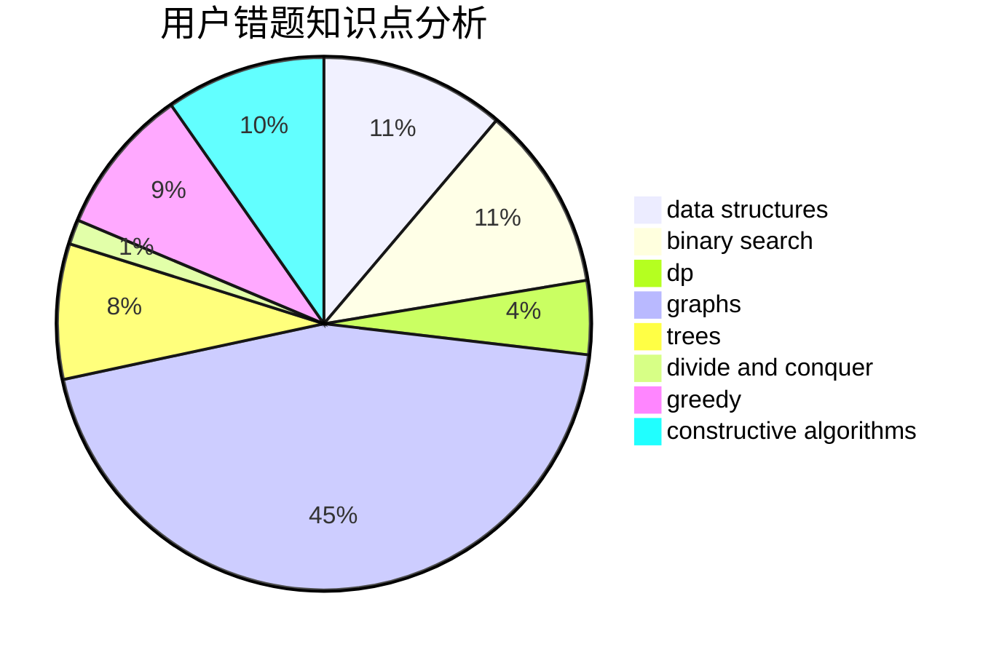

# PinkRabbit

<!-- tabs:start -->

#### **用户提交结果分析**

#### **用户做题类型偏好分析**

#### **用户错题知识点分析**

<!-- tabs:end -->
# 推荐题目
[1456B](https://codeforces.com/contest/1456/problem/B)		dsu,graphs,sortings,trees		  
[633B](https://codeforces.com/contest/633/problem/B)		brute force,
                        constructive algorithms,
                        math,
                        number theory		  
[1104B](https://codeforces.com/contest/1104/problem/B)		data structures,
                        implementation,
                        math		  
[538H](https://codeforces.com/contest/538/problem/H)		2-sat,
                        data structures,
                        dfs and similar,
                        greedy		  
[756D](https://codeforces.com/contest/756/problem/D)		brute force,
                        combinatorics,
                        dp,
                        string suffix structures		  
[136D](https://codeforces.com/contest/136/problem/D)		dsu,graphs,sortings,trees		  
[924E](https://codeforces.com/contest/924/problem/E)		nan		  
[38G](https://codeforces.com/contest/38/problem/G)		data structures		  
[1005E1](https://codeforces.com/contest/1005E/problem/1)		sortings		  
[1206B](https://codeforces.com/contest/1206/problem/B)		dp,
                        implementation		  
