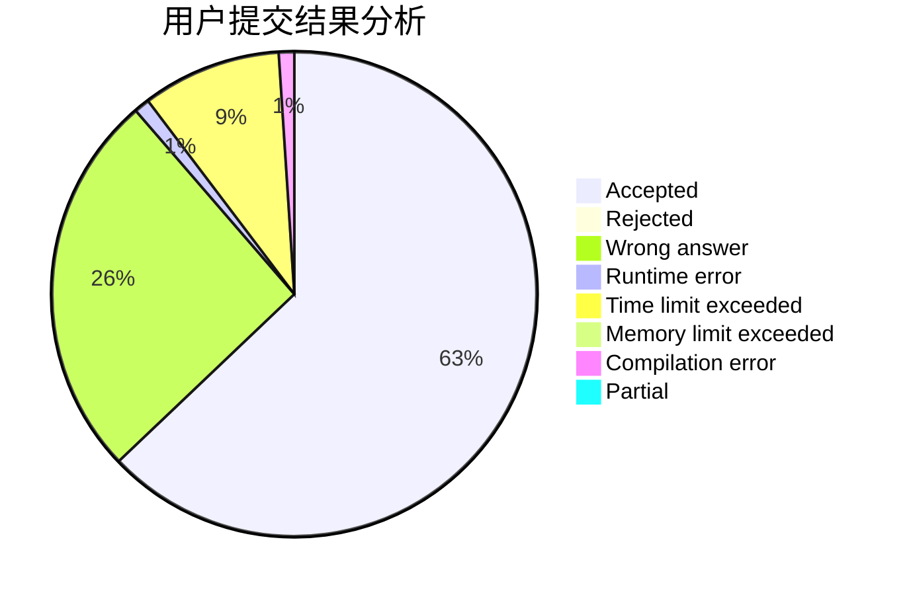
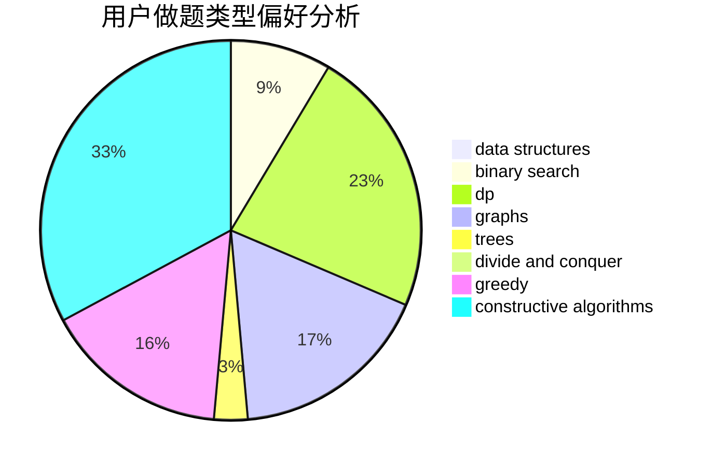
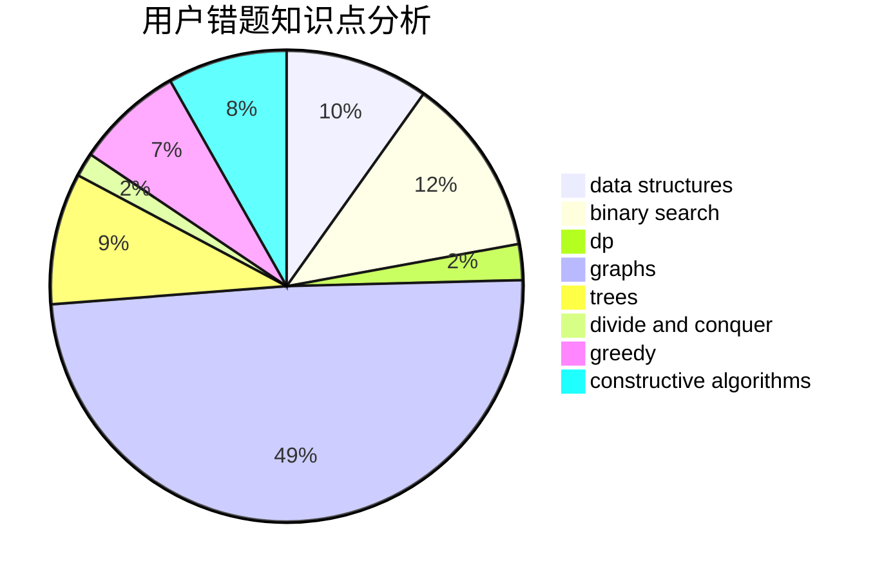

# PinkRabbit

<!-- tabs:start -->

#### **用户提交结果分析**

#### **用户做题类型偏好分析**

#### **用户错题知识点分析**

<!-- tabs:end -->
# 推荐题目
[1465F](https://codeforces.com/contest/1465/problem/F)		dsu,graphs,sortings,trees		  
[665D](https://codeforces.com/contest/665/problem/D)		constructive algorithms,
                        greedy,
                        number theory		  
[1104E](https://codeforces.com/contest/1104/problem/E)		dsu,graphs,sortings,trees		  
[55C](https://codeforces.com/contest/55/problem/C)		games		  
[776B](https://codeforces.com/contest/776/problem/B)		constructive algorithms,
                        number theory		  
[13782](https://codeforces.com/contest/1378/problem/2)		dsu,graphs,sortings,trees		  
[948C](https://codeforces.com/contest/948/problem/C)		dsu,graphs,sortings,trees		  
[41E](https://codeforces.com/contest/41/problem/E)		constructive algorithms,
                        graphs,
                        greedy		  
[1006A](https://codeforces.com/contest/1006/problem/A)		implementation		  
[1210C](https://codeforces.com/contest/1210/problem/C)		math,
                        number theory,
                        trees		  
