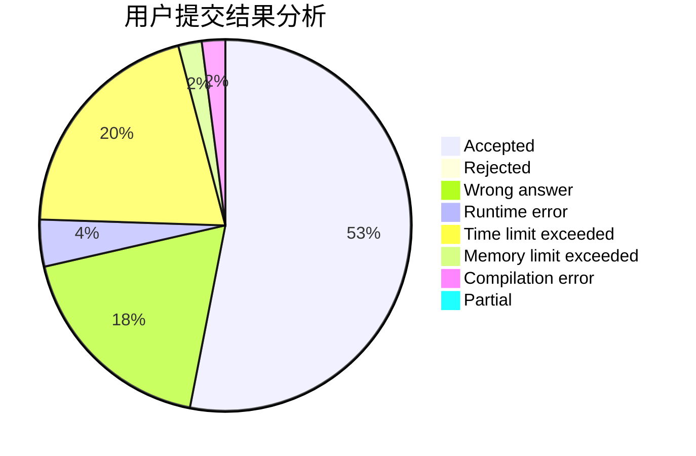
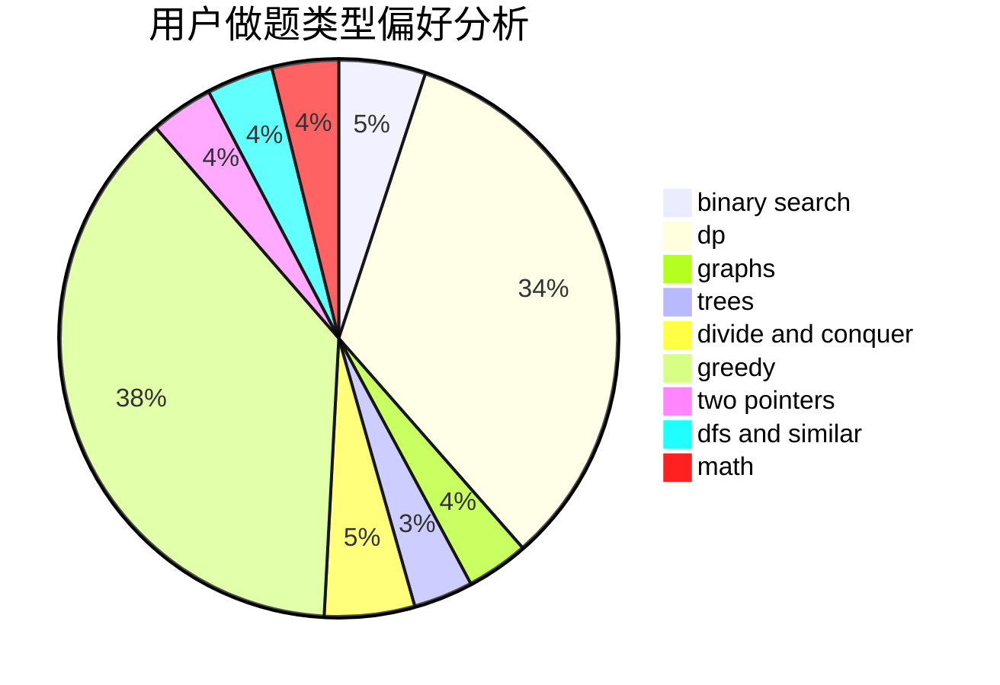

# PinkieRabbit

<!-- tabs:start -->

#### **用户提交结果分析**

#### **用户做题类型偏好分析**

<!-- tabs:end -->
# 推荐题目
[385E](https://codeforces.com/contest/385/problem/E)
[991E](https://codeforces.com/contest/991/problem/E)
[27D](https://codeforces.com/contest/27/problem/D)
[978E](https://codeforces.com/contest/978/problem/E)
[629E](https://codeforces.com/contest/629/problem/E)
[723D](https://codeforces.com/contest/723/problem/D)
[468E](https://codeforces.com/contest/468/problem/E)
[878D](https://codeforces.com/contest/878/problem/D)
[540B](https://codeforces.com/contest/540/problem/B)
[834B](https://codeforces.com/contest/834/problem/B)
