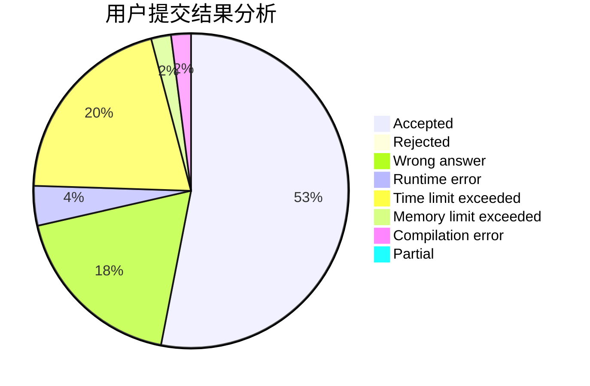
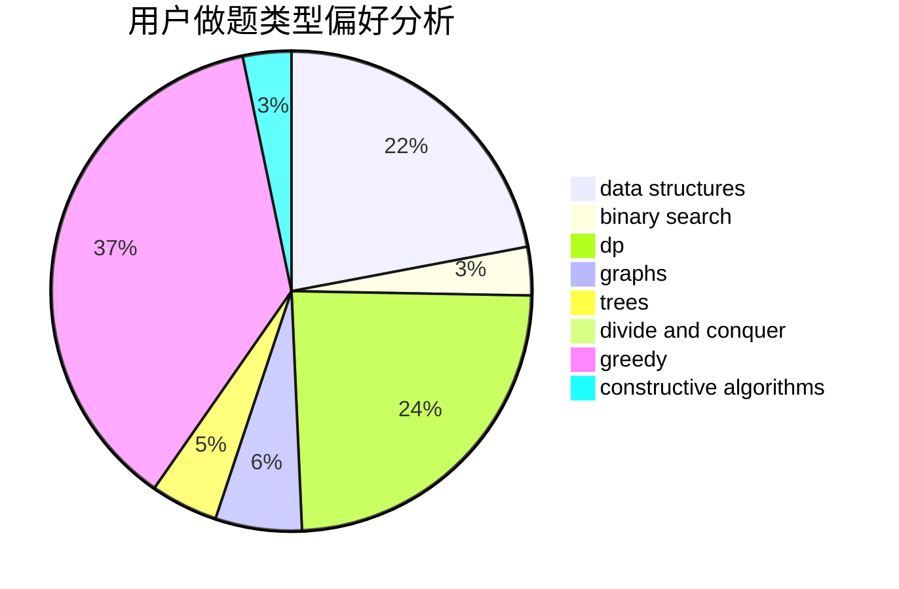
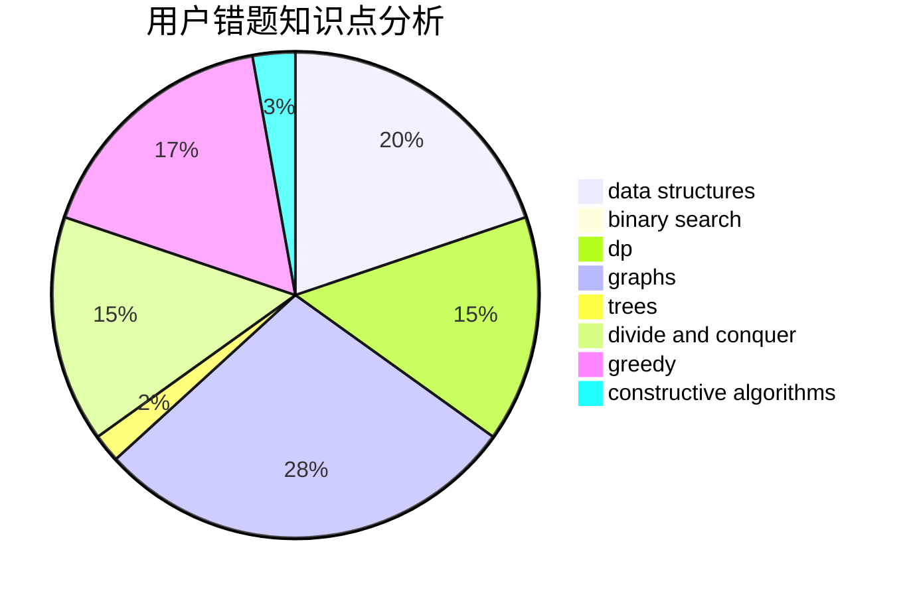

# PinkieRabbit

<!-- tabs:start -->

#### **用户提交结果分析**

#### **用户做题类型偏好分析**

#### **用户错题知识点分析**

<!-- tabs:end -->
# 推荐题目
[359B](https://codeforces.com/contest/359/problem/B)		constructive algorithms,
                        dp,
                        math		  
[978A](https://codeforces.com/contest/978/problem/A)		implementation		  
[263A](https://codeforces.com/contest/263/problem/A)		implementation		  
[957B](https://codeforces.com/contest/957/problem/B)		dsu,graphs,sortings,trees		  
[610C](https://codeforces.com/contest/610/problem/C)		constructive algorithms		  
[704D](https://codeforces.com/contest/704/problem/D)		flows,
                        greedy		  
[449B](https://codeforces.com/contest/449/problem/B)		graphs,
                        greedy,
                        shortest paths		  
[860D](https://codeforces.com/contest/860/problem/D)		dsu,graphs,sortings,trees		  
[514D](https://codeforces.com/contest/514/problem/D)		binary search,
                        data structures,
                        two pointers		  
[815B](https://codeforces.com/contest/815/problem/B)		brute force,
                        combinatorics,
                        constructive algorithms,
                        math		  
