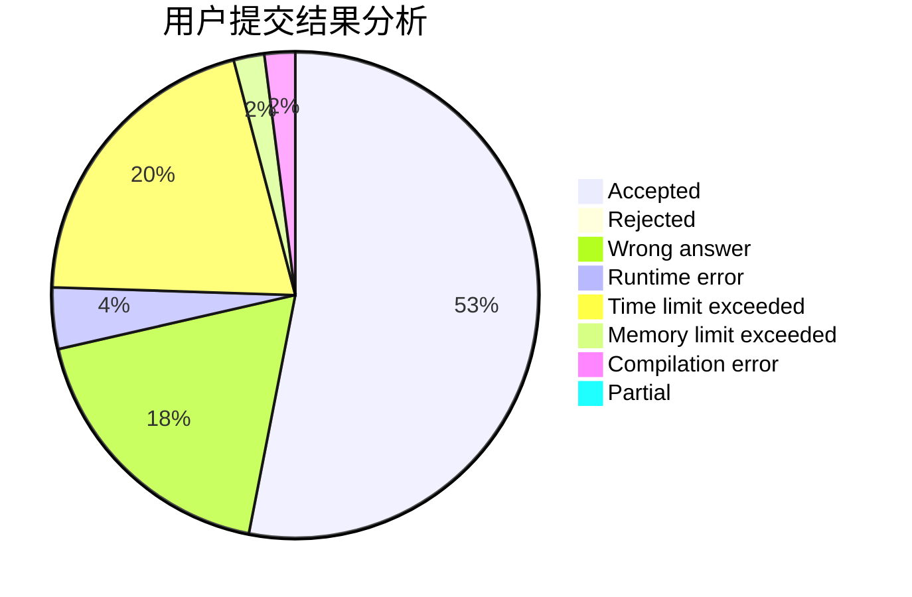
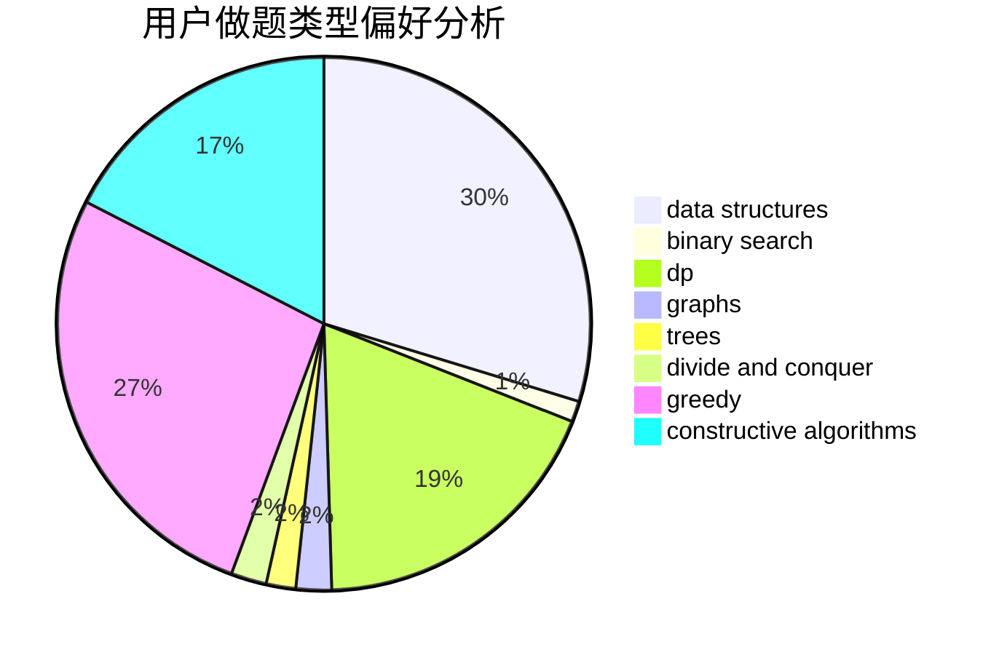
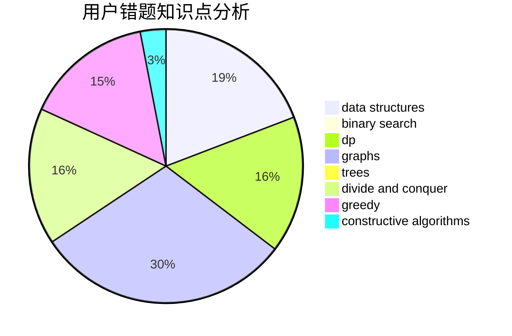

# PinkieRabbit

<!-- tabs:start -->

#### **用户提交结果分析**

#### **用户做题类型偏好分析**

#### **用户错题知识点分析**

<!-- tabs:end -->
# 推荐题目
[385E](https://codeforces.com/contest/385/problem/E)		math,
                        matrices		  
[991E](https://codeforces.com/contest/991/problem/E)		brute force,
                        combinatorics,
                        math		  
[27D](https://codeforces.com/contest/27/problem/D)		2-sat,
                        dfs and similar,
                        dsu,
                        graphs		  
[978E](https://codeforces.com/contest/978/problem/E)		combinatorics,
                        math		  
[629E](https://codeforces.com/contest/629/problem/E)		combinatorics,
                        data structures,
                        dfs and similar,
                        dp,
                        probabilities,
                        trees		  
[723D](https://codeforces.com/contest/723/problem/D)		dfs and similar,
                        dsu,
                        graphs,
                        greedy,
                        implementation		  
[468E](https://codeforces.com/contest/468/problem/E)		dp,
                        graph matchings,
                        math,
                        meet-in-the-middle		  
[878D](https://codeforces.com/contest/878/problem/D)		bitmasks		  
[540B](https://codeforces.com/contest/540/problem/B)		greedy,
                        implementation		  
[834B](https://codeforces.com/contest/834/problem/B)		data structures,
                        implementation		  
