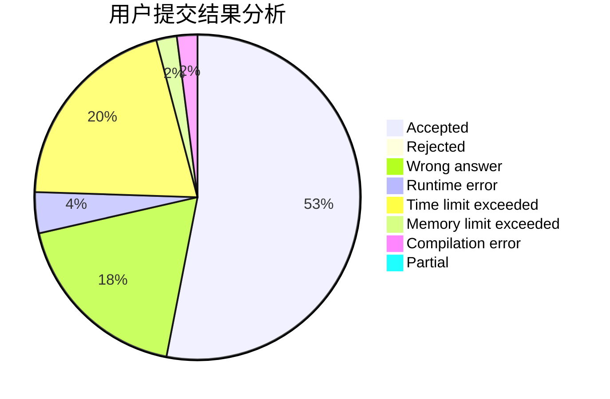
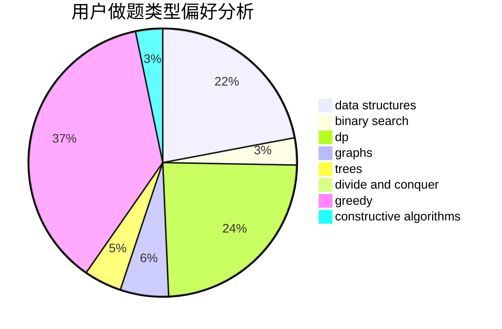
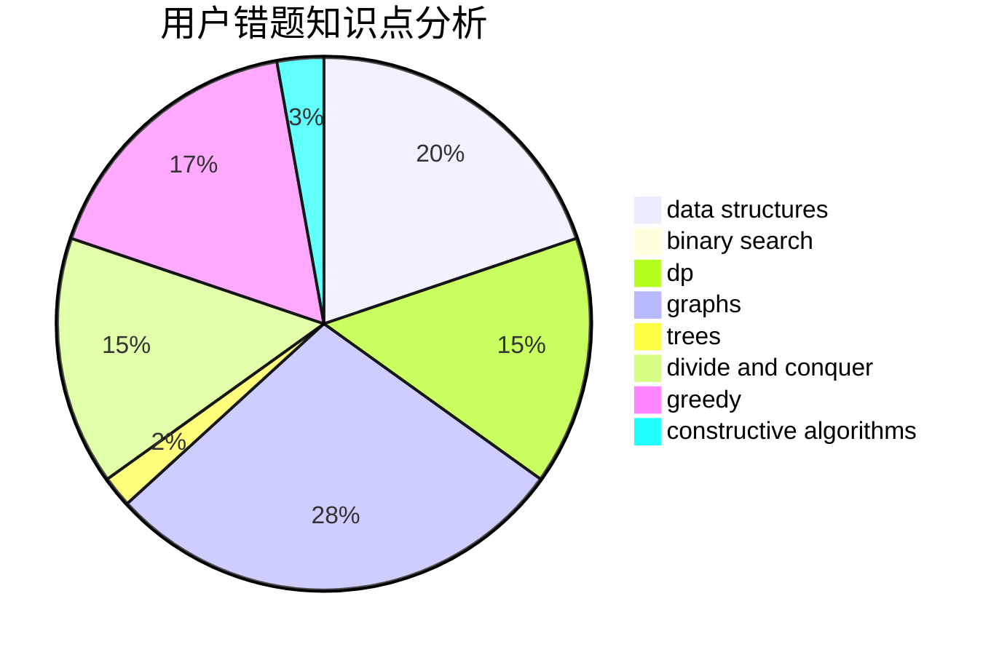

# PinkieRabbit
<!-- tabs:start -->
#### **用户提交结果分析**

#### **用户做题类型偏好分析**

#### **用户错题知识点分析**

<!-- tabs:end -->
# 推荐题目
[Beautiful Matrix](http://codeforces.com/problemset/problem/263/A)		implementation		  
[Mystical Mosaic](https://codeforces.com/contest/957/problem/B)		greedy,
                        implementation		  
[R2D2 and Droid Army](http://codeforces.com/problemset/problem/514/D)		binary search,
                        data structures,
                        two pointers		  
[Harmony Analysis](http://codeforces.com/problemset/problem/610/C)		constructive algorithms		  
[Remove Duplicates](http://codeforces.com/problemset/problem/978/A)		implementation		  
[Tetris revisited](http://codeforces.com/problemset/problem/86/B)		constructive algorithms,
                        graph matchings,
                        greedy,
                        math		  
[A Colourful Prospect](https://codeforces.com/contest/934/problem/E)		geometry,
                        graphs		  
[The Minimum Number of Variables](http://codeforces.com/problemset/problem/279/D)		bitmasks,
                        dp		  
[Karen and Test](http://codeforces.com/problemset/problem/815/B)		brute force,
                        combinatorics,
                        constructive algorithms,
                        math		  
[Niyaz and Small Degrees](http://codeforces.com/problemset/problem/1119/F)		data structures,
                        dp,
                        trees		  
<!-- tabs:start -->
#### **data structures**
[Beautiful Matrix](http://codeforces.com/problemset/problem/514/D)		binary search,
                        data structures,
                        two pointers		  
[Mystical Mosaic](http://codeforces.com/problemset/problem/1119/F)		data structures,
                        dp,
                        trees		  
[R2D2 and Droid Army](http://codeforces.com/problemset/problem/808/B)		data structures,
                        implementation,
                        math		  
[Harmony Analysis](http://codeforces.com/problemset/problem/1209/H)		data structures,
                        greedy,
                        math		  
[Remove Duplicates](http://codeforces.com/problemset/problem/1141/F2)		data structures,
                        greedy		  
[Tetris revisited](http://codeforces.com/problemset/problem/400/E)		binary search,
                        bitmasks,
                        data structures		  
[A Colourful Prospect](http://codeforces.com/problemset/problem/573/B)		binary search,
                        data structures,
                        dp,
                        math		  
[The Minimum Number of Variables](http://codeforces.com/problemset/problem/339/D)		data structures,
                        trees		  
[Karen and Test](http://codeforces.com/problemset/problem/678/F)		data structures,
                        divide and conquer,
                        geometry		  
[Niyaz and Small Degrees](http://codeforces.com/problemset/problem/603/E)		data structures,
                        divide and conquer,
                        dsu,
                        math,
                        trees		  
#### **binary search**
[Beautiful Matrix](http://codeforces.com/problemset/problem/514/D)		binary search,
                        data structures,
                        two pointers		  
[Mystical Mosaic](http://codeforces.com/problemset/problem/400/E)		binary search,
                        bitmasks,
                        data structures		  
[R2D2 and Droid Army](http://codeforces.com/problemset/problem/573/B)		binary search,
                        data structures,
                        dp,
                        math		  
[Harmony Analysis](http://codeforces.com/problemset/problem/1348/D)		binary search,
                        constructive algorithms,
                        greedy,
                        implementation,
                        math		  
[Remove Duplicates](http://codeforces.com/problemset/problem/1492/C)		binary search,
                        data structures,
                        dp,
                        greedy,
                        two pointers		  
[Tetris revisited](http://codeforces.com/problemset/problem/1463/D)		binary search,
                        constructive algorithms,
                        greedy,
                        two pointers		  
[A Colourful Prospect](http://codeforces.com/problemset/problem/1490/G)		binary search,
                        data structures,
                        math		  
[The Minimum Number of Variables](http://codeforces.com/problemset/problem/1479/D)		binary search,
                        bitmasks,
                        brute force,
                        data structures,
                        probabilities,
                        trees		  
[Karen and Test](http://codeforces.com/problemset/problem/1436/E)		binary search,
                        data structures,
                        two pointers		  
[Niyaz and Small Degrees](http://codeforces.com/problemset/problem/1461/D)		binary search,
                        brute force,
                        data structures,
                        divide and conquer,
                        implementation,
                        sortings		  
#### **dp**
[Beautiful Matrix](http://codeforces.com/problemset/problem/279/D)		bitmasks,
                        dp		  
[Mystical Mosaic](http://codeforces.com/problemset/problem/1119/F)		data structures,
                        dp,
                        trees		  
[R2D2 and Droid Army](http://codeforces.com/problemset/problem/1027/E)		combinatorics,
                        dp,
                        math		  
[Harmony Analysis](http://codeforces.com/problemset/problem/1151/B)		bitmasks,
                        brute force,
                        constructive algorithms,
                        dp		  
[Remove Duplicates](https://codeforces.com/contest/512/problem/B)		bitmasks,
                        brute force,
                        dp,
                        math		  
[Tetris revisited](http://codeforces.com/problemset/problem/268/D)		dp		  
[A Colourful Prospect](http://codeforces.com/problemset/problem/573/B)		binary search,
                        data structures,
                        dp,
                        math		  
[The Minimum Number of Variables](http://codeforces.com/problemset/problem/359/B)		constructive algorithms,
                        dp,
                        math		  
[Karen and Test](http://codeforces.com/problemset/problem/446/A)		dp,
                        implementation,
                        two pointers		  
[Niyaz and Small Degrees](http://codeforces.com/problemset/problem/1158/F)		dp,
                        math		  
#### **graph**
[Beautiful Matrix](http://codeforces.com/problemset/problem/86/B)		constructive algorithms,
                        graph matchings,
                        greedy,
                        math		  
[Mystical Mosaic](https://codeforces.com/contest/934/problem/E)		geometry,
                        graphs		  
[R2D2 and Droid Army](https://codeforces.com/contest/860/problem/D)		constructive algorithms,
                        dfs and similar,
                        graphs		  
[Harmony Analysis](http://codeforces.com/problemset/problem/441/D)		constructive algorithms,
                        dsu,
                        graphs,
                        implementation,
                        math,
                        string suffix structures		  
[Remove Duplicates](http://codeforces.com/problemset/problem/449/B)		graphs,
                        greedy,
                        shortest paths		  
[Tetris revisited](http://codeforces.com/problemset/problem/1487/C)		brute force,
                        constructive algorithms,
                        dfs and similar,
                        graphs,
                        greedy,
                        implementation,
                        math		  
[A Colourful Prospect](http://codeforces.com/problemset/problem/1437/C)		dp,
                        flows,
                        graph matchings,
                        greedy,
                        math,
                        sortings		  
[The Minimum Number of Variables](http://codeforces.com/problemset/problem/1470/D)		constructive algorithms,
                        dfs and similar,
                        graph matchings,
                        graphs,
                        greedy		  
[Karen and Test](http://codeforces.com/problemset/problem/1476/C)		dp,
                        graphs,
                        greedy		  
[Niyaz and Small Degrees](http://codeforces.com/problemset/problem/1304/D)		constructive algorithms,
                        graphs,
                        greedy,
                        two pointers		  
#### **trees**
[Beautiful Matrix](http://codeforces.com/problemset/problem/1119/F)		data structures,
                        dp,
                        trees		  
[Mystical Mosaic](http://codeforces.com/problemset/problem/339/D)		data structures,
                        trees		  
[R2D2 and Droid Army](http://codeforces.com/problemset/problem/581/F)		dp,
                        trees,
                        two pointers		  
[Harmony Analysis](http://codeforces.com/problemset/problem/603/E)		data structures,
                        divide and conquer,
                        dsu,
                        math,
                        trees		  
[Remove Duplicates](http://codeforces.com/problemset/problem/1479/D)		binary search,
                        bitmasks,
                        brute force,
                        data structures,
                        probabilities,
                        trees		  
[Tetris revisited](http://codeforces.com/problemset/problem/1511/C)		brute force,
                        data structures,
                        implementation,
                        trees		  
[A Colourful Prospect](http://codeforces.com/problemset/problem/1499/F)		combinatorics,
                        dfs and similar,
                        dp,
                        trees		  
[The Minimum Number of Variables](http://codeforces.com/problemset/problem/1491/E)		brute force,
                        dfs and similar,
                        divide and conquer,
                        number theory,
                        trees		  
[Karen and Test](http://codeforces.com/problemset/problem/1466/D)		data structures,
                        greedy,
                        sortings,
                        trees		  
[Niyaz and Small Degrees](http://codeforces.com/problemset/problem/1495/D)		combinatorics,
                        dfs and similar,
                        graphs,
                        math,
                        shortest paths,
                        trees		  
#### **divide and conquer**
[Beautiful Matrix](http://codeforces.com/problemset/problem/678/F)		data structures,
                        divide and conquer,
                        geometry		  
[Mystical Mosaic](http://codeforces.com/problemset/problem/603/E)		data structures,
                        divide and conquer,
                        dsu,
                        math,
                        trees		  
[R2D2 and Droid Army](http://codeforces.com/problemset/problem/1461/D)		binary search,
                        brute force,
                        data structures,
                        divide and conquer,
                        implementation,
                        sortings		  
[Harmony Analysis](http://codeforces.com/problemset/problem/1466/G)		combinatorics,
                        divide and conquer,
                        hashing,
                        math,
                        string suffix structures,
                        strings		  
[Remove Duplicates](http://codeforces.com/problemset/problem/1490/D)		dfs and similar,
                        divide and conquer,
                        implementation		  
[Tetris revisited](https://codeforces.com/contest/1483/problem/C)		data structures,
                        divide and conquer,
                        dp		  
[A Colourful Prospect](http://codeforces.com/problemset/problem/1491/E)		brute force,
                        dfs and similar,
                        divide and conquer,
                        number theory,
                        trees		  
[The Minimum Number of Variables](http://codeforces.com/problemset/problem/1303/G)		data structures,
                        divide and conquer,
                        geometry,
                        trees		  
[Karen and Test](http://codeforces.com/problemset/problem/1494/D)		constructive algorithms,
                        data structures,
                        dfs and similar,
                        divide and conquer,
                        dsu,
                        greedy,
                        sortings,
                        trees		  
[Niyaz and Small Degrees](http://codeforces.com/problemset/problem/1482/E)		data structures,
                        divide and conquer,
                        dp		  
#### **greedy**
[Beautiful Matrix](https://codeforces.com/contest/957/problem/B)		greedy,
                        implementation		  
[Mystical Mosaic](http://codeforces.com/problemset/problem/86/B)		constructive algorithms,
                        graph matchings,
                        greedy,
                        math		  
[R2D2 and Droid Army](http://codeforces.com/problemset/problem/1209/H)		data structures,
                        greedy,
                        math		  
[Harmony Analysis](http://codeforces.com/problemset/problem/449/B)		graphs,
                        greedy,
                        shortest paths		  
[Remove Duplicates](http://codeforces.com/problemset/problem/1141/F2)		data structures,
                        greedy		  
[Tetris revisited](http://codeforces.com/problemset/problem/1367/D)		constructive algorithms,
                        greedy,
                        implementation,
                        sortings		  
[A Colourful Prospect](http://codeforces.com/problemset/problem/1157/B)		greedy		  
[The Minimum Number of Variables](http://codeforces.com/problemset/problem/704/D)		flows,
                        greedy		  
[Karen and Test](http://codeforces.com/problemset/problem/381/A)		greedy,
                        implementation,
                        two pointers		  
[Niyaz and Small Degrees](http://codeforces.com/problemset/problem/1348/D)		binary search,
                        constructive algorithms,
                        greedy,
                        implementation,
                        math		  
#### **constructive algorithms**
[Beautiful Matrix](http://codeforces.com/problemset/problem/610/C)		constructive algorithms		  
[Mystical Mosaic](http://codeforces.com/problemset/problem/86/B)		constructive algorithms,
                        graph matchings,
                        greedy,
                        math		  
[R2D2 and Droid Army](http://codeforces.com/problemset/problem/815/B)		brute force,
                        combinatorics,
                        constructive algorithms,
                        math		  
[Harmony Analysis](https://codeforces.com/contest/860/problem/D)		constructive algorithms,
                        dfs and similar,
                        graphs		  
[Remove Duplicates](http://codeforces.com/problemset/problem/441/D)		constructive algorithms,
                        dsu,
                        graphs,
                        implementation,
                        math,
                        string suffix structures		  
[Tetris revisited](http://codeforces.com/problemset/problem/1151/B)		bitmasks,
                        brute force,
                        constructive algorithms,
                        dp		  
[A Colourful Prospect](http://codeforces.com/problemset/problem/359/B)		constructive algorithms,
                        dp,
                        math		  
[The Minimum Number of Variables](http://codeforces.com/problemset/problem/1367/D)		constructive algorithms,
                        greedy,
                        implementation,
                        sortings		  
[Karen and Test](http://codeforces.com/problemset/problem/727/C)		constructive algorithms,
                        interactive,
                        math		  
[Niyaz and Small Degrees](http://codeforces.com/problemset/problem/763/B)		constructive algorithms,
                        geometry		  
#### **sortings**
[Beautiful Matrix](http://codeforces.com/problemset/problem/15/A)		implementation,
                        sortings		  
[Mystical Mosaic](http://codeforces.com/problemset/problem/845/A)		implementation,
                        sortings		  
[R2D2 and Droid Army](http://codeforces.com/problemset/problem/1367/D)		constructive algorithms,
                        greedy,
                        implementation,
                        sortings		  
[Harmony Analysis](http://codeforces.com/problemset/problem/1165/E)		greedy,
                        math,
                        sortings		  
[Remove Duplicates](http://codeforces.com/problemset/problem/1445/A)		greedy,
                        sortings		  
[Tetris revisited](https://codeforces.com/contest/1496/problem/C)		geometry,
                        greedy,
                        math,
                        sortings		  
[A Colourful Prospect](http://codeforces.com/problemset/problem/1495/A)		geometry,
                        greedy,
                        math,
                        sortings		  
[The Minimum Number of Variables](http://codeforces.com/problemset/problem/1497/A)		brute force,
                        data structures,
                        greedy,
                        sortings		  
[Karen and Test](http://codeforces.com/problemset/problem/1427/A)		math,
                        sortings		  
[Niyaz and Small Degrees](http://codeforces.com/problemset/problem/1461/D)		binary search,
                        brute force,
                        data structures,
                        divide and conquer,
                        implementation,
                        sortings		  
<!-- tabs:end -->
