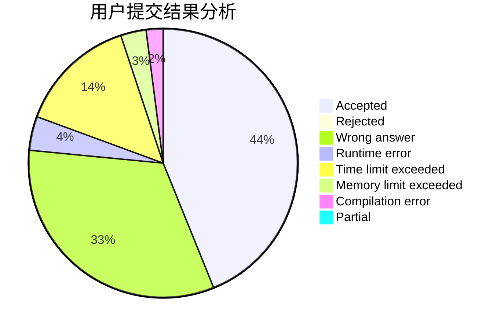
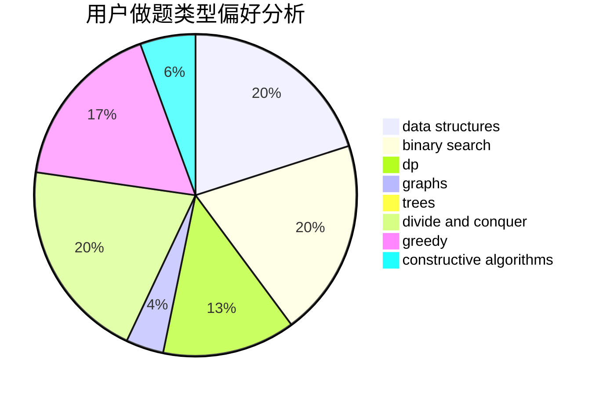
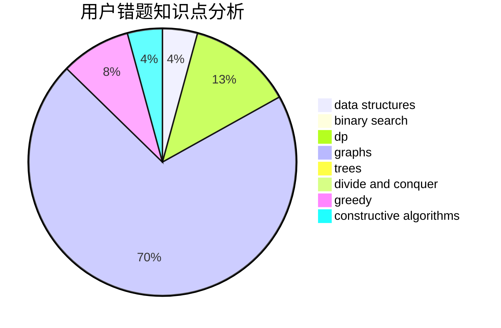

# Plalyy

<!-- tabs:start -->

#### **用户提交结果分析**

#### **用户做题类型偏好分析**

#### **用户错题知识点分析**

<!-- tabs:end -->
# 推荐题目
[1494A](https://codeforces.com/contest/1494/problem/A)		bitmasks,
                        brute force,
                        implementation		  
[1355B](https://codeforces.com/contest/1355/problem/B)		dp,
                        greedy,
                        sortings		  
[309B](https://codeforces.com/contest/309/problem/B)		dp,
                        two pointers		  
[712C](https://codeforces.com/contest/712/problem/C)		greedy,
                        math		  
[443D](https://codeforces.com/contest/443/problem/D)		dsu,graphs,sortings,trees		  
[777C](https://codeforces.com/contest/777/problem/C)		binary search,
                        data structures,
                        dp,
                        greedy,
                        implementation,
                        two pointers		  
[639E](https://codeforces.com/contest/639/problem/E)		binary search,
                        greedy,
                        math,
                        sortings		  
[1120B](https://codeforces.com/contest/1120/problem/B)		constructive algorithms,
                        greedy,
                        implementation,
                        math		  
[1282E](https://codeforces.com/contest/1282/problem/E)		constructive algorithms,
                        data structures,
                        dfs and similar,
                        graphs		  
[662B](https://codeforces.com/contest/662/problem/B)		dfs and similar,
                        graphs		  
