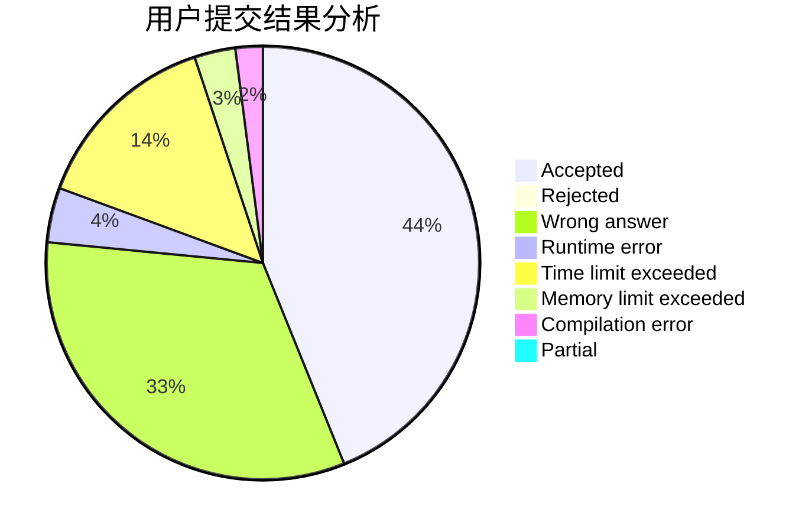
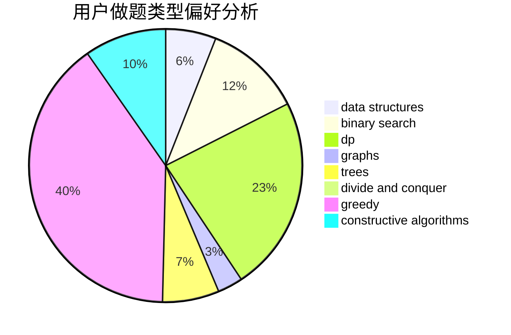
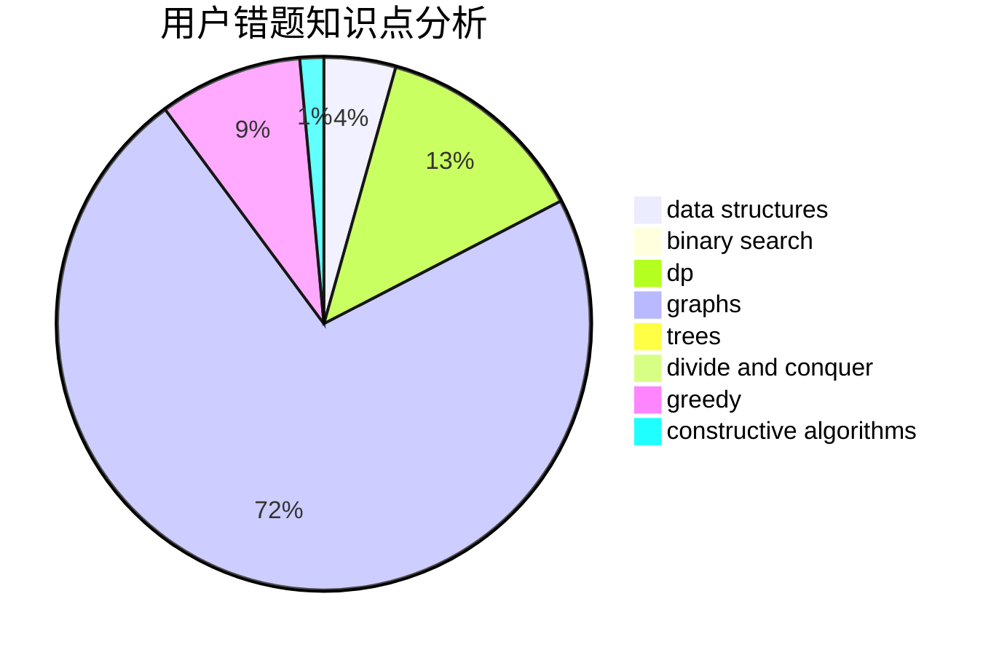

# Plalyy

<!-- tabs:start -->

#### **用户提交结果分析**

#### **用户做题类型偏好分析**

#### **用户错题知识点分析**

<!-- tabs:end -->
# 推荐题目
[1503A](https://codeforces.com/contest/1503/problem/A)		constructive algorithms,
                        greedy		  
[1362A](https://codeforces.com/contest/1362/problem/A)		implementation		  
[32A](https://codeforces.com/contest/32/problem/A)		brute force		  
[731E](https://codeforces.com/contest/731/problem/E)		dp,
                        games		  
[464A](https://codeforces.com/contest/464/problem/A)		greedy,
                        strings		  
[795K](https://codeforces.com/contest/795/problem/K)		dsu,graphs,sortings,trees		  
[669C](https://codeforces.com/contest/669/problem/C)		dsu,graphs,sortings,trees		  
[112A](https://codeforces.com/contest/112/problem/A)		implementation,
                        strings		  
[128C](https://codeforces.com/contest/128/problem/C)		combinatorics,
                        dp		  
[682B](https://codeforces.com/contest/682/problem/B)		sortings		  
