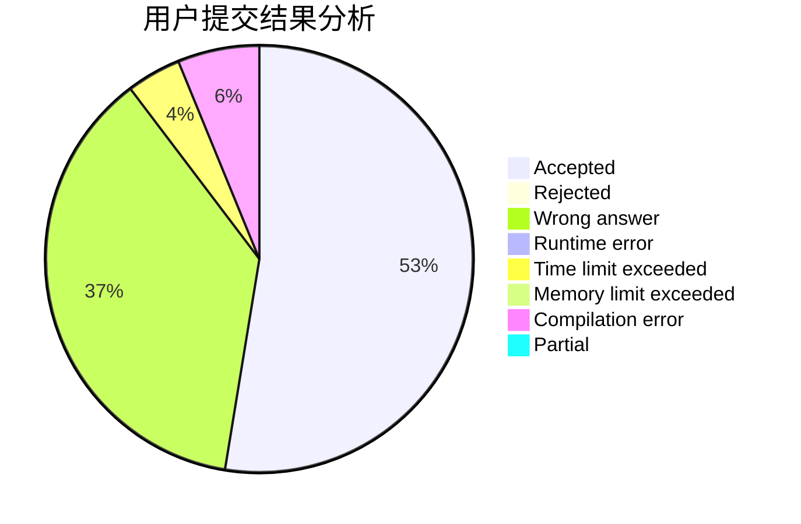
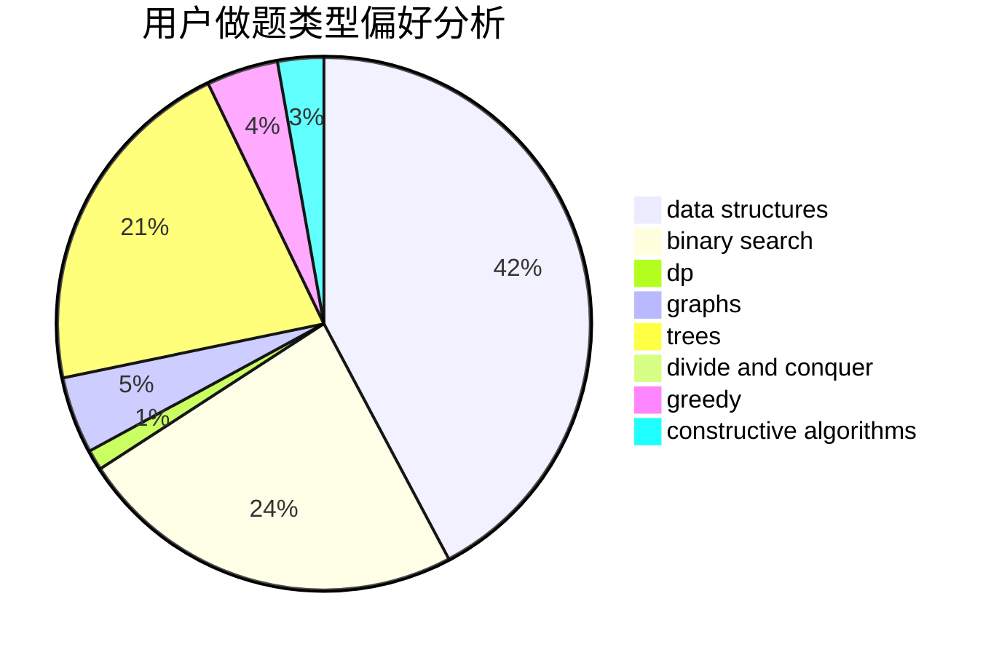

# Planaria

<!-- tabs:start -->

#### **用户提交结果分析**

#### **用户做题类型偏好分析**

#### **用户错题知识点分析**

<!-- tabs:end -->
# 推荐题目
[650E](https://codeforces.com/contest/650/problem/E)		data structures,
                        dfs and similar,
                        dsu,
                        greedy,
                        trees		  
[587D](https://codeforces.com/contest/587/problem/D)		2-sat,
                        binary search		  
[1442A](https://codeforces.com/contest/1442/problem/A)		constructive algorithms,
                        dp,
                        greedy		  
[109A](https://codeforces.com/contest/109/problem/A)		brute force,
                        implementation		  
[777D](https://codeforces.com/contest/777/problem/D)		binary search,
                        greedy,
                        implementation,
                        strings		  
[1357B1](https://codeforces.com/contest/1357B/problem/1)		nan		  
[629A](https://codeforces.com/contest/629/problem/A)		brute force,
                        combinatorics,
                        constructive algorithms,
                        implementation		  
[1367F2](https://codeforces.com/contest/1367F/problem/2)		binary search,
                        data structures,
                        dp,
                        greedy,
                        sortings,
                        two pointers		  
[656F](https://codeforces.com/contest/656/problem/F)		*special problem		  
[1230A](https://codeforces.com/contest/1230/problem/A)		brute force,
                        implementation		  
