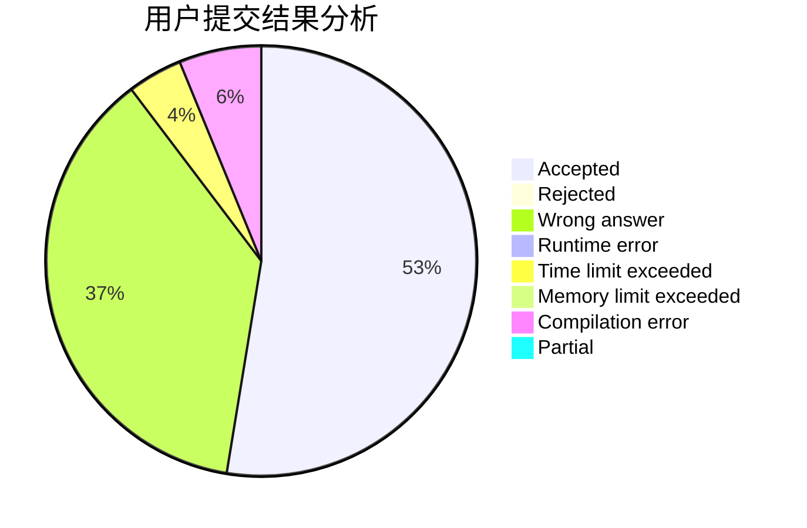
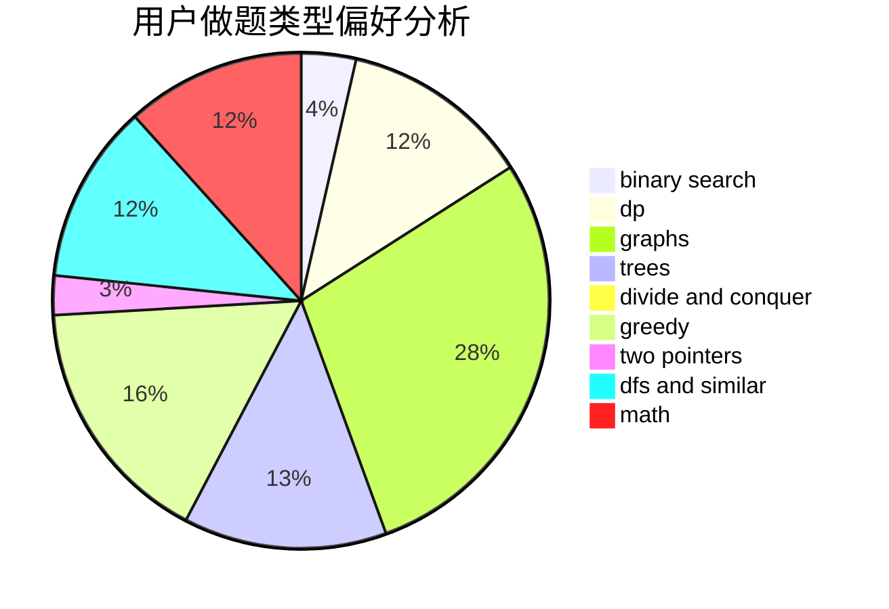

# Planaria

<!-- tabs:start -->

#### **用户提交结果分析**

#### **用户做题类型偏好分析**

<!-- tabs:end -->
# 推荐题目
[674G](https://codeforces.com/contest/674/problem/G)
[607E](https://codeforces.com/contest/607/problem/E)
[1451F](https://codeforces.com/contest/1451/problem/F)
[10C](https://codeforces.com/contest/10/problem/C)
[796A](https://codeforces.com/contest/796/problem/A)
[1364D](https://codeforces.com/contest/1364/problem/D)
[659A](https://codeforces.com/contest/659/problem/A)
[1374D](https://codeforces.com/contest/1374/problem/D)
[678F](https://codeforces.com/contest/678/problem/F)
[1238E](https://codeforces.com/contest/1238/problem/E)
