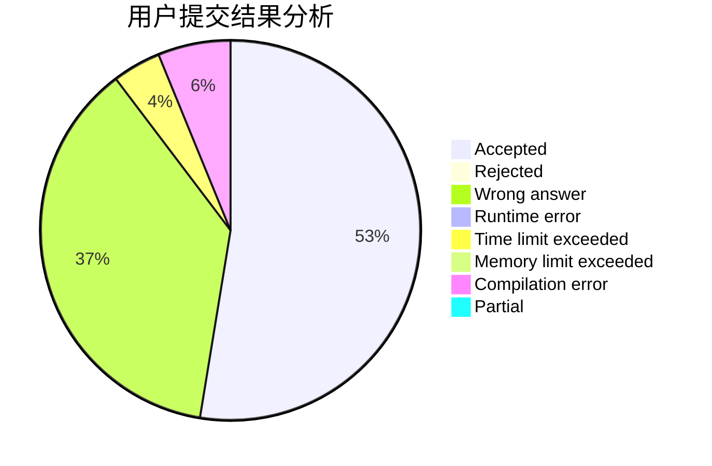
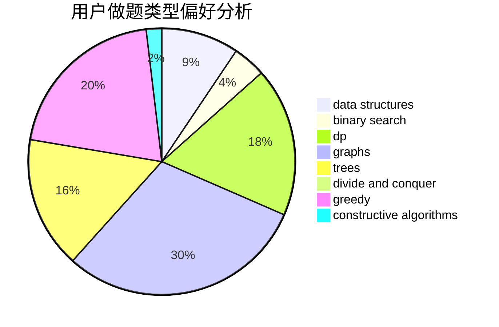
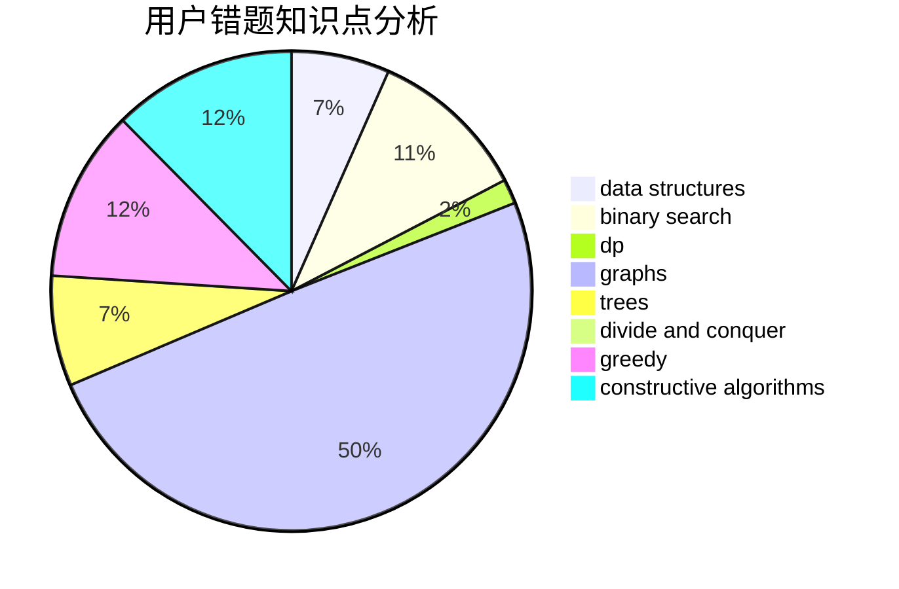

# Planaria

<!-- tabs:start -->

#### **用户提交结果分析**

#### **用户做题类型偏好分析**

#### **用户错题知识点分析**

<!-- tabs:end -->
# 推荐题目
[674G](https://codeforces.com/contest/674/problem/G)		dsu,graphs,sortings,trees		  
[607E](https://codeforces.com/contest/607/problem/E)		binary search,
                        geometry		  
[1451F](https://codeforces.com/contest/1451/problem/F)		constructive algorithms,
                        games		  
[10C](https://codeforces.com/contest/10/problem/C)		number theory		  
[796A](https://codeforces.com/contest/796/problem/A)		brute force,
                        implementation		  
[1364D](https://codeforces.com/contest/1364/problem/D)		constructive algorithms,
                        dfs and similar,
                        graphs,
                        greedy,
                        implementation,
                        trees		  
[659A](https://codeforces.com/contest/659/problem/A)		implementation,
                        math		  
[1374D](https://codeforces.com/contest/1374/problem/D)		math,
                        sortings,
                        two pointers		  
[678F](https://codeforces.com/contest/678/problem/F)		data structures,
                        divide and conquer,
                        geometry		  
[1238E](https://codeforces.com/contest/1238/problem/E)		bitmasks,
                        dp		  
