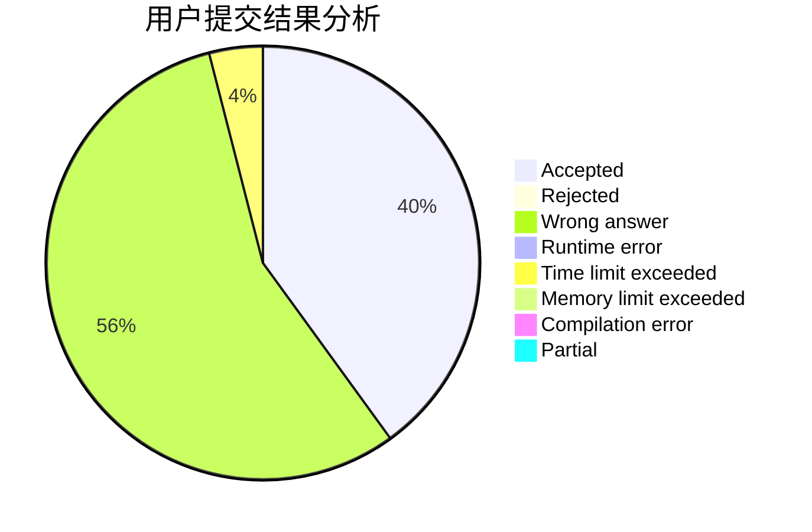
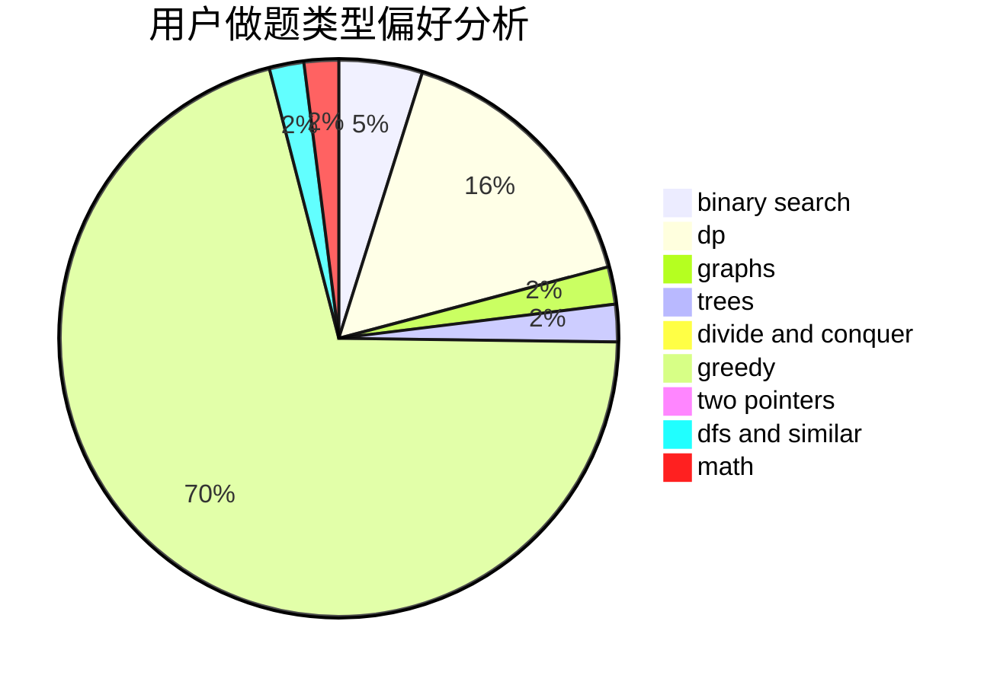

# Plasware

<!-- tabs:start -->

#### **用户提交结果分析**

#### **用户做题类型偏好分析**

<!-- tabs:end -->
# 推荐题目
[681B](https://codeforces.com/contest/681/problem/B)
[618G](https://codeforces.com/contest/618/problem/G)
[1034D](https://codeforces.com/contest/1034/problem/D)
[11081](https://codeforces.com/contest/1108/problem/1)
[63C](https://codeforces.com/contest/63/problem/C)
[723B](https://codeforces.com/contest/723/problem/B)
[1070I](https://codeforces.com/contest/1070/problem/I)
[1038D](https://codeforces.com/contest/1038/problem/D)
[1288D](https://codeforces.com/contest/1288/problem/D)
[1373E](https://codeforces.com/contest/1373/problem/E)
