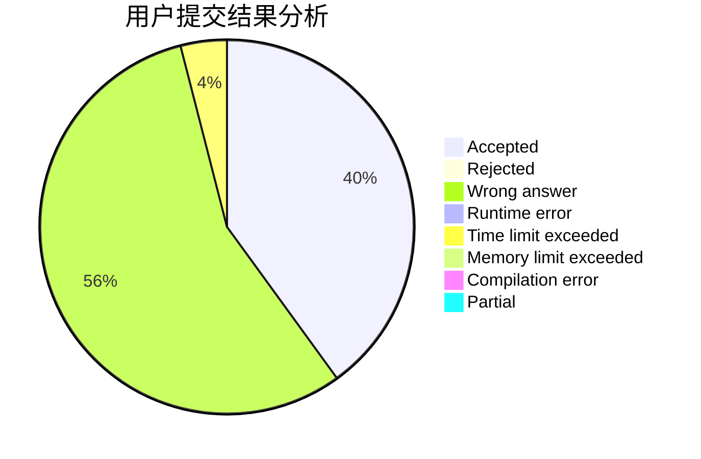
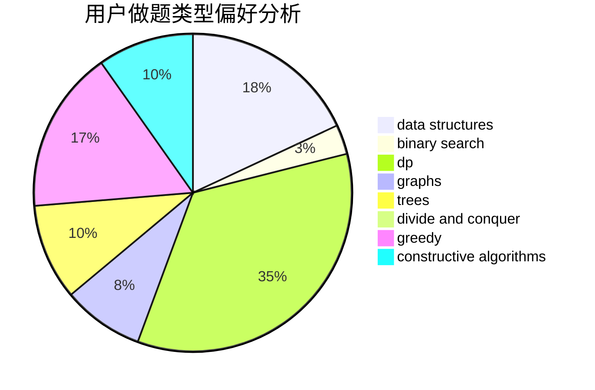
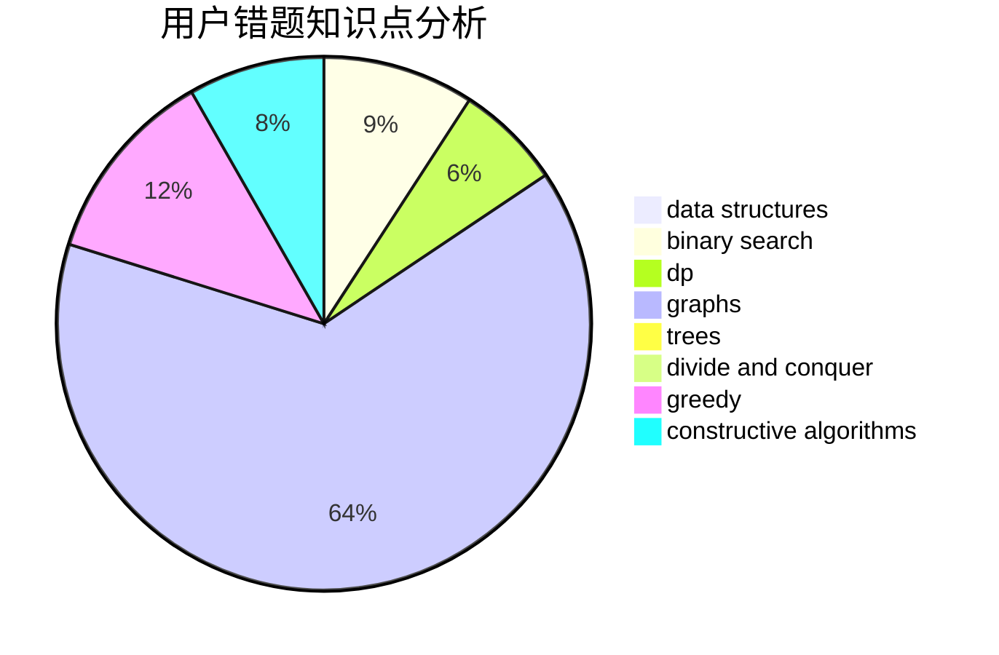

# Plasware

<!-- tabs:start -->

#### **用户提交结果分析**

#### **用户做题类型偏好分析**

#### **用户错题知识点分析**

<!-- tabs:end -->
# 推荐题目
[660D](https://codeforces.com/contest/660/problem/D)		geometry		  
[600A](https://codeforces.com/contest/600/problem/A)		implementation,
                        strings		  
[1034A](https://codeforces.com/contest/1034/problem/A)		number theory		  
[1107D](https://codeforces.com/contest/1107/problem/D)		dp,
                        implementation,
                        math,
                        number theory		  
[61A](https://codeforces.com/contest/61/problem/A)		implementation		  
[704B](https://codeforces.com/contest/704/problem/B)		dp,
                        graphs,
                        greedy		  
[1070F](https://codeforces.com/contest/1070/problem/F)		greedy		  
[1038A](https://codeforces.com/contest/1038/problem/A)		implementation,
                        strings		  
[1282B1](https://codeforces.com/contest/1282B/problem/1)		dp,
                        greedy,
                        sortings		  
[1366F](https://codeforces.com/contest/1366/problem/F)		binary search,
                        dp,
                        geometry,
                        graphs		  
