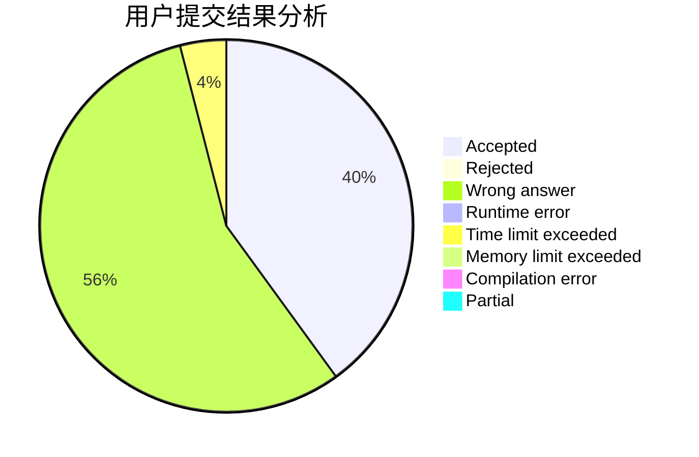
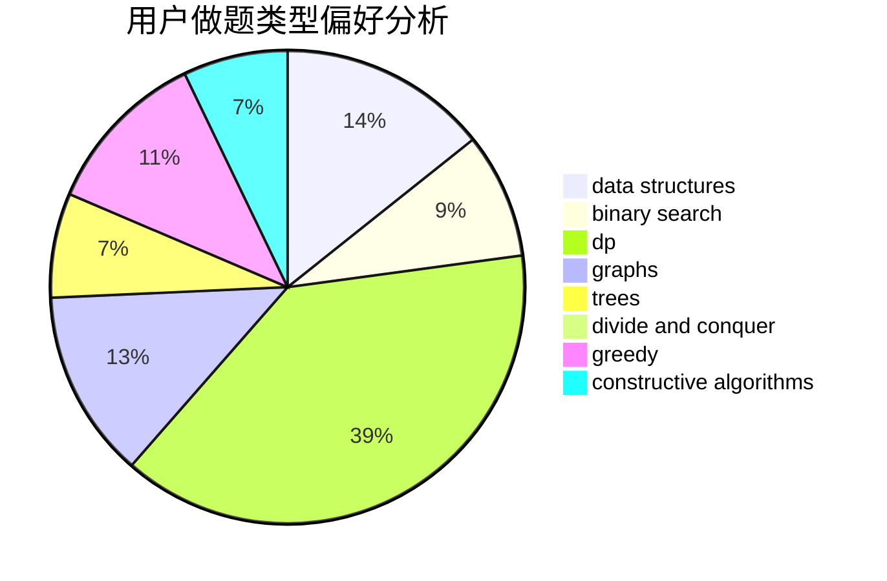
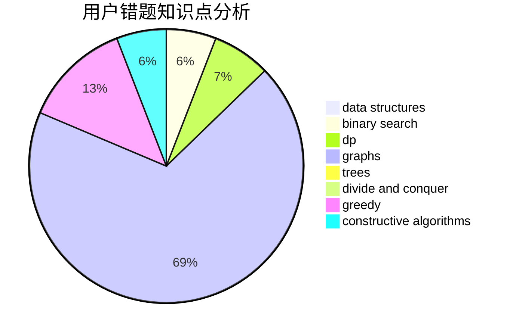

# Plasware

<!-- tabs:start -->

#### **用户提交结果分析**

#### **用户做题类型偏好分析**

#### **用户错题知识点分析**

<!-- tabs:end -->
# 推荐题目
[681B](https://codeforces.com/contest/681/problem/B)		brute force		  
[618G](https://codeforces.com/contest/618/problem/G)		dp,
                        math,
                        matrices,
                        probabilities		  
[1034D](https://codeforces.com/contest/1034/problem/D)		binary search,
                        data structures,
                        two pointers		  
[11081](https://codeforces.com/contest/1108/problem/1)		dsu,graphs,sortings,trees		  
[63C](https://codeforces.com/contest/63/problem/C)		brute force,
                        implementation		  
[723B](https://codeforces.com/contest/723/problem/B)		expression parsing,
                        implementation,
                        strings		  
[1070I](https://codeforces.com/contest/1070/problem/I)		flows,
                        graph matchings,
                        graphs		  
[1038D](https://codeforces.com/contest/1038/problem/D)		dp,
                        greedy,
                        implementation		  
[1288D](https://codeforces.com/contest/1288/problem/D)		binary search,
                        bitmasks,
                        dp		  
[1373E](https://codeforces.com/contest/1373/problem/E)		brute force,
                        constructive algorithms,
                        dp,
                        greedy		  
