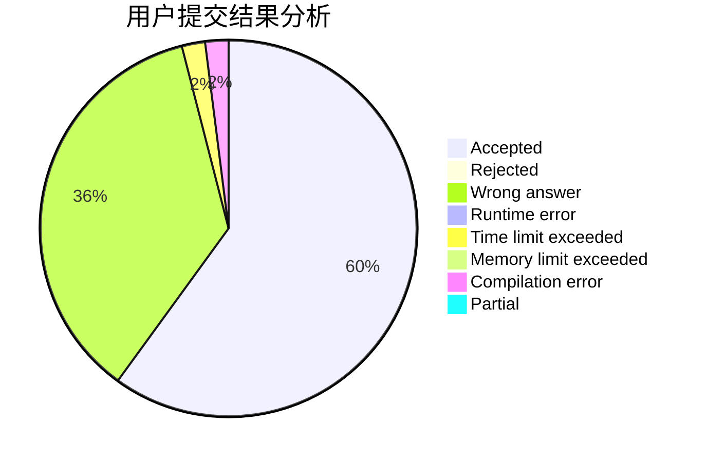
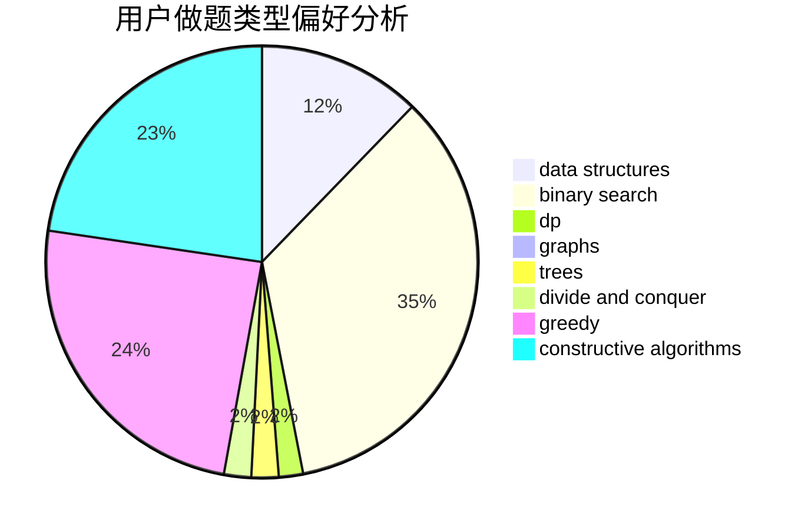
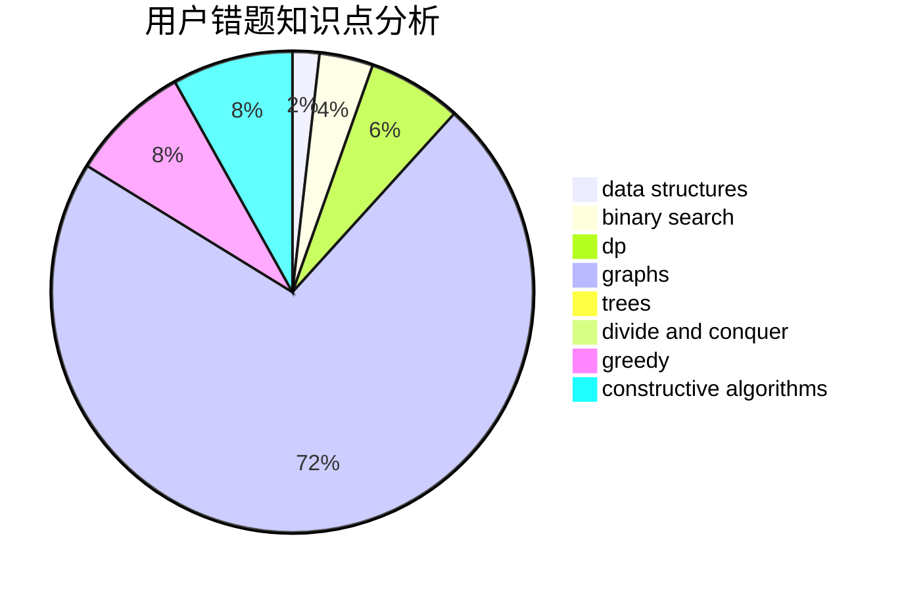

# PoPk1u

<!-- tabs:start -->

#### **用户提交结果分析**

#### **用户做题类型偏好分析**

#### **用户错题知识点分析**

<!-- tabs:end -->
# 推荐题目
[809E](https://codeforces.com/contest/809/problem/E)		divide and conquer,
                        math,
                        number theory,
                        trees		  
[1180B](https://codeforces.com/contest/1180/problem/B)		greedy,
                        implementation		  
[618E](https://codeforces.com/contest/618/problem/E)		data structures,
                        geometry		  
[483E](https://codeforces.com/contest/483/problem/E)		dsu,graphs,sortings,trees		  
[1266F](https://codeforces.com/contest/1266/problem/F)		dfs and similar,
                        graphs		  
[343C](https://codeforces.com/contest/343/problem/C)		binary search,
                        greedy,
                        two pointers		  
[650B](https://codeforces.com/contest/650/problem/B)		binary search,
                        brute force,
                        dp,
                        two pointers		  
[1400C](https://codeforces.com/contest/1400/problem/C)		2-sat,
                        brute force,
                        constructive algorithms,
                        greedy		  
[1023D](https://codeforces.com/contest/1023/problem/D)		constructive algorithms,
                        data structures		  
[533F](https://codeforces.com/contest/533/problem/F)		hashing,
                        string suffix structures,
                        strings		  
