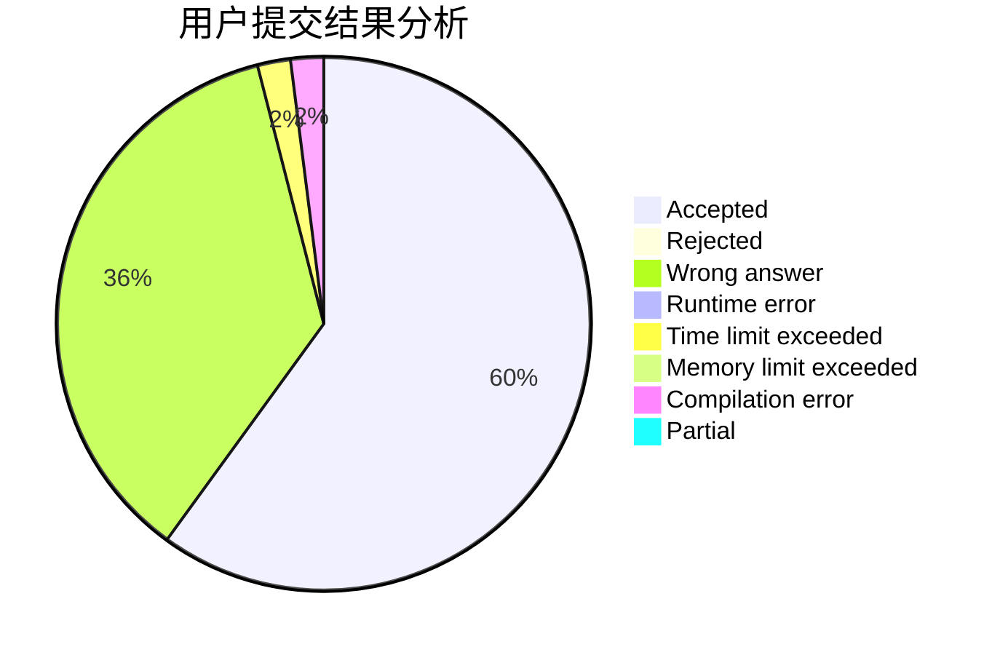
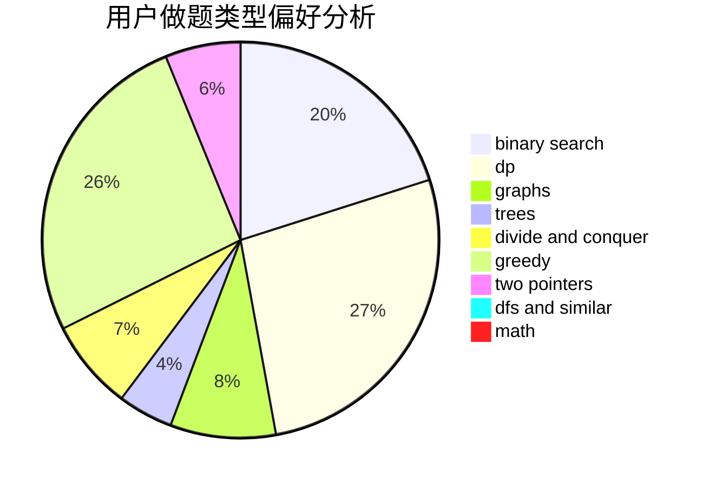

# PoPk1u

<!-- tabs:start -->

#### **用户提交结果分析**

#### **用户做题类型偏好分析**

<!-- tabs:end -->
# 推荐题目
[827D](https://codeforces.com/contest/827/problem/D)
[1183C](https://codeforces.com/contest/1183/problem/C)
[639D](https://codeforces.com/contest/639/problem/D)
[505A](https://codeforces.com/contest/505/problem/A)
[1272A](https://codeforces.com/contest/1272/problem/A)
[36D](https://codeforces.com/contest/36/problem/D)
[673B](https://codeforces.com/contest/673/problem/B)
[140B](https://codeforces.com/contest/140/problem/B)
[1023G](https://codeforces.com/contest/1023/problem/G)
[555D](https://codeforces.com/contest/555/problem/D)
