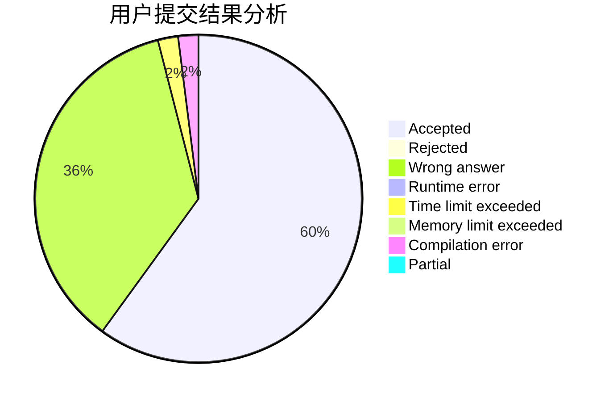
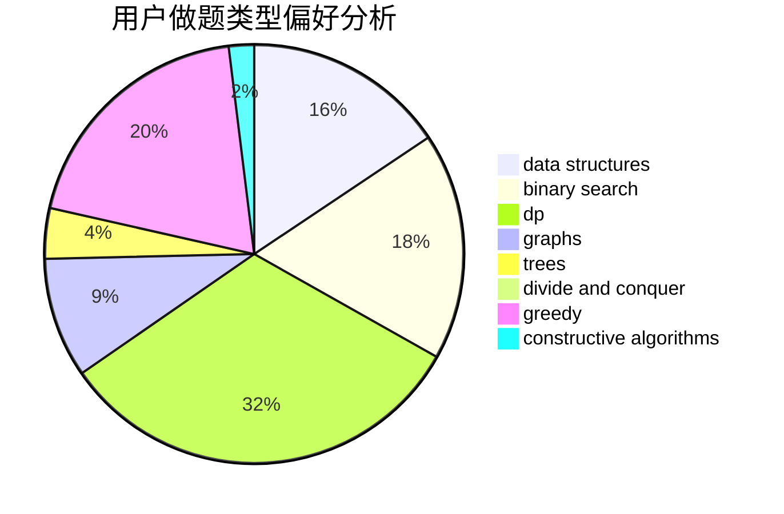

# PoPk1u

<!-- tabs:start -->

#### **用户提交结果分析**

#### **用户做题类型偏好分析**

#### **用户错题知识点分析**

<!-- tabs:end -->
# 推荐题目
[827D](https://codeforces.com/contest/827/problem/D)		data structures,
                        dfs and similar,
                        graphs,
                        trees		  
[1183C](https://codeforces.com/contest/1183/problem/C)		binary search,
                        math		  
[639D](https://codeforces.com/contest/639/problem/D)		data structures,
                        greedy,
                        sortings,
                        two pointers		  
[505A](https://codeforces.com/contest/505/problem/A)		brute force,
                        implementation,
                        strings		  
[1272A](https://codeforces.com/contest/1272/problem/A)		brute force,
                        greedy,
                        math,
                        sortings		  
[36D](https://codeforces.com/contest/36/problem/D)		games		  
[673B](https://codeforces.com/contest/673/problem/B)		greedy,
                        implementation		  
[140B](https://codeforces.com/contest/140/problem/B)		brute force,
                        greedy,
                        implementation		  
[1023G](https://codeforces.com/contest/1023/problem/G)		data structures,
                        flows,
                        trees		  
[555D](https://codeforces.com/contest/555/problem/D)		binary search,
                        implementation,
                        math		  
