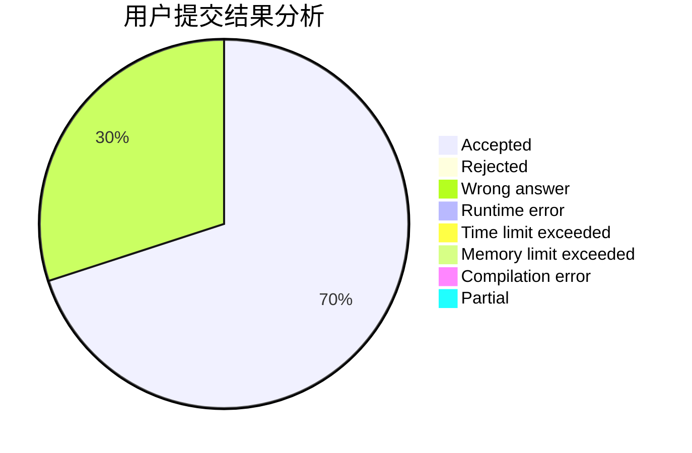
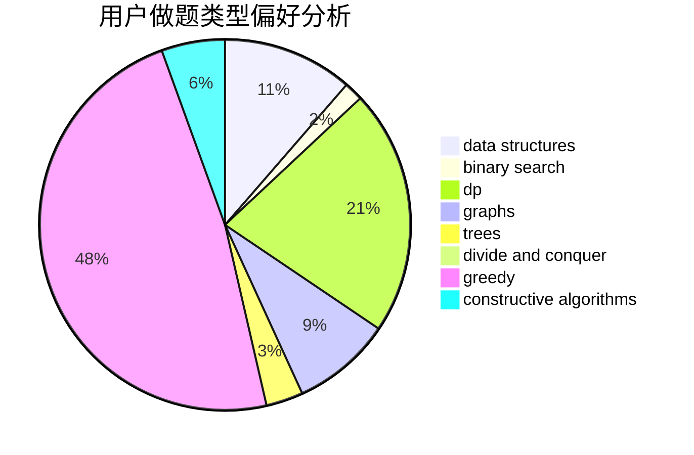
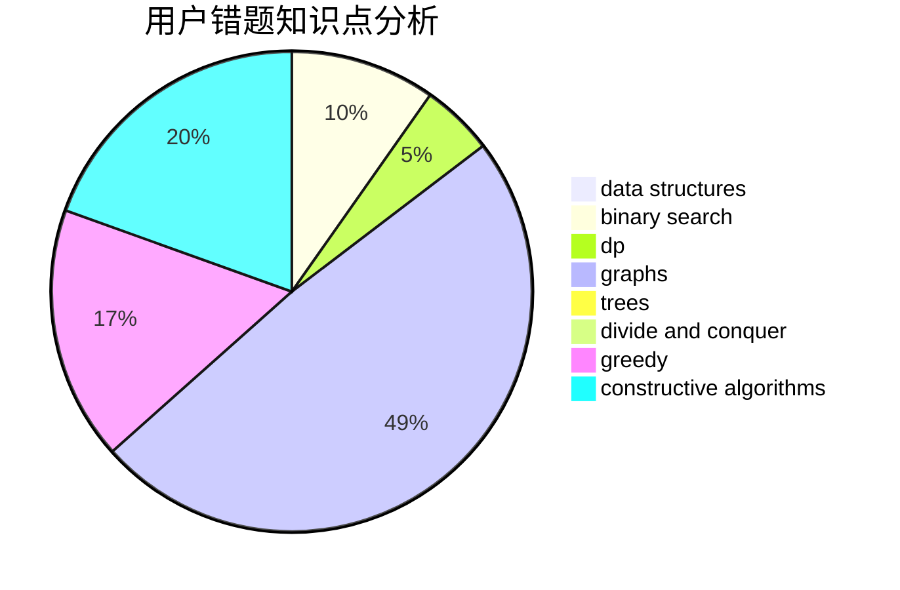

# Poilkxx

<!-- tabs:start -->

#### **用户提交结果分析**

#### **用户做题类型偏好分析**

#### **用户错题知识点分析**

<!-- tabs:end -->
# 推荐题目
[1421A](https://codeforces.com/contest/1421/problem/A)		bitmasks,
                        greedy,
                        math		  
[772E](https://codeforces.com/contest/772/problem/E)		binary search,
                        divide and conquer,
                        interactive,
                        trees		  
[1347C](https://codeforces.com/contest/1347/problem/C)		dsu,graphs,sortings,trees		  
[742D](https://codeforces.com/contest/742/problem/D)		dsu,graphs,sortings,trees		  
[779A](https://codeforces.com/contest/779/problem/A)		constructive algorithms,
                        math		  
[1081A](https://codeforces.com/contest/1081/problem/A)		constructive algorithms,
                        math		  
[626F](https://codeforces.com/contest/626/problem/F)		dp		  
[402C](https://codeforces.com/contest/402/problem/C)		brute force,
                        constructive algorithms,
                        graphs		  
[498C](https://codeforces.com/contest/498/problem/C)		flows,
                        graph matchings,
                        number theory		  
[474E](https://codeforces.com/contest/474/problem/E)		binary search,
                        data structures,
                        dp,
                        sortings,
                        trees		  
