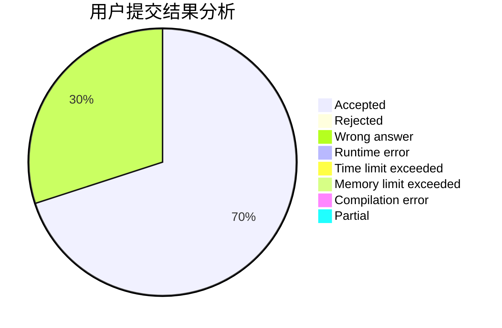
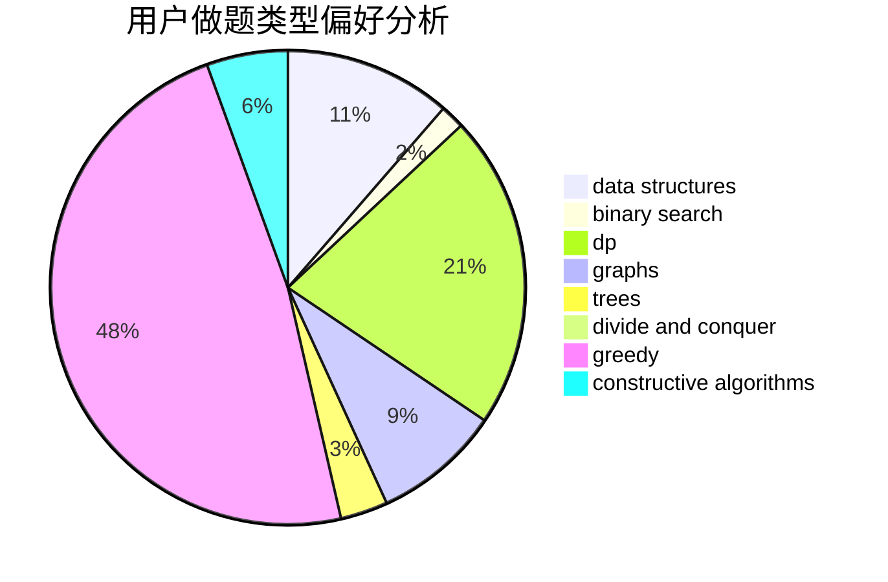
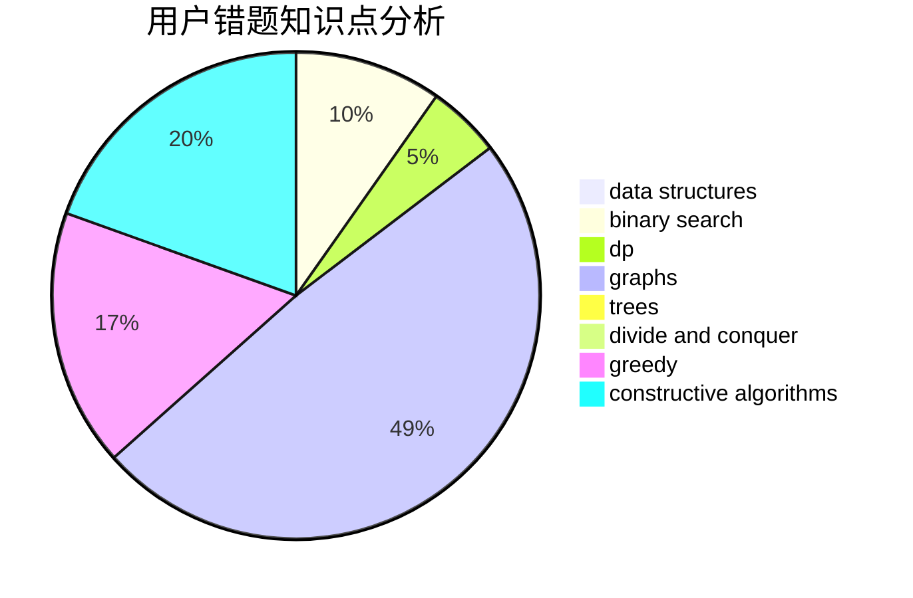

# Poilkxx
<!-- tabs:start -->
#### **用户提交结果分析**

#### **用户做题类型偏好分析**

#### **用户错题知识点分析**

<!-- tabs:end -->
# 推荐题目
[XORwice](http://codeforces.com/problemset/problem/1421/A)		bitmasks,
                        greedy,
                        math		  
[Arpa's weak amphitheater and Mehrdad's valuable Hoses](https://codeforces.com/contest/742/problem/D)		dfs and similar,
                        dp,
                        dsu		  
[Verifying Kingdom](http://codeforces.com/problemset/problem/772/E)		binary search,
                        divide and conquer,
                        interactive,
                        trees		  
[Intranet of Buses](https://codeforces.com/contest/781/problem/F)		binary search,
                        geometry,
                        implementation,
                        two pointers		  
[Soap Time! - 2](http://codeforces.com/problemset/problem/185/E)		binary search,
                        data structures		  
[Definite Game](http://codeforces.com/problemset/problem/1081/A)		constructive algorithms,
                        math		  
[Sum of Round Numbers](https://codeforces.com/contest/1347/problem/C)		implementation,
                        math		  
[Coprime Arrays](http://codeforces.com/problemset/problem/915/G)		math,
                        number theory		  
[Group Projects](http://codeforces.com/problemset/problem/626/F)		dp		  
[Love Triangles](http://codeforces.com/problemset/problem/553/C)		dfs and similar,
                        dsu,
                        graphs		  
<!-- tabs:start -->
#### **data structures**
[XORwice](http://codeforces.com/problemset/problem/185/E)		binary search,
                        data structures		  
[Arpa's weak amphitheater and Mehrdad's valuable Hoses](http://codeforces.com/problemset/problem/1004/F)		bitmasks,
                        data structures,
                        divide and conquer		  
[Verifying Kingdom](http://codeforces.com/problemset/problem/1304/F2)		data structures,
                        dp,
                        greedy		  
[Intranet of Buses](http://codeforces.com/problemset/problem/1264/C)		data structures,
                        probabilities		  
[Soap Time! - 2](http://codeforces.com/problemset/problem/198/E)		binary search,
                        data structures,
                        sortings		  
[Definite Game](https://codeforces.com/contest/504/problem/A)		constructive algorithms,
                        data structures,
                        greedy,
                        sortings,
                        trees		  
[Sum of Round Numbers](http://codeforces.com/problemset/problem/474/E)		binary search,
                        data structures,
                        dp,
                        sortings,
                        trees		  
[Coprime Arrays](http://codeforces.com/problemset/problem/1139/F)		data structures,
                        divide and conquer		  
[Group Projects](http://codeforces.com/problemset/problem/1324/D)		binary search,
                        data structures,
                        sortings,
                        two pointers		  
[Love Triangles](http://codeforces.com/problemset/problem/1473/D)		data structures,
                        dp,
                        implementation,
                        strings		  
#### **binary search**
[XORwice](http://codeforces.com/problemset/problem/772/E)		binary search,
                        divide and conquer,
                        interactive,
                        trees		  
[Arpa's weak amphitheater and Mehrdad's valuable Hoses](https://codeforces.com/contest/781/problem/F)		binary search,
                        geometry,
                        implementation,
                        two pointers		  
[Verifying Kingdom](http://codeforces.com/problemset/problem/185/E)		binary search,
                        data structures		  
[Intranet of Buses](http://codeforces.com/problemset/problem/1310/C)		binary search,
                        dp,
                        strings		  
[Soap Time! - 2](http://codeforces.com/problemset/problem/958/E2)		binary search,
                        dp,
                        greedy,
                        sortings		  
[Definite Game](http://codeforces.com/problemset/problem/198/E)		binary search,
                        data structures,
                        sortings		  
[Sum of Round Numbers](http://codeforces.com/problemset/problem/887/E)		binary search,
                        geometry,
                        sortings		  
[Coprime Arrays](http://codeforces.com/problemset/problem/474/E)		binary search,
                        data structures,
                        dp,
                        sortings,
                        trees		  
[Group Projects](http://codeforces.com/problemset/problem/626/E)		binary search,
                        math,
                        ternary search		  
[Love Triangles](http://codeforces.com/problemset/problem/1324/D)		binary search,
                        data structures,
                        sortings,
                        two pointers		  
#### **dp**
[XORwice](https://codeforces.com/contest/742/problem/D)		dfs and similar,
                        dp,
                        dsu		  
[Arpa's weak amphitheater and Mehrdad's valuable Hoses](http://codeforces.com/problemset/problem/626/F)		dp		  
[Verifying Kingdom](http://codeforces.com/problemset/problem/1304/F2)		data structures,
                        dp,
                        greedy		  
[Intranet of Buses](http://codeforces.com/problemset/problem/1084/C)		combinatorics,
                        dp,
                        implementation		  
[Soap Time! - 2](http://codeforces.com/problemset/problem/1310/C)		binary search,
                        dp,
                        strings		  
[Definite Game](http://codeforces.com/problemset/problem/958/E2)		binary search,
                        dp,
                        greedy,
                        sortings		  
[Sum of Round Numbers](https://codeforces.com/contest/434/problem/C)		dp		  
[Coprime Arrays](http://codeforces.com/problemset/problem/474/E)		binary search,
                        data structures,
                        dp,
                        sortings,
                        trees		  
[Group Projects](http://codeforces.com/problemset/problem/1299/D)		bitmasks,
                        combinatorics,
                        dfs and similar,
                        dp,
                        graphs,
                        graphs,
                        math,
                        trees		  
[Love Triangles](https://codeforces.com/contest/1382/problem/D)		dp		  
#### **graph**
[XORwice](http://codeforces.com/problemset/problem/553/C)		dfs and similar,
                        dsu,
                        graphs		  
[Arpa's weak amphitheater and Mehrdad's valuable Hoses](http://codeforces.com/problemset/problem/402/C)		brute force,
                        constructive algorithms,
                        graphs		  
[Verifying Kingdom](http://codeforces.com/problemset/problem/1299/D)		bitmasks,
                        combinatorics,
                        dfs and similar,
                        dp,
                        graphs,
                        graphs,
                        math,
                        trees		  
[Intranet of Buses](http://codeforces.com/problemset/problem/498/C)		flows,
                        graph matchings,
                        number theory		  
[Soap Time! - 2](http://codeforces.com/problemset/problem/1081/D)		dsu,
                        graphs,
                        shortest paths,
                        sortings		  
[Definite Game](http://codeforces.com/problemset/problem/550/D)		constructive algorithms,
                        graphs,
                        implementation		  
[Sum of Round Numbers](http://codeforces.com/problemset/problem/246/D)		brute force,
                        dfs and similar,
                        graphs		  
[Coprime Arrays](http://codeforces.com/problemset/problem/590/E)		graph matchings,
                        strings		  
[Group Projects](http://codeforces.com/problemset/problem/1476/C)		dp,
                        graphs,
                        greedy		  
[Love Triangles](http://codeforces.com/problemset/problem/1487/C)		brute force,
                        constructive algorithms,
                        dfs and similar,
                        graphs,
                        greedy,
                        implementation,
                        math		  
#### **trees**
[XORwice](http://codeforces.com/problemset/problem/772/E)		binary search,
                        divide and conquer,
                        interactive,
                        trees		  
[Arpa's weak amphitheater and Mehrdad's valuable Hoses](https://codeforces.com/contest/504/problem/A)		constructive algorithms,
                        data structures,
                        greedy,
                        sortings,
                        trees		  
[Verifying Kingdom](http://codeforces.com/problemset/problem/474/E)		binary search,
                        data structures,
                        dp,
                        sortings,
                        trees		  
[Intranet of Buses](http://codeforces.com/problemset/problem/1299/D)		bitmasks,
                        combinatorics,
                        dfs and similar,
                        dp,
                        graphs,
                        graphs,
                        math,
                        trees		  
[Soap Time! - 2](http://codeforces.com/problemset/problem/1085/D)		constructive algorithms,
                        implementation,
                        trees		  
[Definite Game](http://codeforces.com/problemset/problem/1479/D)		binary search,
                        bitmasks,
                        brute force,
                        data structures,
                        probabilities,
                        trees		  
[Sum of Round Numbers](http://codeforces.com/problemset/problem/1511/C)		brute force,
                        data structures,
                        implementation,
                        trees		  
[Coprime Arrays](http://codeforces.com/problemset/problem/1499/F)		combinatorics,
                        dfs and similar,
                        dp,
                        trees		  
[Group Projects](http://codeforces.com/problemset/problem/1491/E)		brute force,
                        dfs and similar,
                        divide and conquer,
                        number theory,
                        trees		  
[Love Triangles](http://codeforces.com/problemset/problem/1466/D)		data structures,
                        greedy,
                        sortings,
                        trees		  
#### **divide and conquer**
[XORwice](http://codeforces.com/problemset/problem/772/E)		binary search,
                        divide and conquer,
                        interactive,
                        trees		  
[Arpa's weak amphitheater and Mehrdad's valuable Hoses](http://codeforces.com/problemset/problem/1004/F)		bitmasks,
                        data structures,
                        divide and conquer		  
[Verifying Kingdom](http://codeforces.com/problemset/problem/1139/F)		data structures,
                        divide and conquer		  
[Intranet of Buses](http://codeforces.com/problemset/problem/662/C)		bitmasks,
                        brute force,
                        divide and conquer,
                        dp,
                        fft,
                        math		  
[Soap Time! - 2](https://codeforces.com/contest/1484/problem/E)		data structures,
                        divide and conquer,
                        dp		  
[Definite Game](http://codeforces.com/problemset/problem/1461/D)		binary search,
                        brute force,
                        data structures,
                        divide and conquer,
                        implementation,
                        sortings		  
[Sum of Round Numbers](http://codeforces.com/problemset/problem/1466/G)		combinatorics,
                        divide and conquer,
                        hashing,
                        math,
                        string suffix structures,
                        strings		  
[Coprime Arrays](http://codeforces.com/problemset/problem/1490/D)		dfs and similar,
                        divide and conquer,
                        implementation		  
[Group Projects](https://codeforces.com/contest/1483/problem/C)		data structures,
                        divide and conquer,
                        dp		  
[Love Triangles](http://codeforces.com/problemset/problem/1491/E)		brute force,
                        dfs and similar,
                        divide and conquer,
                        number theory,
                        trees		  
#### **greedy**
[XORwice](http://codeforces.com/problemset/problem/1421/A)		bitmasks,
                        greedy,
                        math		  
[Arpa's weak amphitheater and Mehrdad's valuable Hoses](http://codeforces.com/problemset/problem/1304/F2)		data structures,
                        dp,
                        greedy		  
[Verifying Kingdom](http://codeforces.com/problemset/problem/958/E2)		binary search,
                        dp,
                        greedy,
                        sortings		  
[Intranet of Buses](https://codeforces.com/contest/504/problem/A)		constructive algorithms,
                        data structures,
                        greedy,
                        sortings,
                        trees		  
[Soap Time! - 2](http://codeforces.com/problemset/problem/58/B)		greedy		  
[Definite Game](http://codeforces.com/problemset/problem/402/A)		greedy,
                        math		  
[Sum of Round Numbers](http://codeforces.com/problemset/problem/1476/C)		dp,
                        graphs,
                        greedy		  
[Coprime Arrays](http://codeforces.com/problemset/problem/1492/C)		binary search,
                        data structures,
                        dp,
                        greedy,
                        two pointers		  
[Group Projects](https://codeforces.com/contest/1496/problem/C)		geometry,
                        greedy,
                        math,
                        sortings		  
[Love Triangles](http://codeforces.com/problemset/problem/1493/A)		constructive algorithms,
                        greedy		  
#### **constructive algorithms**
[XORwice](http://codeforces.com/problemset/problem/1081/A)		constructive algorithms,
                        math		  
[Arpa's weak amphitheater and Mehrdad's valuable Hoses](http://codeforces.com/problemset/problem/402/C)		brute force,
                        constructive algorithms,
                        graphs		  
[Verifying Kingdom](http://codeforces.com/problemset/problem/779/A)		constructive algorithms,
                        math		  
[Intranet of Buses](http://codeforces.com/problemset/problem/1168/E)		constructive algorithms,
                        math		  
[Soap Time! - 2](https://codeforces.com/contest/504/problem/A)		constructive algorithms,
                        data structures,
                        greedy,
                        sortings,
                        trees		  
[Definite Game](http://codeforces.com/problemset/problem/550/D)		constructive algorithms,
                        graphs,
                        implementation		  
[Sum of Round Numbers](http://codeforces.com/problemset/problem/1085/D)		constructive algorithms,
                        implementation,
                        trees		  
[Coprime Arrays](http://codeforces.com/problemset/problem/1413/A)		constructive algorithms,
                        math		  
[Group Projects](http://codeforces.com/problemset/problem/1493/A)		constructive algorithms,
                        greedy		  
[Love Triangles](http://codeforces.com/problemset/problem/1463/D)		binary search,
                        constructive algorithms,
                        greedy,
                        two pointers		  
#### **sortings**
[XORwice](http://codeforces.com/problemset/problem/958/E2)		binary search,
                        dp,
                        greedy,
                        sortings		  
[Arpa's weak amphitheater and Mehrdad's valuable Hoses](http://codeforces.com/problemset/problem/198/E)		binary search,
                        data structures,
                        sortings		  
[Verifying Kingdom](https://codeforces.com/contest/504/problem/A)		constructive algorithms,
                        data structures,
                        greedy,
                        sortings,
                        trees		  
[Intranet of Buses](http://codeforces.com/problemset/problem/887/E)		binary search,
                        geometry,
                        sortings		  
[Soap Time! - 2](http://codeforces.com/problemset/problem/474/E)		binary search,
                        data structures,
                        dp,
                        sortings,
                        trees		  
[Definite Game](http://codeforces.com/problemset/problem/1081/D)		dsu,
                        graphs,
                        shortest paths,
                        sortings		  
[Sum of Round Numbers](http://codeforces.com/problemset/problem/1324/D)		binary search,
                        data structures,
                        sortings,
                        two pointers		  
[Coprime Arrays](http://codeforces.com/problemset/problem/1284/D)		binary search,
                        data structures,
                        hashing,
                        sortings		  
[Group Projects](https://codeforces.com/contest/1496/problem/C)		geometry,
                        greedy,
                        math,
                        sortings		  
[Love Triangles](http://codeforces.com/problemset/problem/1495/A)		geometry,
                        greedy,
                        math,
                        sortings		  
<!-- tabs:end -->
