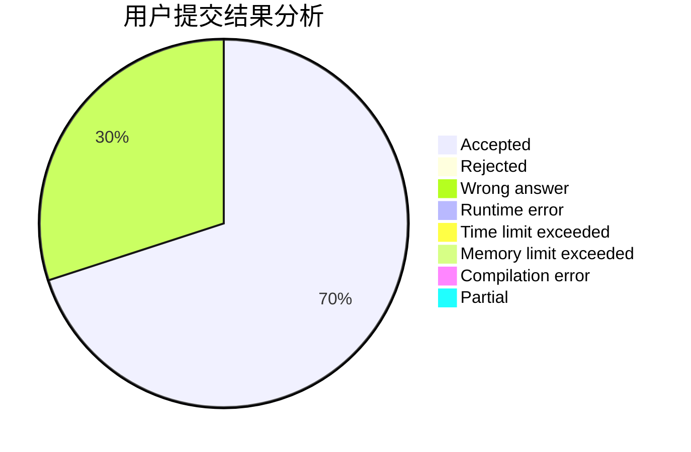
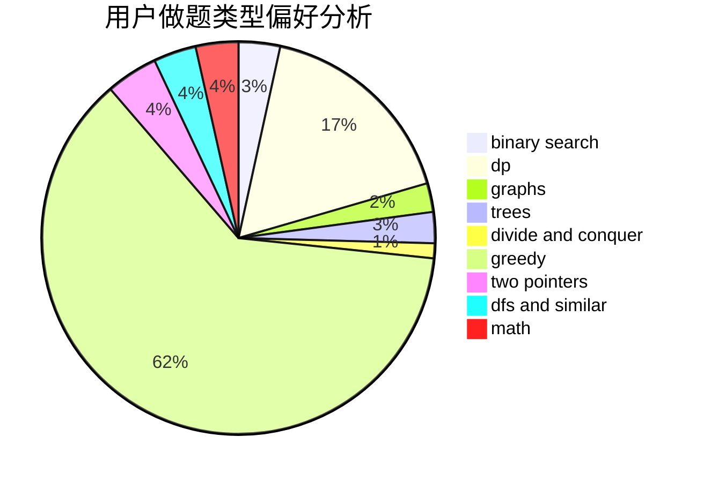

# Poilkxx

<!-- tabs:start -->

#### **用户提交结果分析**

#### **用户做题类型偏好分析**

<!-- tabs:end -->
# 推荐题目
[1428D](https://codeforces.com/contest/1428/problem/D)
[792C](https://codeforces.com/contest/792/problem/C)
[1354B](https://codeforces.com/contest/1354/problem/B)
[763A](https://codeforces.com/contest/763/problem/A)
[797C](https://codeforces.com/contest/797/problem/C)
[1081D](https://codeforces.com/contest/1081/problem/D)
[653A](https://codeforces.com/contest/653/problem/A)
[430C](https://codeforces.com/contest/430/problem/C)
[519B](https://codeforces.com/contest/519/problem/B)
[493D](https://codeforces.com/contest/493/problem/D)
