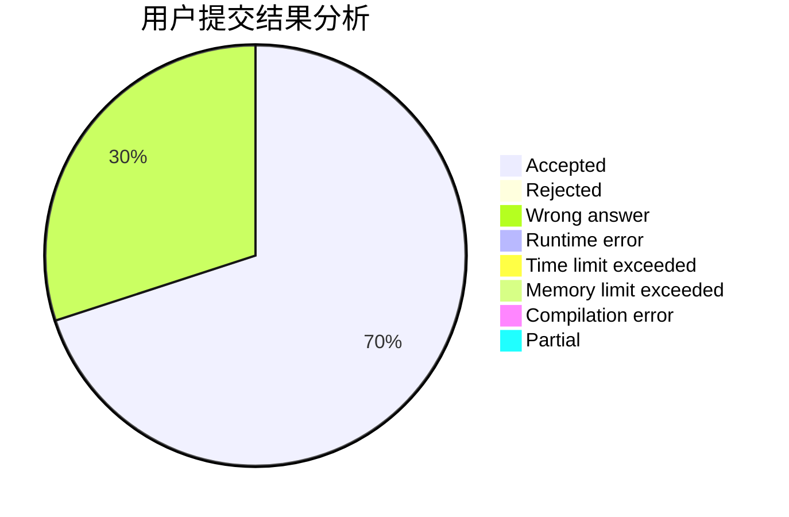
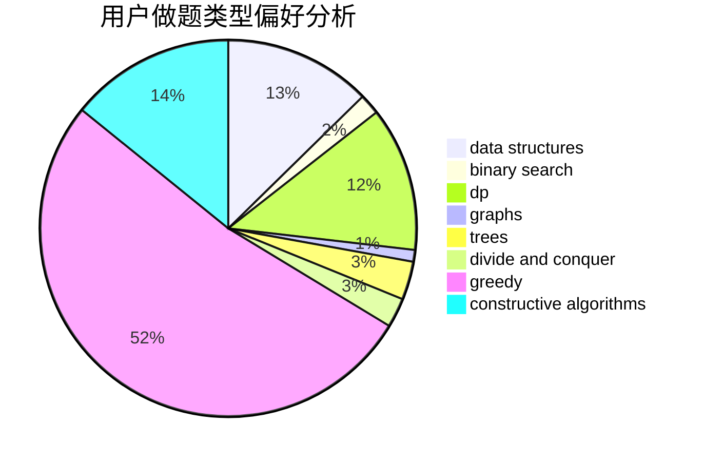
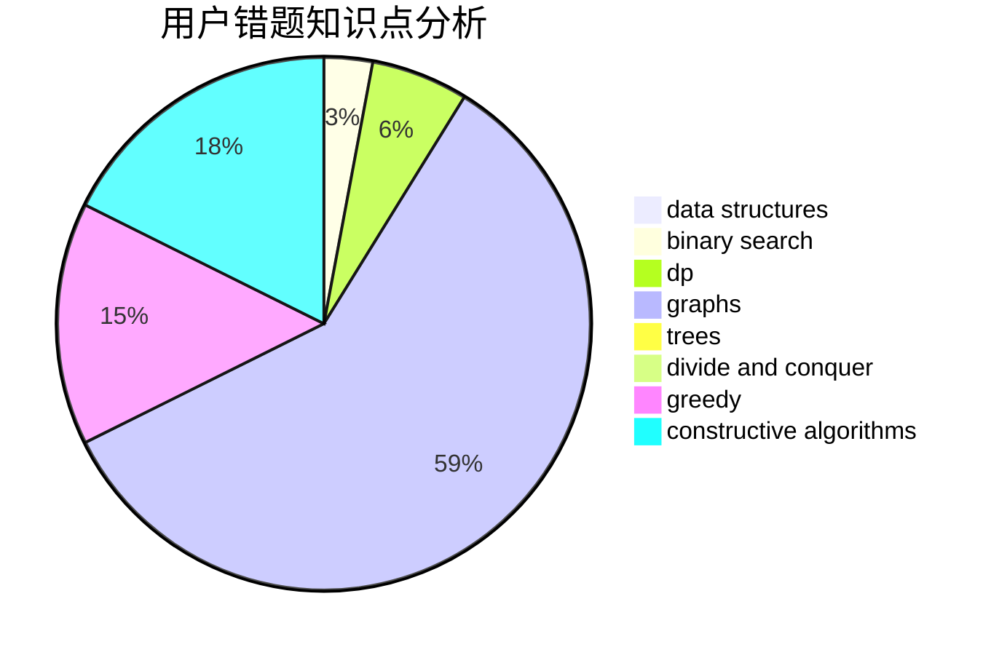

# Poilkxx

<!-- tabs:start -->

#### **用户提交结果分析**

#### **用户做题类型偏好分析**

#### **用户错题知识点分析**

<!-- tabs:end -->
# 推荐题目
[1428D](https://codeforces.com/contest/1428/problem/D)		constructive algorithms,
                        greedy,
                        implementation		  
[792C](https://codeforces.com/contest/792/problem/C)		dp,
                        greedy,
                        math,
                        number theory		  
[1354B](https://codeforces.com/contest/1354/problem/B)		binary search,
                        dp,
                        implementation,
                        two pointers		  
[763A](https://codeforces.com/contest/763/problem/A)		dfs and similar,
                        dp,
                        dsu,
                        graphs,
                        implementation,
                        trees		  
[797C](https://codeforces.com/contest/797/problem/C)		data structures,
                        greedy,
                        strings		  
[1081D](https://codeforces.com/contest/1081/problem/D)		dsu,
                        graphs,
                        shortest paths,
                        sortings		  
[653A](https://codeforces.com/contest/653/problem/A)		brute force,
                        implementation,
                        sortings		  
[430C](https://codeforces.com/contest/430/problem/C)		dsu,graphs,sortings,trees		  
[519B](https://codeforces.com/contest/519/problem/B)		data structures,
                        implementation,
                        sortings		  
[493D](https://codeforces.com/contest/493/problem/D)		constructive algorithms,
                        games,
                        math		  
