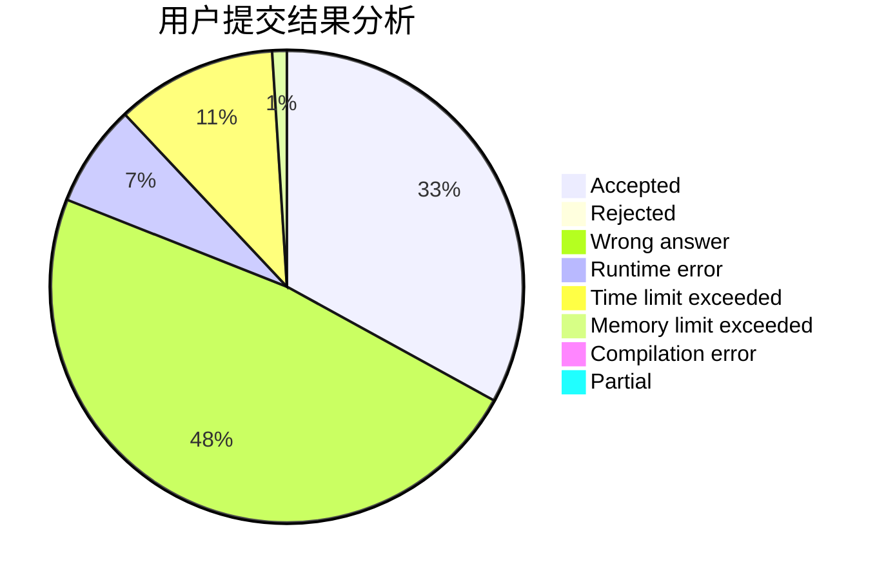
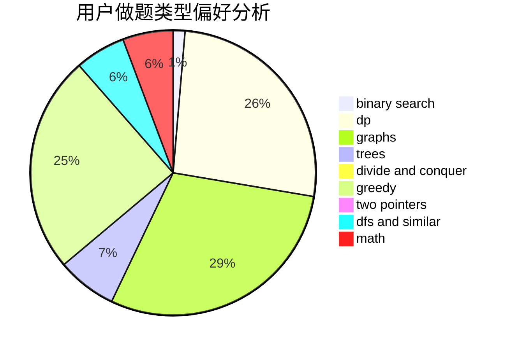

# Point_King

<!-- tabs:start -->

#### **用户提交结果分析**

#### **用户做题类型偏好分析**

<!-- tabs:end -->
# 推荐题目
[18C](https://codeforces.com/contest/18/problem/C)
[567A](https://codeforces.com/contest/567/problem/A)
[1191A](https://codeforces.com/contest/1191/problem/A)
[759B](https://codeforces.com/contest/759/problem/B)
[1271F](https://codeforces.com/contest/1271/problem/F)
[859F](https://codeforces.com/contest/859/problem/F)
[1060D](https://codeforces.com/contest/1060/problem/D)
[264D](https://codeforces.com/contest/264/problem/D)
[676A](https://codeforces.com/contest/676/problem/A)
[1499G](https://codeforces.com/contest/1499/problem/G)
