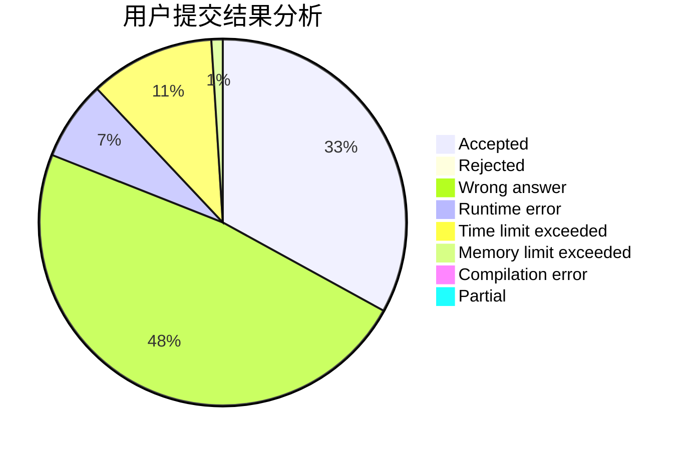
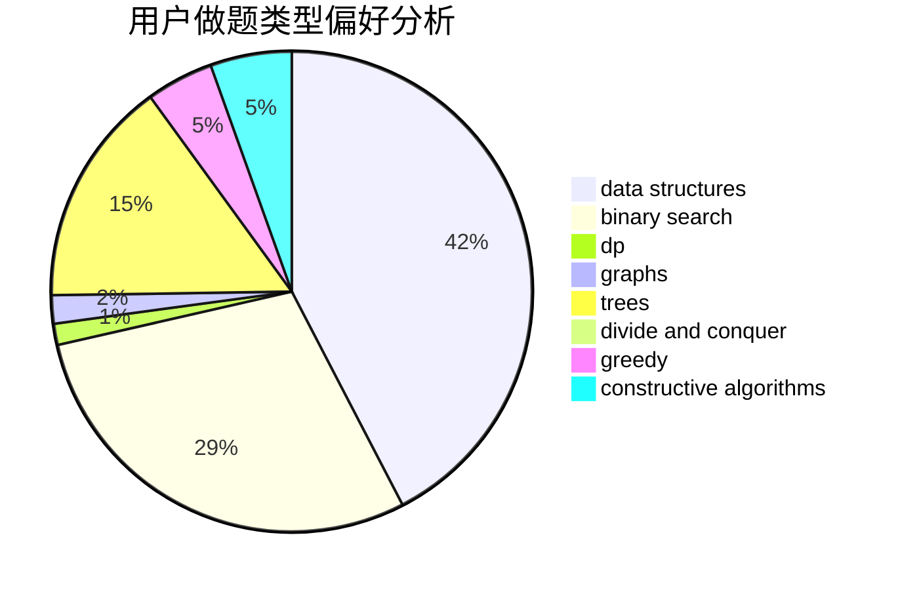

# Point_King

<!-- tabs:start -->

#### **用户提交结果分析**

#### **用户做题类型偏好分析**

#### **用户错题知识点分析**

<!-- tabs:end -->
# 推荐题目
[165A](https://codeforces.com/contest/165/problem/A)		implementation		  
[542E](https://codeforces.com/contest/542/problem/E)		graphs,
                        shortest paths		  
[1187D](https://codeforces.com/contest/1187/problem/D)		data structures,
                        sortings		  
[737E](https://codeforces.com/contest/737/problem/E)		graph matchings,
                        graphs,
                        greedy,
                        schedules		  
[1266E](https://codeforces.com/contest/1266/problem/E)		data structures,
                        greedy,
                        implementation		  
[840B](https://codeforces.com/contest/840/problem/B)		constructive algorithms,
                        data structures,
                        dfs and similar,
                        dp,
                        graphs		  
[1060A](https://codeforces.com/contest/1060/problem/A)		brute force		  
[243C](https://codeforces.com/contest/243/problem/C)		dfs and similar,
                        implementation		  
[652B](https://codeforces.com/contest/652/problem/B)		sortings		  
[1491A](https://codeforces.com/contest/1491/problem/A)		brute force,
                        greedy,
                        implementation		  
