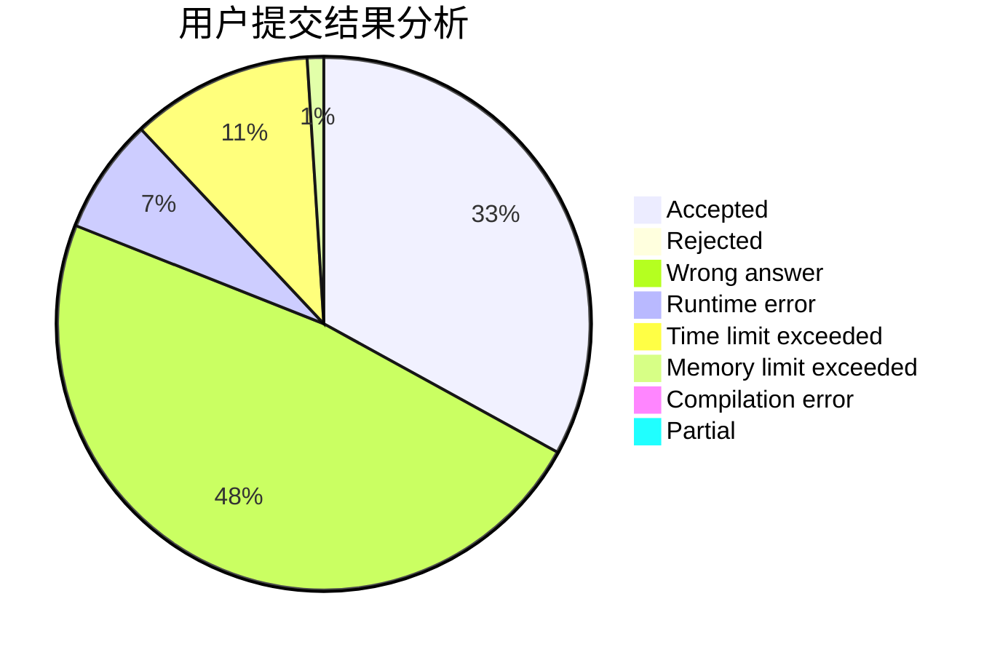
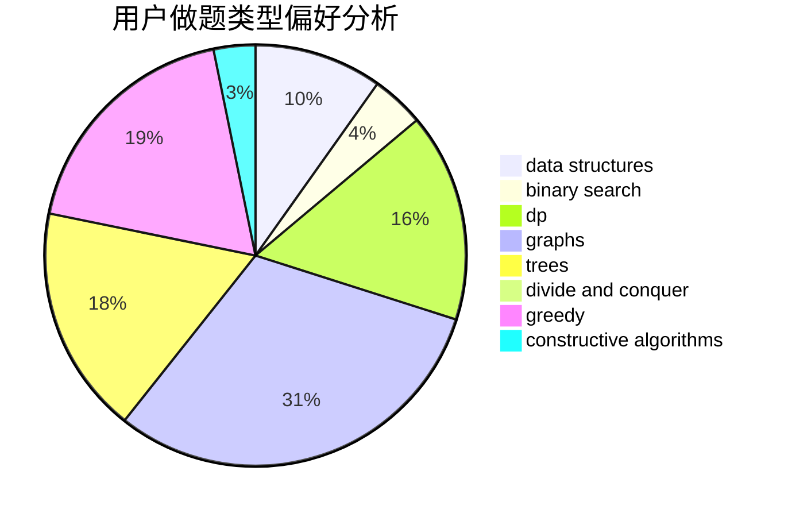

# Point_King

<!-- tabs:start -->

#### **用户提交结果分析**

#### **用户做题类型偏好分析**

#### **用户错题知识点分析**

<!-- tabs:end -->
# 推荐题目
[18C](https://codeforces.com/contest/18/problem/C)		data structures,
                        implementation		  
[567A](https://codeforces.com/contest/567/problem/A)		greedy,
                        implementation		  
[1191A](https://codeforces.com/contest/1191/problem/A)		brute force		  
[759B](https://codeforces.com/contest/759/problem/B)		dsu,graphs,sortings,trees		  
[1271F](https://codeforces.com/contest/1271/problem/F)		brute force		  
[859F](https://codeforces.com/contest/859/problem/F)		greedy		  
[1060D](https://codeforces.com/contest/1060/problem/D)		greedy,
                        math		  
[264D](https://codeforces.com/contest/264/problem/D)		dp,
                        two pointers		  
[676A](https://codeforces.com/contest/676/problem/A)		constructive algorithms,
                        implementation		  
[1499G](https://codeforces.com/contest/1499/problem/G)		data structures,
                        graphs,
                        interactive		  
