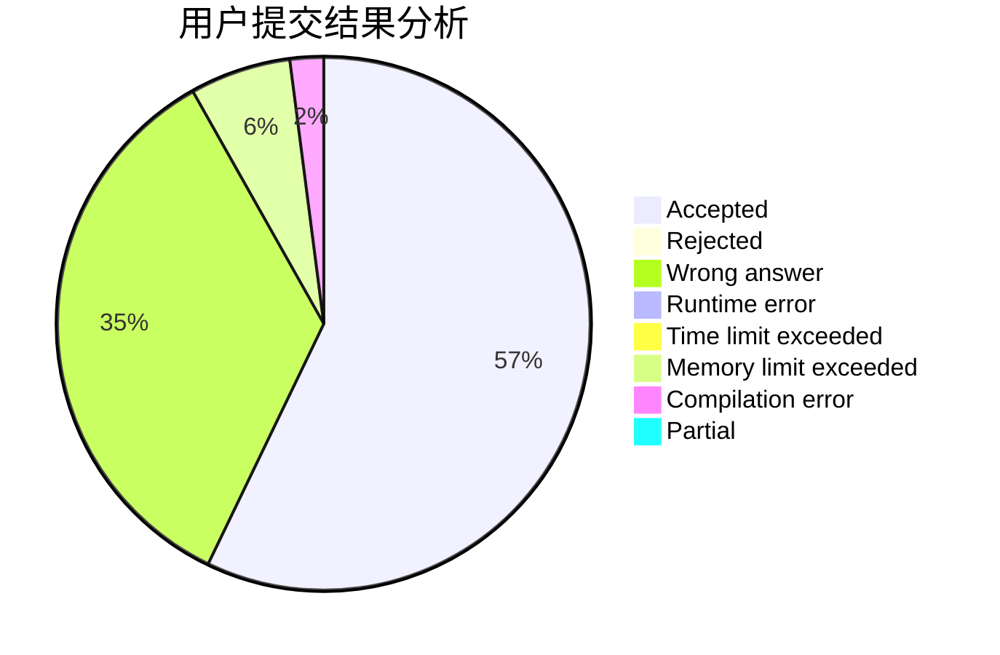
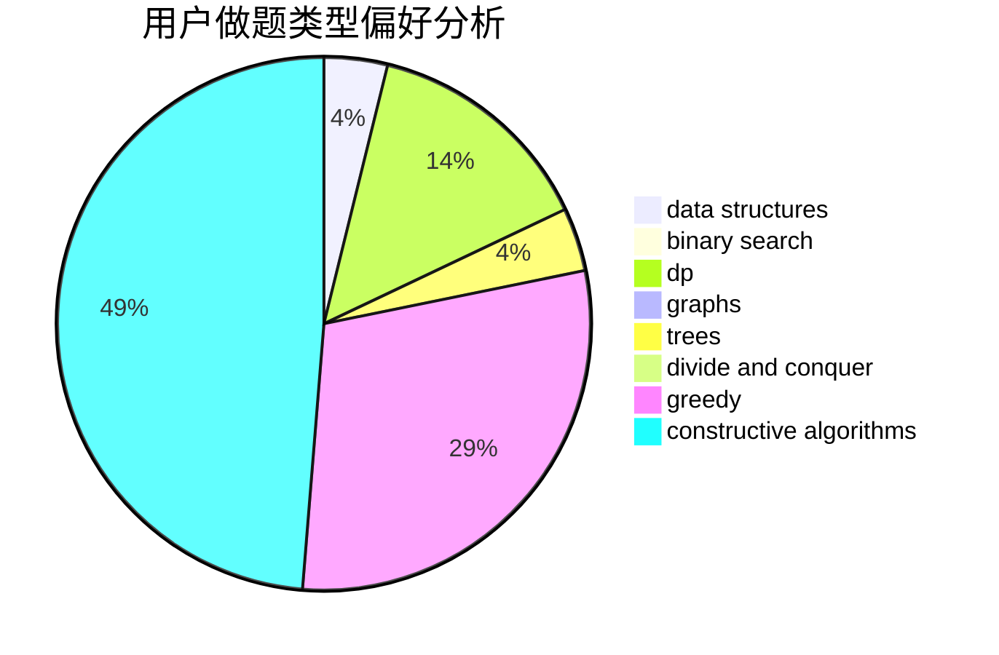
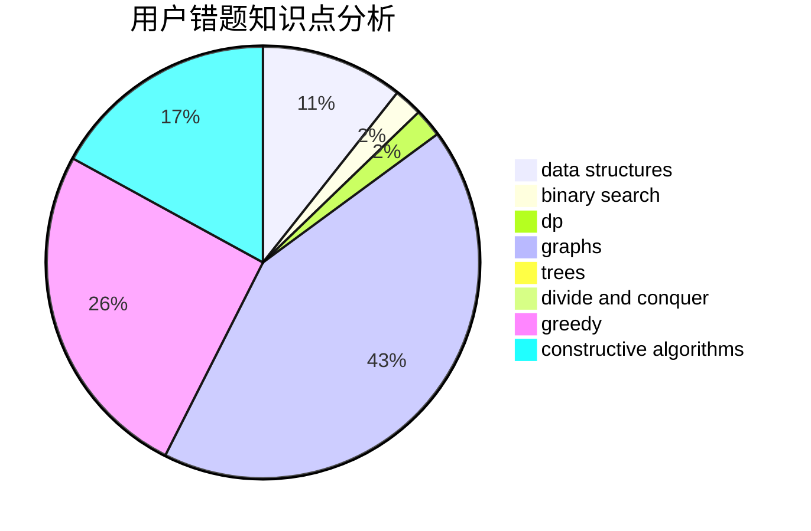

# Pointy

<!-- tabs:start -->

#### **用户提交结果分析**

#### **用户做题类型偏好分析**

#### **用户错题知识点分析**

<!-- tabs:end -->
# 推荐题目
[1461D](https://codeforces.com/contest/1461/problem/D)		binary search,
                        brute force,
                        data structures,
                        divide and conquer,
                        implementation,
                        sortings		  
[1380G](https://codeforces.com/contest/1380/problem/G)		greedy,
                        math,
                        probabilities		  
[1369E](https://codeforces.com/contest/1369/problem/E)		data structures,
                        dfs and similar,
                        greedy,
                        implementation,
                        sortings		  
[1081A](https://codeforces.com/contest/1081/problem/A)		constructive algorithms,
                        math		  
[612B](https://codeforces.com/contest/612/problem/B)		implementation,
                        math		  
[1256F](https://codeforces.com/contest/1256/problem/F)		constructive algorithms,
                        sortings,
                        strings		  
[1045I](https://codeforces.com/contest/1045/problem/I)		hashing,
                        strings		  
[666A](https://codeforces.com/contest/666/problem/A)		dp,
                        implementation,
                        strings		  
[827F](https://codeforces.com/contest/827/problem/F)		data structures,
                        dp,
                        graphs,
                        shortest paths		  
[590A](https://codeforces.com/contest/590/problem/A)		implementation		  
