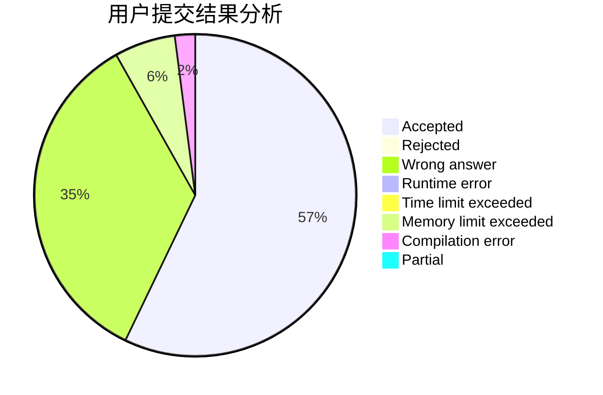
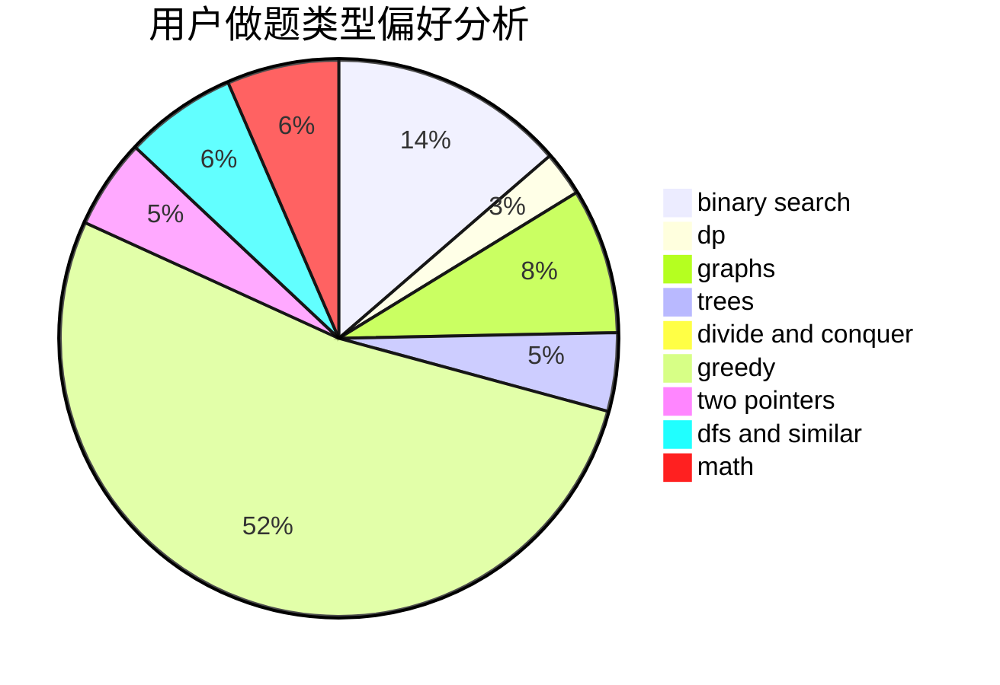

# Pointy

<!-- tabs:start -->

#### **用户提交结果分析**

#### **用户做题类型偏好分析**

<!-- tabs:end -->
# 推荐题目
[1468N](https://codeforces.com/contest/1468/problem/N)
[1391A](https://codeforces.com/contest/1391/problem/A)
[13764](https://codeforces.com/contest/1376/problem/4)
[1081D](https://codeforces.com/contest/1081/problem/D)
[631D](https://codeforces.com/contest/631/problem/D)
[12642](https://codeforces.com/contest/1264/problem/2)
[1046H](https://codeforces.com/contest/1046/problem/H)
[687A](https://codeforces.com/contest/687/problem/A)
[846B](https://codeforces.com/contest/846/problem/B)
[609F](https://codeforces.com/contest/609/problem/F)
