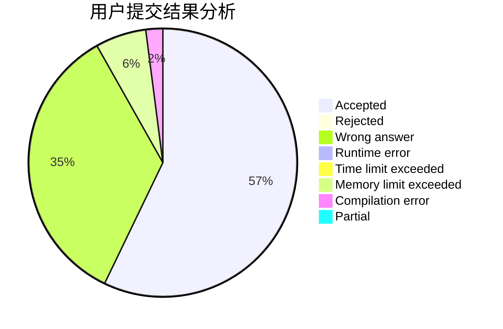
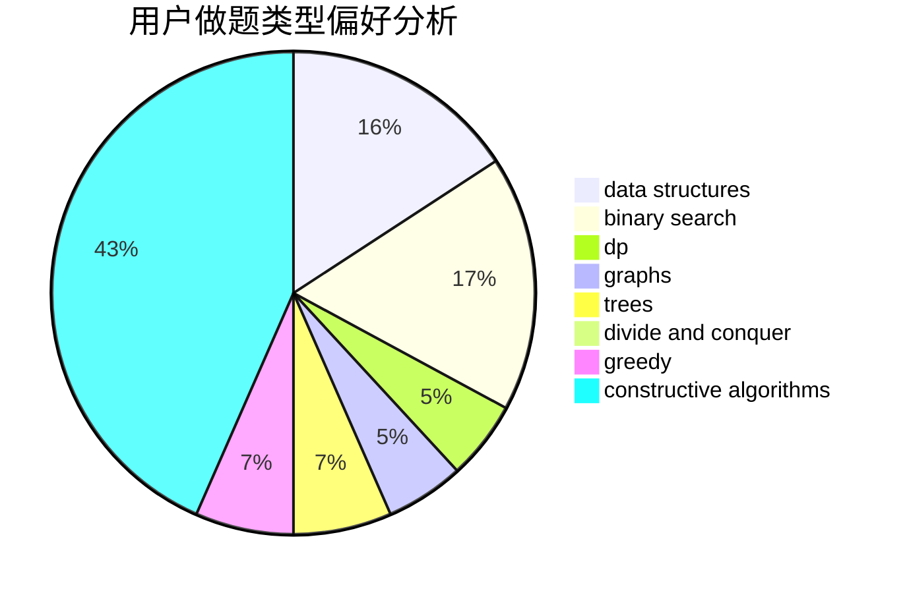
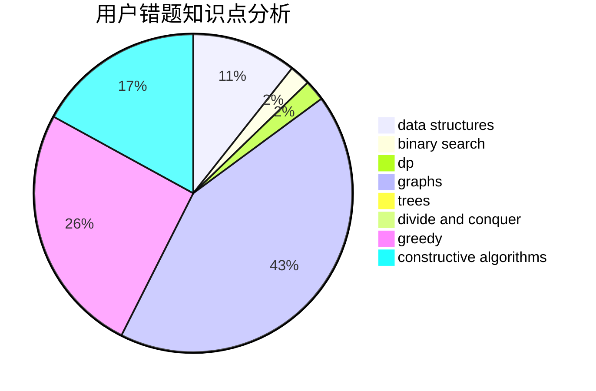

# Pointy

<!-- tabs:start -->

#### **用户提交结果分析**

#### **用户做题类型偏好分析**

#### **用户错题知识点分析**

<!-- tabs:end -->
# 推荐题目
[1468N](https://codeforces.com/contest/1468/problem/N)		greedy,
                        implementation		  
[1391A](https://codeforces.com/contest/1391/problem/A)		constructive algorithms,
                        math		  
[13764](https://codeforces.com/contest/1376/problem/4)		dsu,graphs,sortings,trees		  
[1081D](https://codeforces.com/contest/1081/problem/D)		dsu,
                        graphs,
                        shortest paths,
                        sortings		  
[631D](https://codeforces.com/contest/631/problem/D)		data structures,
                        hashing,
                        implementation,
                        string suffix structures,
                        strings		  
[12642](https://codeforces.com/contest/1264/problem/2)		dsu,graphs,sortings,trees		  
[1046H](https://codeforces.com/contest/1046/problem/H)		dsu,graphs,sortings,trees		  
[687A](https://codeforces.com/contest/687/problem/A)		dfs and similar,
                        graphs		  
[846B](https://codeforces.com/contest/846/problem/B)		brute force,
                        greedy		  
[609F](https://codeforces.com/contest/609/problem/F)		data structures,
                        greedy		  
