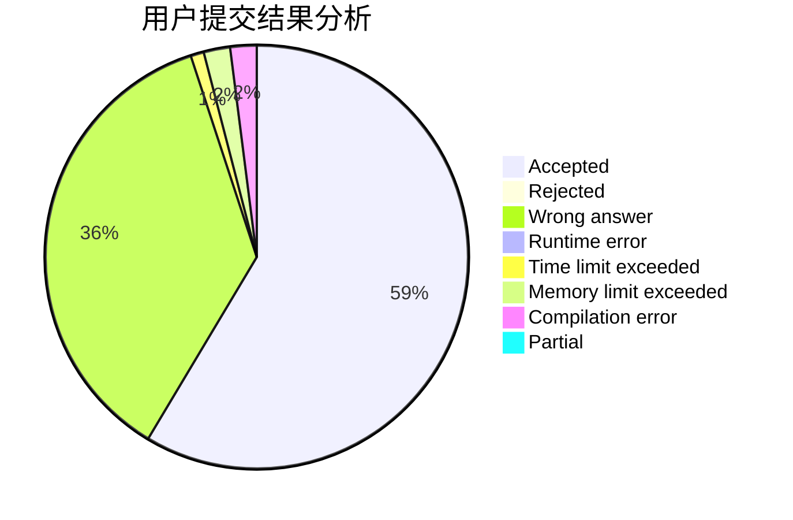
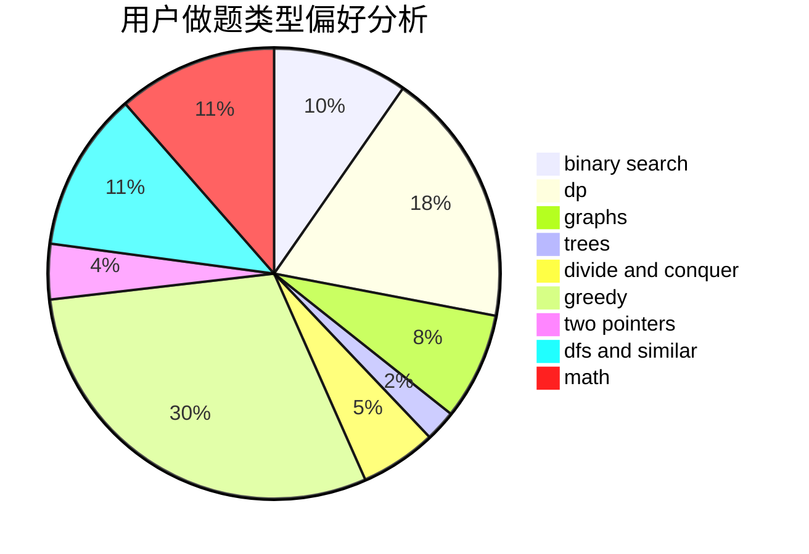

# AC_Crush

<!-- tabs:start -->

#### **用户提交结果分析**

#### **用户做题类型偏好分析**

<!-- tabs:end -->
# 推荐题目
[1484C](https://codeforces.com/contest/1484/problem/C)
[1485E](https://codeforces.com/contest/1485/problem/E)
[1307A](https://codeforces.com/contest/1307/problem/A)
[1483F](https://codeforces.com/contest/1483/problem/F)
[1037A](https://codeforces.com/contest/1037/problem/A)
[1178C](https://codeforces.com/contest/1178/problem/C)
[1464B](https://codeforces.com/contest/1464/problem/B)
[1482H](https://codeforces.com/contest/1482/problem/H)
[1482D](https://codeforces.com/contest/1482/problem/D)
[1108C](https://codeforces.com/contest/1108/problem/C)
