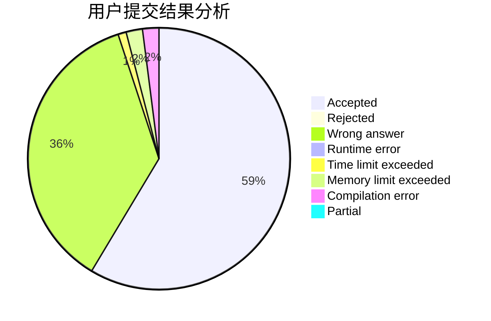
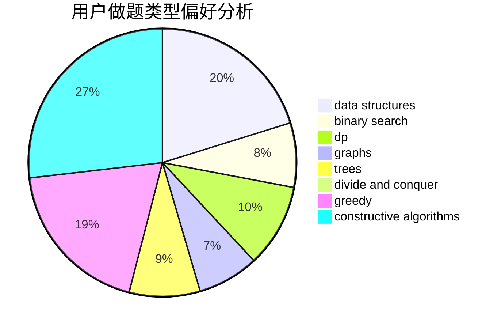

# AC_Crush
<!-- tabs:start -->
#### **用户提交结果分析**

#### **用户做题类型偏好分析**

#### **用户错题知识点分析**

<!-- tabs:end -->
# 推荐题目
[Unusual Matrix](http://codeforces.com/problemset/problem/1475/F)		2-sat,
                        brute force,
                        constructive algorithms		  
[Tiles](http://codeforces.com/problemset/problem/1473/G)		combinatorics,
                        dp,
                        fft,
                        math		  
[Electrification](http://codeforces.com/problemset/problem/1175/C)		binary search,
                        brute force,
                        greedy		  
[Minimum Difference](http://codeforces.com/problemset/problem/1476/G)		data structures,
                        hashing,
                        sortings,
                        two pointers		  
[So Mean](http://codeforces.com/problemset/problem/1299/E)		interactive,
                        math		  
[Pattern Matching](http://codeforces.com/problemset/problem/1476/E)		bitmasks,
                        data structures,
                        dfs and similar,
                        graphs,
                        hashing,
                        sortings,
                        strings		  
[Vasya and Arrays](http://codeforces.com/problemset/problem/1036/D)		greedy,
                        two pointers		  
[Johnny and Megan's Necklace](https://codeforces.com/contest/1362/problem/F)		binary search,
                        bitmasks,
                        constructive algorithms,
                        dfs and similar,
                        dsu,
                        graphs		  
[Banh-mi](http://codeforces.com/problemset/problem/1062/C)		greedy,
                        implementation,
                        math		  
[Candies Distribution](http://codeforces.com/problemset/problem/1054/C)		constructive algorithms,
                        implementation		  
<!-- tabs:start -->
#### **data structures**
[Unusual Matrix](http://codeforces.com/problemset/problem/1476/G)		data structures,
                        hashing,
                        sortings,
                        two pointers		  
[Tiles](http://codeforces.com/problemset/problem/1476/E)		bitmasks,
                        data structures,
                        dfs and similar,
                        graphs,
                        hashing,
                        sortings,
                        strings		  
[Electrification](http://codeforces.com/problemset/problem/1446/D2)		data structures,
                        greedy,
                        two pointers		  
[Minimum Difference](http://codeforces.com/problemset/problem/1379/F2)		data structures,
                        divide and conquer		  
[So Mean](http://codeforces.com/problemset/problem/1474/C)		brute force,
                        constructive algorithms,
                        data structures,
                        greedy,
                        implementation,
                        sortings		  
[Pattern Matching](http://codeforces.com/problemset/problem/1373/G)		data structures,
                        divide and conquer,
                        greedy		  
[Vasya and Arrays](http://codeforces.com/problemset/problem/1290/A)		brute force,
                        data structures,
                        implementation		  
[Johnny and Megan's Necklace](http://codeforces.com/problemset/problem/1477/B)		data structures,
                        greedy		  
[Banh-mi](http://codeforces.com/problemset/problem/1476/F)		binary search,
                        data structures,
                        dp		  
[Candies Distribution](http://codeforces.com/problemset/problem/1474/D)		data structures,
                        dp,
                        greedy,
                        math		  
#### **binary search**
[Unusual Matrix](http://codeforces.com/problemset/problem/1175/C)		binary search,
                        brute force,
                        greedy		  
[Tiles](https://codeforces.com/contest/1362/problem/F)		binary search,
                        bitmasks,
                        constructive algorithms,
                        dfs and similar,
                        dsu,
                        graphs		  
[Electrification](http://codeforces.com/problemset/problem/1361/C)		binary search,
                        bitmasks,
                        constructive algorithms,
                        dfs and similar,
                        dsu,
                        graphs		  
[Minimum Difference](http://codeforces.com/problemset/problem/1475/D)		binary search,
                        dp,
                        sortings,
                        two pointers		  
[So Mean](http://codeforces.com/problemset/problem/1476/A)		binary search,
                        constructive algorithms,
                        greedy,
                        math		  
[Pattern Matching](http://codeforces.com/problemset/problem/1476/F)		binary search,
                        data structures,
                        dp		  
[Vasya and Arrays](http://codeforces.com/problemset/problem/1474/B)		binary search,
                        constructive algorithms,
                        greedy,
                        math,
                        number theory		  
[Johnny and Megan's Necklace](http://codeforces.com/problemset/problem/1476/B)		binary search,
                        brute force,
                        greedy,
                        math		  
[Banh-mi](http://codeforces.com/problemset/problem/1326/D2)		binary search,
                        greedy,
                        hashing,
                        string suffix structures,
                        strings		  
[Candies Distribution](http://codeforces.com/problemset/problem/1492/C)		binary search,
                        data structures,
                        dp,
                        greedy,
                        two pointers		  
#### **dp**
[Unusual Matrix](http://codeforces.com/problemset/problem/1473/G)		combinatorics,
                        dp,
                        fft,
                        math		  
[Tiles](https://codeforces.com/contest/116/problem/C)		bitmasks,
                        brute force,
                        dp,
                        graphs		  
[Electrification](http://codeforces.com/problemset/problem/1475/D)		binary search,
                        dp,
                        sortings,
                        two pointers		  
[Minimum Difference](http://codeforces.com/problemset/problem/1452/E)		brute force,
                        dp,
                        greedy,
                        sortings,
                        two pointers		  
[So Mean](http://codeforces.com/problemset/problem/1476/C)		dp,
                        graphs,
                        greedy		  
[Pattern Matching](http://codeforces.com/problemset/problem/1409/F)		dp,
                        strings		  
[Vasya and Arrays](http://codeforces.com/problemset/problem/1476/F)		binary search,
                        data structures,
                        dp		  
[Johnny and Megan's Necklace](http://codeforces.com/problemset/problem/1475/B)		brute force,
                        dp,
                        math		  
[Banh-mi](http://codeforces.com/problemset/problem/1060/E)		dfs and similar,
                        dp,
                        trees		  
[Candies Distribution](http://codeforces.com/problemset/problem/1474/F)		dp,
                        math,
                        matrices		  
#### **graph**
[Unusual Matrix](http://codeforces.com/problemset/problem/1476/E)		bitmasks,
                        data structures,
                        dfs and similar,
                        graphs,
                        hashing,
                        sortings,
                        strings		  
[Tiles](https://codeforces.com/contest/1362/problem/F)		binary search,
                        bitmasks,
                        constructive algorithms,
                        dfs and similar,
                        dsu,
                        graphs		  
[Electrification](https://codeforces.com/contest/116/problem/C)		bitmasks,
                        brute force,
                        dp,
                        graphs		  
[Minimum Difference](http://codeforces.com/problemset/problem/1454/E)		combinatorics,
                        dfs and similar,
                        graphs,
                        trees		  
[So Mean](http://codeforces.com/problemset/problem/1475/C)		combinatorics,
                        graphs,
                        math		  
[Pattern Matching](http://codeforces.com/problemset/problem/1361/C)		binary search,
                        bitmasks,
                        constructive algorithms,
                        dfs and similar,
                        dsu,
                        graphs		  
[Vasya and Arrays](http://codeforces.com/problemset/problem/1476/C)		dp,
                        graphs,
                        greedy		  
[Johnny and Megan's Necklace](http://codeforces.com/problemset/problem/1383/A)		dsu,
                        graphs,
                        greedy,
                        sortings,
                        strings,
                        trees,
                        two pointers		  
[Banh-mi](http://codeforces.com/problemset/problem/1487/C)		brute force,
                        constructive algorithms,
                        dfs and similar,
                        graphs,
                        greedy,
                        implementation,
                        math		  
[Candies Distribution](http://codeforces.com/problemset/problem/1437/C)		dp,
                        flows,
                        graph matchings,
                        greedy,
                        math,
                        sortings		  
#### **trees**
[Unusual Matrix](http://codeforces.com/problemset/problem/1454/E)		combinatorics,
                        dfs and similar,
                        graphs,
                        trees		  
[Tiles](http://codeforces.com/problemset/problem/1060/E)		dfs and similar,
                        dp,
                        trees		  
[Electrification](http://codeforces.com/problemset/problem/1383/A)		dsu,
                        graphs,
                        greedy,
                        sortings,
                        strings,
                        trees,
                        two pointers		  
[Minimum Difference](http://codeforces.com/problemset/problem/1479/D)		binary search,
                        bitmasks,
                        brute force,
                        data structures,
                        probabilities,
                        trees		  
[So Mean](http://codeforces.com/problemset/problem/1511/C)		brute force,
                        data structures,
                        implementation,
                        trees		  
[Pattern Matching](http://codeforces.com/problemset/problem/1499/F)		combinatorics,
                        dfs and similar,
                        dp,
                        trees		  
[Vasya and Arrays](http://codeforces.com/problemset/problem/1491/E)		brute force,
                        dfs and similar,
                        divide and conquer,
                        number theory,
                        trees		  
[Johnny and Megan's Necklace](http://codeforces.com/problemset/problem/1466/D)		data structures,
                        greedy,
                        sortings,
                        trees		  
[Banh-mi](http://codeforces.com/problemset/problem/1495/D)		combinatorics,
                        dfs and similar,
                        graphs,
                        math,
                        shortest paths,
                        trees		  
[Candies Distribution](http://codeforces.com/problemset/problem/1303/G)		data structures,
                        divide and conquer,
                        geometry,
                        trees		  
#### **divide and conquer**
[Unusual Matrix](http://codeforces.com/problemset/problem/1379/F2)		data structures,
                        divide and conquer		  
[Tiles](http://codeforces.com/problemset/problem/1373/G)		data structures,
                        divide and conquer,
                        greedy		  
[Electrification](http://codeforces.com/problemset/problem/1461/D)		binary search,
                        brute force,
                        data structures,
                        divide and conquer,
                        implementation,
                        sortings		  
[Minimum Difference](http://codeforces.com/problemset/problem/1466/G)		combinatorics,
                        divide and conquer,
                        hashing,
                        math,
                        string suffix structures,
                        strings		  
[So Mean](http://codeforces.com/problemset/problem/1490/D)		dfs and similar,
                        divide and conquer,
                        implementation		  
[Pattern Matching](https://codeforces.com/contest/1483/problem/C)		data structures,
                        divide and conquer,
                        dp		  
[Vasya and Arrays](http://codeforces.com/problemset/problem/1491/E)		brute force,
                        dfs and similar,
                        divide and conquer,
                        number theory,
                        trees		  
[Johnny and Megan's Necklace](http://codeforces.com/problemset/problem/1303/G)		data structures,
                        divide and conquer,
                        geometry,
                        trees		  
[Banh-mi](http://codeforces.com/problemset/problem/1494/D)		constructive algorithms,
                        data structures,
                        dfs and similar,
                        divide and conquer,
                        dsu,
                        greedy,
                        sortings,
                        trees		  
[Candies Distribution](http://codeforces.com/problemset/problem/1482/E)		data structures,
                        divide and conquer,
                        dp		  
#### **greedy**
[Unusual Matrix](http://codeforces.com/problemset/problem/1175/C)		binary search,
                        brute force,
                        greedy		  
[Tiles](http://codeforces.com/problemset/problem/1036/D)		greedy,
                        two pointers		  
[Electrification](http://codeforces.com/problemset/problem/1062/C)		greedy,
                        implementation,
                        math		  
[Minimum Difference](http://codeforces.com/problemset/problem/1474/E)		constructive algorithms,
                        greedy		  
[So Mean](http://codeforces.com/problemset/problem/1108/B)		brute force,
                        greedy,
                        math,
                        number theory		  
[Pattern Matching](http://codeforces.com/problemset/problem/1446/D2)		data structures,
                        greedy,
                        two pointers		  
[Vasya and Arrays](http://codeforces.com/problemset/problem/1366/C)		greedy,
                        math		  
[Johnny and Megan's Necklace](http://codeforces.com/problemset/problem/1474/C)		brute force,
                        constructive algorithms,
                        data structures,
                        greedy,
                        implementation,
                        sortings		  
[Banh-mi](http://codeforces.com/problemset/problem/1373/G)		data structures,
                        divide and conquer,
                        greedy		  
[Candies Distribution](http://codeforces.com/problemset/problem/1138/B)		brute force,
                        greedy,
                        math,
                        strings		  
#### **constructive algorithms**
[Unusual Matrix](http://codeforces.com/problemset/problem/1475/F)		2-sat,
                        brute force,
                        constructive algorithms		  
[Tiles](https://codeforces.com/contest/1362/problem/F)		binary search,
                        bitmasks,
                        constructive algorithms,
                        dfs and similar,
                        dsu,
                        graphs		  
[Electrification](http://codeforces.com/problemset/problem/1054/C)		constructive algorithms,
                        implementation		  
[Minimum Difference](http://codeforces.com/problemset/problem/1474/E)		constructive algorithms,
                        greedy		  
[So Mean](http://codeforces.com/problemset/problem/1174/D)		bitmasks,
                        constructive algorithms		  
[Pattern Matching](http://codeforces.com/problemset/problem/1361/C)		binary search,
                        bitmasks,
                        constructive algorithms,
                        dfs and similar,
                        dsu,
                        graphs		  
[Vasya and Arrays](http://codeforces.com/problemset/problem/1474/C)		brute force,
                        constructive algorithms,
                        data structures,
                        greedy,
                        implementation,
                        sortings		  
[Johnny and Megan's Necklace](http://codeforces.com/problemset/problem/1476/A)		binary search,
                        constructive algorithms,
                        greedy,
                        math		  
[Banh-mi](http://codeforces.com/problemset/problem/1477/A)		constructive algorithms,
                        math,
                        number theory		  
[Candies Distribution](http://codeforces.com/problemset/problem/1474/B)		binary search,
                        constructive algorithms,
                        greedy,
                        math,
                        number theory		  
#### **sortings**
[Unusual Matrix](http://codeforces.com/problemset/problem/1476/G)		data structures,
                        hashing,
                        sortings,
                        two pointers		  
[Tiles](http://codeforces.com/problemset/problem/1476/E)		bitmasks,
                        data structures,
                        dfs and similar,
                        graphs,
                        hashing,
                        sortings,
                        strings		  
[Electrification](http://codeforces.com/problemset/problem/1474/C)		brute force,
                        constructive algorithms,
                        data structures,
                        greedy,
                        implementation,
                        sortings		  
[Minimum Difference](http://codeforces.com/problemset/problem/1475/E)		combinatorics,
                        math,
                        sortings		  
[So Mean](http://codeforces.com/problemset/problem/1475/D)		binary search,
                        dp,
                        sortings,
                        two pointers		  
[Pattern Matching](http://codeforces.com/problemset/problem/1452/E)		brute force,
                        dp,
                        greedy,
                        sortings,
                        two pointers		  
[Vasya and Arrays](http://codeforces.com/problemset/problem/1383/A)		dsu,
                        graphs,
                        greedy,
                        sortings,
                        strings,
                        trees,
                        two pointers		  
[Johnny and Megan's Necklace](http://codeforces.com/problemset/problem/1475/G)		dp,
                        math,
                        number theory,
                        sortings		  
[Banh-mi](http://codeforces.com/problemset/problem/1174/B)		sortings		  
[Candies Distribution](https://codeforces.com/contest/1496/problem/C)		geometry,
                        greedy,
                        math,
                        sortings		  
<!-- tabs:end -->
